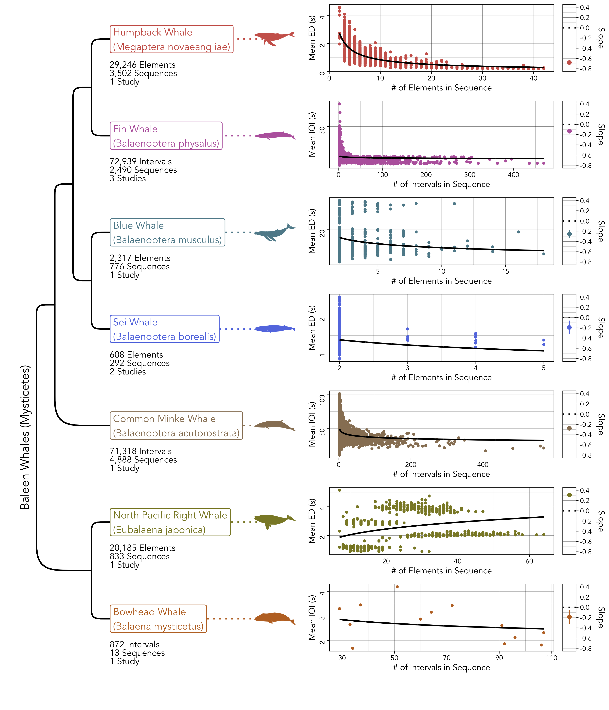
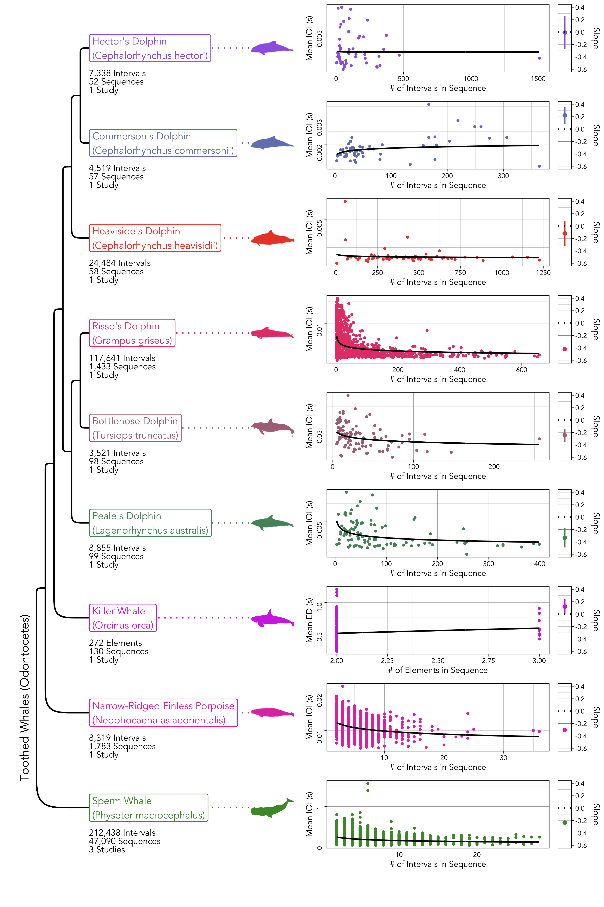
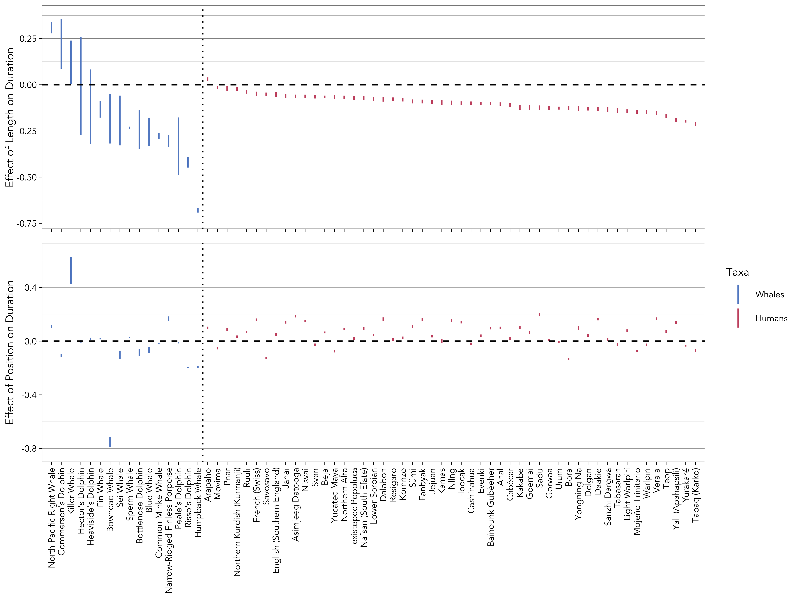

<!-- TARGET 1 IS PNAS -->
<!-- generous waiver policy: https://www.pnas.org/author-center/publication-charges -->
<!-- 4000 words -->
<!-- budget of 50 references and 4 medium-size figures and tables -->

<!-- TARGET 2 IS CURRENT BIOLOGY -->
<!-- very limited waiver policy that may be a barrier: https://www.cell.com/open-access -->
<!-- 5000 words -->
<!-- budget of 7 figures and tables -->

<!-- TARGET 3 IS PROCEEDINGS B -->
<!-- ~8500 words (assuming three figures and a table) -->
<!-- has some sort of waiver policy, unclear but potentially do-able: https://royalsocietypublishing.org/rspb/for-authors -->

<!-- TARGET 4 IS BIOLOGY LETTERS -->
<!-- no explicity waiver policy: https://royalsocietypublishing.org/rsbl/for-authors -->
<!-- 3500 words -->
<!-- excludes references, title, author list, data accessibility, ethics, author contributions, and competing interests -->
<!-- includes legends, acknowledgments, and funding statements -->
<!-- budget of three figures and three tables -->

```{r word-doc, echo = FALSE, eval = FALSE}
#optionally hide all code
knitr::opts_chunk$set(echo = FALSE)

#set fonts of flextables
flextable::set_flextable_defaults(font.family = "Garamond", font.size = 10, padding.top = 1, padding.bottom = 1, keep_with_next = TRUE)
```

<!--- Bibliography management done via (cmd+k to insert): https://gsverhoeven.github.io/post/zotero-rmarkdown-csl/ -->
<!-- Github hosting done via: https://mbounthavong.com/blog/2022/7/30/hosting-a-r-markdown-html-file-on-a-github-page -->

```{css, echo = FALSE}
pre, code {white-space:pre !important; overflow-x:auto}

/* Move code folding buttons to the left */
div.col-md-12 .pull-right {
  float: left !important
}
```

<br>
&copy; Popular Mechanics

# Links {-}

* [Main text](https://masonyoungblood.github.io/whale_efficiency/)
* [Supplementary information](https://masonyoungblood.github.io/whale_efficiency/supplement/supplement.html)
* [GitHub repository](https://github.com/masonyoungblood/whale_efficiency)

<!-- * [PsyArXiv preprint]() -->

```{r admin, echo = FALSE, eval = TRUE, warning = FALSE, message = FALSE}
#set working directory, load sheet of datasets used, and source modeling functions
setwd("~/Documents/Work/Spring 2024/Whale ZLA/whale_efficiency/docs")
datasets <- readxl::read_xlsx("data/datasets.xlsx")
source("functions.R")

#load datasets
files <- list.files("data/processed/")[grep(".RData", list.files("data/processed/"))]
for(i in 1:length(files)){load(paste0("data/processed/", files[i]))}
```

```{r data-sizes, echo = FALSE, eval = TRUE}
#store labels for each dataset (from phylo plot)
data_sizes <- lapply(list(sperm_data, humpback_data, humpback_phrase_data, fin_data, killer_data, killer_sequence_data, blue_data, minke_data, bowhead_data, right_data, narrow_data, rissos_data, bottlenose_data, heavisides_data, commersons_data, peales_data, hectors_data, sei_data), label_maker)

#get number of elements and intervals, sequences, and studies
n_elements <- sum(sapply(data_sizes, function(x){as.numeric(gsub(",", "", gsub(" Elements.*", "", x)))})) #number of elements and intervals
n_sequences <- sum(sapply(data_sizes, function(x){as.numeric(gsub(",", "", gsub(".*Elements\n", "", gsub(" Sequences.*", "", x))))})) #number of sequences
n_studies <- sum(sapply(data_sizes, function(x){as.numeric(as.numeric(gsub(" Stud.*", "", gsub(".*Sequences\n", "", x))))})) #number of studies
```

# Introduction

Human language and other forms of animal communication exhibit striking parallels in their structure, such as hierarchical organization [@sainburg_etal19] and adherence to linguistic laws [@youngblood24] in some songbirds. These features are thought to reflect common constraints that shape communication systems. Complexity, for example, is thought to boost the informativeness of signals by allowing them to take more forms [@fitch00], but more complex signals are generally harder to learn and produce [@gibson_etal19]. Communication systems tend to balance this trade-off by maximizing their efficiency&mdash;the ratio of the lifetime benefits that they provide to the costs of learning and producing them [@gruber_etal22].

One of the clearest manifestations of communicative efficiency is Menzerath's law, which predicts that longer sequences (e.g., songs, words) will be comprised of shorter elements (e.g., notes, phonemes) [@menzerath54]. The logic here is simple: when production costs are increased in one domain (e.g., sequence length) they should be decreased in another (e.g., element duration). This negative correlation between sequence length and item length is found at various levels of analysis in language (e.g. phonemes in words, clauses in sentences) [@hou_etal17; @cramer05; @stave_etal21; @eroglu13] as well as in music [@boroda_altmann91]. Mathematical modeling work demonstrates that Menzerath's law is a result of information compression [@gustison_etal16; @ferrer-i-cancho16; @ferrer-i-cancho_etal22].

In non-human communication, Menzerath's law appears to be present in chimpanzee gesture [@heesen_etal19] and in the vocalizations of some primates and birds [@gustisonGeladaVocalSequences2016; @huang_etal20; @favaro_etal20; @fedurek_etal17; @james_etal21; @youngblood24]. In cetaceans, though, communicative efficiency is relatively understudied. To my knowledge, Menzerath's law has only been assessed in the whistle sequences of bottlenose dolphins, where it is present, [@vradi21] and in the songs of pygmy blue whales, where it is absent [@jolliffe_etal23]. The aim of this study was to assess the evidence for Menzerath's law in cetaceans by analyzing vocal sequences from 16 baleen and toothed whale species and comparing them to spoken data from 51 human languages.

I focus on Menzerath's law, rather than other commonly-studied features like Zipf's laws [@semple_etal22], because its predictions are agnostic about the categories of elements in sequences, thus expanding the number of species that it can be explored in. There are two reasons for this: (1) some species lack detailed classification schemes for their vocal behavior simply because they are understudied, and (2) some species produce rhythmic sequences comprised of one type of click or broadband sound. In these species (e.g., sperm whales, fin whales) the individual element durations are relatively uniform and information is thought to be encoded in the inter-element intervals [@hersh_etal22; @romagosa_etal24; @martin_etal18]. A study of gelada baboon vocalizations assessed Menzerath's law using both elements and intervals and found that its strength was similar in both cases [@gustison_etal16]. In this study, I adopt Menzerath's broader view of his law&mdash;"the greater the whole the smaller its parts" [@menzerath54; @altmann80]&mdash;and fit it to the durations of either elements or intervals depending on which data are reported.

<!-- [@kang21; @allen_etal19; @markov_ostrovskaya90; @mccowan_etal99; @stepanov_etal23; @vradi21],  -->

<!-- Use @semple_etal22 as a reference for the other "big two" linguistic laws -->

<!-- Zipf's rank-frequency and brevity laws appear to be present in the vocalizations of humpback whales and bottlenose dolphins. -->

<!-- Pygmy blue whale songs do not adhere to Menzerath's law [@jolliffe_etal23]. -->

<!-- Zipf's law of abbreviation holds in humpback whales but not in Risso's dolphin, Beluga whales, or killer whales [@kang21]. -->

<!-- Zipf's rank-frequency law holds in humpback whales [@allen_etal19]. -->

<!-- Zipf's rank-frequency law in whistles [@markov_ostrovskaya90; @mccowan_etal99] and burst pulses [@stepanov_etal23], Zipf's law of abbreviation in whistles [@vradi21] and burst pulses [@stepanov_etal23], and Menzerath's law in whistles [@vradi21] and burst pulses [@stepanov_etal23]. -->

# Methods

## Data

Cetacean vocal sequences have different names in different species (e.g., songs, codas, burst-pulses), and there is significant variation in research effort across taxa, so I used a mixture of different strategies to compile a convenience sample of candidate datasets. For heavily studied species I was able to find papers by using species-specific search term combinations like {"humpback whale" AND "song sequences"} and {"sperm whale" AND "codas"} on Google Scholar. For less represented taxa, like dolphins and porpoises, I also searched for datasets directly on repositories like Dryad, Zenodo, and Figshare. Within odontocetes (i.e., toothed whales), who produce clicks for echolocation, I only included vocalizations that have a known or hypothesized communication function (e.g., sperm whale codas, dolphin burst-pulses) [@hersh_etal22; @martin_etal18].

In total, I found `r nrow(datasets)` studies that reported the durations of elements, or the intervals between elements, within vocal sequences. `r length(which(datasets$Open == "Yes" & datasets$Used == "Yes"))` of these had open data that were suitable for analysis. I emailed the corresponding authors of the remaining studies and was granted access to `r length(which(datasets$Used == "Yes" & datasets$Open == "No"))` closed datasets that were suitable for analysis. <!-- `r length(which(datasets$Acquired == "Yes")) - length(which(datasets$Used == "Yes"))` of the acquired datasets could not be included in the main analysis due to low sample size (i.e. two sequences [REF]) or because they were the wrong level of analysis (e.g. phrases within songs rather than elements within phrases [REF]). -->The final `r length(which(datasets$Used == "Yes"))` datasets can be seen in Table \@ref(tab:table-datasets) [@lewis_etal18; @erbs_etal21; @romagosa_etal24; @wood_sirovic22; @best_etal22; @schall_etal21; @schall_etal22; @owen_etal19; @martin_etal22; @crance_etal19; @macklin_etal24; @stepanov_etal23; @martin_etal21; @martin_etal18; @nielsen_etal24; @selbmann_etal23; @terada_etal22; @martin_etal24; @arranz_etal16; @hersh_etal22; @vachon_etal22; @gero_etal16; @sharpe_etal17]. Three of the datasets, two in humpback whales [@schall_etal21; @schall_etal22] and one in killer whales [@selbmann_etal23], were analyzed separately because they log the durations of higher-level units (e.g., for the humpbacks, phrases within songs rather than notes within phrases).

The phrase-level humpback whale dataset [@owen_etal19] was the only one that did not include the durations of individual elements or intervals in sequences. Instead, Owen et al. [@owen_etal19] report the sequences as strings of element categories, with a separate file that logs the durations of many different elements from each category. For this dataset, I interpolated the sequences with the median duration of each element category. Supplementary analysis with human language data suggests that interpolation with median durations systematically reduces the strength of Menzerath's law, which should lead to more conservative conclusions (see [Supplementary Information](https://masonyoungblood.github.io/whale_efficiency/supplement/supplement.html)).

The phylogeny in Figures \@ref(fig:figure-myst-plot) and \@ref(fig:figure-odon-plot) comes from a metatree of Cetacea comprised of both molecular and morphological data [@lloyd_slater21]. As the phylogeny was primarily for visualization purposes, I assigned three species that do not appear in the metatree to close relatives in the same genus: the narrow-ridged finless porpoise (*Neophocaena asiaeorientalis*) to the Indo-Pacific finless porpoise (*Neophocaena phocaenoides*), the Commerson's dolphin (*Cephalorhynchus commersonii*) to the Chilean dolphin (*Cephalorhynchus eutropia*), and the Peale's dolphin (*Lagenorhynchus australis*) to the white-beaked dolphin (*Lagenorhynchus albirostris*).

As a comparison with the whale data, I also analyzed spoken language data from DoReCo [@seifart_etal22]&mdash;a corpus of ~500,000 annotated words (with phonemes) from 51 languages that focuses on small and endangered languages [@seifart_etal22]. DoReCo has been used in previous studies of Menzerath's law [@stave_etal21]. The only pre-processing was removing everything marked as an "exceptional speech event" (i.e., singing, disfluencies, silent pauses). For the main analysis, I followed @menzerath54 in using the durations of phonemes within words, but the results with the durations of words within sentences can be found in the [Supplementary Information](https://masonyoungblood.github.io/whale_efficiency/supplement/supplement.html).

```{r data-table, echo = FALSE, message = FALSE, warning = FALSE}
#load libraries
library(flextable)
library(dplyr)
library(ftExtra)
library(officer)

#store data to print
table_data <- datasets[which(datasets$Used == "Yes"), c(5, 6, 7, 8, 1, 10, 11)]

#order by group and then by species
table_data <- table_data[with(table_data, order(Group, Species)), ]

#restructure references
table_data$Zotero <- paste0(table_data$Dataset, paste0(" [@", table_data$Zotero, "]"))
colnames(table_data)[which(colnames(table_data) == "Zotero")] <- "Source"
table_data <- table_data[, -which(colnames(table_data) == "Dataset")]

#print table
flex_table <- flextable(table_data) %>% 
  merge_v(j = 1) %>% merge_v(j = 2) %>%
  theme_vanilla() %>% set_table_properties(layout = "autofit") %>%
  set_caption("The datasets included in this analysis, with whether they are open access, the vocalization category, and whether the sequences are comprised of element durations or inter-element intervals.", autonum = run_autonum(seq_id = "tab", bkm = "table-datasets")) %>%
  colformat_md()
flex_table
```

## Mathematical Models

In this study, I focus on the Menzerath-Altmann law&mdash;a precise and more robust mathematical form of Menzerath's law [@altmann80; @g_torre_etal21]. Here is the standard form of the Menzerath-Altmann law where $y$ is the duration of elements within a sequence comprised of $x$ elements, and $a$, $b$, and $c$ are parameters controlling the shape of the relationship.

\begin{equation}
y = ax^{b}e^{cx} \;\;\textrm{(full model)}
(\#eq:fullmenz)
\end{equation}

$c$ is usually close to 0 when this model is fit to empirical data [@james_etal21], leading to a reduced model that is its most common form in contemporary linguistics [@hou_etal17].

\begin{equation}
y = ax^{b} \;\;\textrm{(reduced model)}
(\#eq:reducedmenz)
\end{equation}

With some simple algebra we can convert Equation \@ref(eq:fullmenz) and Equation \@ref(eq:reducedmenz) into linear models.

\begin{equation}
\ln(y) = \ln(a) + b\ln(x) + cx \;\;\textrm{(full model)}
(\#eq:fullmenzlinear)
\end{equation}

\begin{equation}
\ln(y) = \ln(a) + b\ln(x) \;\;\textrm{(reduced model)}
(\#eq:reducedmenzlinear)
\end{equation}

I will use Equation \@ref(eq:reducedmenzlinear) to enable direct comparison with previous studies of the Menzerath-Altmann law in non-human animals [@james_etal21; @lewis_etal23; @gustison_etal16; @vradi21; @stepanov_etal23; @clink_lau20; @favaro_etal20; @huang_etal20], and because the inclusion of $x$ twice in \@ref(eq:fullmenzlinear) leads to fairly severe problems with multicollinearity ($\bar{VIF}$ = 17.2).

$y$ is usually the mean duration of elements within sequences, but I will follow [@youngblood24] in using the full distribution of element durations within sequences. This leads to similar estimates of $a$ and $b$ in linguistic corpora, helps to avoid spurious "regression to the mean" effects [@milicka23; @gustison_etal16; @ferrer-i-cancho_etal14], and better captures uncertainty in the models [@youngblood24]. I also follow other work in excluding single-element sequences (i.e., with a length of one) from the analysis, which have been shown to depart from Menzerath's law [@heesen_etal19; @torre_etal19; @g_torre_etal21; @hernandez-fernandez_etal19].

## Model Fitting

All models were fit using the *lme4* (v1.1-35.1) package in *R* (v4.3.1) [@bates_etal15] with the BOBYQA optimizer. To enable direct comparison of fixed effects across different models, I used maximum likelihood and z-scored the sequence lengths and element or interval durations within species and languages [@fox_etal15]. All reported models were manually checked for convergence.

The main model used to test Menzerath's law was Equation \@ref(eq:reducedmenzlinear) with sequence ID as a varying intercept to account for the repeated measurements of durations within sequences. Some species had multiple datasets, in which case the study ID was included as a second varying intercept. Here is the main model in Wilkinson notation&mdash;standard R model syntax.

\begin{equation}
\ln(\textrm{duration}) \sim \ln(\textrm{length}) + (1|\textrm{sequence})
(\#eq:lengthmodel)
\end{equation}

Additionally, I fit a second model that included the position of each element or interval in the sequence as a fixed effect, following previous studies of Menzerath's law in non-human animals [@james_etal21; @lewis_etal23; @vradi21; @gustison_etal16; @clink_lau20; @huang_etal20]. Position was normalized between 0 and 1 using the function $(n - 1)/(l - 1)$, where $n$ is the position of the element or interval and $l$ is the length of the sequence [@james_etal21]. The purpose of this model was to assess whether Menzerath's law is driven by a shortening of elements or intervals over the course of the sequence, or a tendency to begin long sequences with shorter elements or intervals.

\begin{equation}
\ln(\textrm{duration}) \sim \ln(\textrm{length}) + \textrm{position} + (1|\textrm{sequence})
(\#eq:positionmodel)
\end{equation}

```{r run-models, echo = TRUE, eval = FALSE, warning = FALSE, message = FALSE}
#fit models to datasets
#singular fit errors occur because the random effects terms are estimated near zero
#not a problem, especially as it seems to occur only with the null models
sperm_models <- menz_fit(sperm_data)
humpback_models <- menz_fit(humpback_data)
humpback_phrase_models <- menz_fit(humpback_phrase_data)
fin_models <- menz_fit(fin_data)
killer_models <- menz_fit(killer_data)
killer_sequence_models <- menz_fit(killer_sequence_data)
blue_models <- menz_fit(blue_data)
minke_models <- menz_fit(minke_data)
bowhead_models <- menz_fit(bowhead_data)
right_models <- menz_fit(right_data)
narrow_models <- menz_fit(narrow_data)
rissos_models <- menz_fit(rissos_data)
bottlenose_models <- menz_fit(bottlenose_data)
heavisides_models <- menz_fit(heavisides_data)
commersons_models <- menz_fit(commersons_data)
peales_models <- menz_fit(peales_data)
hectors_models <- menz_fit(hectors_data)
sei_models <- menz_fit(sei_data)
```

```{r save-models, echo = FALSE, eval = FALSE}
#save fitted models
save(sperm_models, file = "models/sperm_models.RData")
save(humpback_models, file = "models/humpback_models.RData")
save(humpback_phrase_models, file = "models/humpback_phrase_models.RData")
save(fin_models, file = "models/fin_models.RData")
save(killer_models, file = "models/killer_models.RData")
save(killer_sequence_models, file = "models/killer_sequence_models.RData")
save(blue_models, file = "models/blue_models.RData")
save(minke_models, file = "models/minke_models.RData")
save(bowhead_models, file = "models/bowhead_models.RData")
save(right_models, file = "models/right_models.RData")
save(narrow_models, file = "models/narrow_models.RData")
save(rissos_models, file = "models/rissos_models.RData")
save(bottlenose_models, file = "models/bottlenose_models.RData")
save(heavisides_models, file = "models/heavisides_models.RData")
save(commersons_models, file = "models/commersons_models.RData")
save(peales_models, file = "models/peales_models.RData")
save(hectors_models, file = "models/hectors_models.RData")
save(sei_models, file = "models/sei_models.RData")
```

```{r vifs, echo = FALSE, eval = FALSE}
#get average variance inflation factor from the full models across all species
vifs <- c(car::vif(sperm_models$actual$full),
          car::vif(humpback_models$actual$full),
          car::vif(fin_models$actual$full),
          #car::vif(killer_models$actual$full), #throws error during model fitting, another reason to drop
          car::vif(blue_models$actual$full),
          car::vif(minke_models$actual$full),
          car::vif(bowhead_models$actual$full),
          car::vif(right_models$actual$full),
          car::vif(narrow_models$actual$full),
          car::vif(rissos_models$actual$full),
          car::vif(bottlenose_models$actual$full),
          car::vif(heavisides_models$actual$full),
          car::vif(commersons_models$actual$full),
          car::vif(peales_models$actual$full),
          car::vif(hectors_models$actual$full),
          car::vif(sei_models$actual$full))
```

```{r delta-aic, echo = FALSE, eval = FALSE}
#negative values mean full model fits better
#positive values mean reduced model fits better
delta_aic <- c(
  AIC(sperm_models$actual$full) - AIC(sperm_models$actual$reduced),
  AIC(humpback_models$actual$full) - AIC(humpback_models$actual$reduced),
  AIC(fin_models$actual$full) - AIC(fin_models$actual$reduced),
  AIC(killer_models$actual$full) - AIC(killer_models$actual$reduced),
  AIC(blue_models$actual$full) - AIC(blue_models$actual$reduced),
  AIC(minke_models$actual$full) - AIC(minke_models$actual$reduced),
  AIC(bowhead_models$actual$full) - AIC(bowhead_models$actual$reduced),
  AIC(right_models$actual$full) - AIC(right_models$actual$reduced),
  AIC(narrow_models$actual$full) - AIC(narrow_models$actual$reduced),
  AIC(rissos_models$actual$full) - AIC(rissos_models$actual$reduced),
  AIC(bottlenose_models$actual$full) - AIC(bottlenose_models$actual$reduced),
  AIC(heavisides_models$actual$full) - AIC(heavisides_models$actual$reduced),
  AIC(commersons_models$actual$full) - AIC(commersons_models$actual$reduced),
  AIC(peales_models$actual$full) - AIC(peales_models$actual$reduced),
  AIC(hectors_models$actual$full) - AIC(hectors_models$actual$reduced),
  AIC(sei_models$actual$full) - AIC(sei_models$actual$reduced)
)
```

```{r check-convergence, echo = FALSE, eval = FALSE, warning = FALSE, message = FALSE}
#for all model objects, print messages from most complex model
convergence_check <- function(object){summary(object$actual$position_scaled)$optinfo$conv$lme4$messages}
convergence_check(sperm_models)
convergence_check(humpback_models)
convergence_check(humpback_phrase_models)
convergence_check(fin_models)
convergence_check(killer_models)
convergence_check(killer_sequence_models)
convergence_check(blue_models)
convergence_check(minke_models)
convergence_check(bowhead_models)
convergence_check(right_models)
convergence_check(narrow_models)
convergence_check(rissos_models)
convergence_check(bottlenose_models)
convergence_check(heavisides_models)
convergence_check(commersons_models)
convergence_check(peales_models)
convergence_check(hectors_models)
convergence_check(sei_models)
```

```{r right-whale-models, echo = FALSE, eval = FALSE, warning = FALSE, message = FALSE}
#run right whale models separately on each type of song, and save
right_type_models <- list(type_1 = menz_fit(right_data[which(gsub("-.*", "", right_data$sequence) == 1), ]),
                          type_2 = menz_fit(right_data[which(gsub("-.*", "", right_data$sequence) == 2), ]),
                          type_3 = menz_fit(right_data[which(gsub("-.*", "", right_data$sequence) == 3), ]),
                          type_4 = menz_fit(right_data[which(gsub("-.*", "", right_data$sequence) == 4), ]))
save(right_type_models, file = "models/right_type_models.RData")
```

```{r phylo-signal, echo = TRUE, eval = FALSE}
#load phylogenetic data
cetaceans <- ape::read.tree("data/phylo_lloyd_2021.tre")

#create table of all tips
ceta_tips <- data.frame(scientific = c("Megaptera_novaeangliae", #humpback
                                       "Balaenoptera_musculus", #blue
                                       "Balaenoptera_physalus", #fin
                                       "Balaenoptera_acutorostrata", #minke
                                       "Balaena_mysticetus", #bowhead
                                       "Eubalaena_japonica", #right
                                       "Balaenoptera_borealis", #sei whale
                                       "Physeter_macrocephalus", #sperm
                                       "Orcinus_orca", #killer
                                       #"Phocoena_phocoena", #narrow-ridged finless porpoise (replaced species name with harbor porpoise bc does not exist in phylo)
                                       "Grampus_griseus", #rissos dolphin
                                       "Tursiops_truncatus", #bottlenose dolphin
                                       "Cephalorhynchus_heavisidii", #heavisides dolphin
                                       #"Cephalorhynchus_eutropia", #commersons dolphin (replaced species name with close relative bc does not exist in phylo)
                                       #"Lagenorhynchus_albirostris", #peales dolphin (replaced species name with close relative bc does not exist in phylo)
                                       "Cephalorhynchus_hectori"), #hectors dolphin
                        common = c("humpback",
                                   "blue",
                                   "fin",
                                   "minke",
                                   "bowhead",
                                   "right",
                                   "sei",
                                   "sperm",
                                   "killer",
                                   #"narrow",
                                   "rissos",
                                   "bottlenose",
                                   "heavisides",
                                   #"commersons",
                                   #"peales",
                                   "hectors"))

#subset the original phylogeny to only include the relevant species
cetaceans <- ape::keep.tip(cetaceans, ceta_tips$scientific)

#overwrite with common name abbreviation for easy matching
cetaceans$tip.label <- ceta_tips$common[match(cetaceans$tip.label, ceta_tips$scientific)]

#format model estimates and standard errors for computing the phylogenetic signal
phylo_sig_data <- data.frame(est = c(summary(sperm_models$actual$reduced_scaled)$coef[2, 1],
                                     summary(humpback_models$actual$reduced_scaled)$coef[2, 1],
                                     summary(fin_models$actual$reduced_scaled)$coef[2, 1],
                                     summary(killer_models$actual$reduced_scaled)$coef[2, 1],
                                     summary(blue_models$actual$reduced_scaled)$coef[2, 1],
                                     summary(minke_models$actual$reduced_scaled)$coef[2, 1],
                                     summary(bowhead_models$actual$reduced_scaled)$coef[2, 1],
                                     summary(right_models$actual$reduced_scaled)$coef[2, 1],
                                     summary(narrow_models$actual$reduced_scaled)$coef[2, 1],
                                     summary(rissos_models$actual$reduced_scaled)$coef[2, 1],
                                     summary(bottlenose_models$actual$reduced_scaled)$coef[2, 1],
                                     summary(heavisides_models$actual$reduced_scaled)$coef[2, 1],
                                     summary(commersons_models$actual$reduced_scaled)$coef[2, 1],
                                     summary(peales_models$actual$reduced_scaled)$coef[2, 1],
                                     summary(hectors_models$actual$reduced_scaled)$coef[2, 1],
                                     summary(sei_models$actual$reduced_scaled)$coef[2, 1]),
                             err = c(summary(sperm_models$actual$reduced_scaled)$coef[2, 2],
                                     summary(humpback_models$actual$reduced_scaled)$coef[2, 2],
                                     summary(fin_models$actual$reduced_scaled)$coef[2, 2],
                                     summary(killer_models$actual$reduced_scaled)$coef[2, 2],
                                     summary(blue_models$actual$reduced_scaled)$coef[2, 2],
                                     summary(minke_models$actual$reduced_scaled)$coef[2, 2],
                                     summary(bowhead_models$actual$reduced_scaled)$coef[2, 2],
                                     summary(right_models$actual$reduced_scaled)$coef[2, 2],
                                     summary(narrow_models$actual$reduced_scaled)$coef[2, 2],
                                     summary(rissos_models$actual$reduced_scaled)$coef[2, 2],
                                     summary(bottlenose_models$actual$reduced_scaled)$coef[2, 2],
                                     summary(heavisides_models$actual$reduced_scaled)$coef[2, 2],
                                     summary(commersons_models$actual$reduced_scaled)$coef[2, 2],
                                     summary(peales_models$actual$reduced_scaled)$coef[2, 2],
                                     summary(hectors_models$actual$reduced_scaled)$coef[2, 2],
                                     summary(sei_models$actual$reduced_scaled)$coef[2, 2]),
                             species = c("sperm", "humpback", "fin", "killer", "blue", "minke", "bowhead", "right", 
                                         "narrow", 
                                         "rissos", "bottlenose", "heavisides", 
                                         "commersons", "peales", 
                                         "hectors", "sei"))

  #compute and save phylogenetic signal with a p-value
  phylo_signal <- phytools::phylosig(cetaceans, x = phylo_sig_data$est[match(cetaceans$tip.label, phylo_sig_data$species)], se = phylo_sig_data$err[match(cetaceans$tip.label, phylo_sig_data$species)],  method = "K", test = TRUE)
  save(phylo_signal, file = "models/phylo_signal.RData")
```

```{r load-phylo-signal,echo = FALSE, eval = TRUE}
load("models/phylo_signal.RData")
```

```{r run-phonemes, echo = TRUE, eval = FALSE, warning = FALSE, message = FALSE}
#store locations of human datasets
human_datasets <- list.files("data/doreco/")
human_datasets <- substr(human_datasets[grep("doreco", human_datasets)], 1, 15)

#get labels for plotting
human_dataset_labels <- as.character(sapply(human_datasets, function(x){gsub(" DoReCo dataset.*", "", gsub("^The ", "", readLines(paste0("data/doreco/", x, "_extended/", x, "_dataset-info.txt")[1])[1]))}))

#store the actual phonemic data files for each language
human_datasets <- paste0("data/doreco/", human_datasets, "_extended/", human_datasets, "_ph.csv")

#compile dataset of phonemes in words and phonemes in sentences
phonemes <- parallel::mclapply(human_datasets, read_phonemes, mc.cores = 7)

#run menzerath models on all of the datasets at the word level
#cannot parallelize because menz_fit includes parallelization
#if inf cumsum error happens you need to increase the multiple in the null model window calculation
phonemes_in_words <- lapply(1:length(phonemes), function(g){menz_fit(data = phonemes[[g]]$words, cores = 1)})

#run menzerath models on all of the datasets at the sentence level
words_in_sentences <- lapply(1:length(phonemes), function(g){menz_fit(data = phonemes[[g]]$sentences, cores = 1)})

#save phonemic data
save(phonemes, file = "data/doreco/phonemes.RData")
save(phonemes_in_words, file = "models/phonemes_in_words.RData")
save(words_in_sentences, file = "models/words_in_sentences.RData")
```

```{r load-phonemes, echo = FALSE, eval = FALSE}
#load phonemic data
load("data/doreco/phonemes.RData")
load("models/phonemes_in_words.RData")
load("models/words_in_sentences.RData")
```

Finally, I assessed broader cross-species trends in Menzerath's law with expanded forms of Equation \@ref(eq:lengthmodel) and \@ref(eq:positionmodel) applied to all species at once. Interactions between length and position and the following two features were added: (1) the group the species comes from, to determine whether the effect varies between Mysticetes and Odontocetes, and (2) the type of vocalization, to determine whether the effect is stronger for elements or intervals. Group and type were not added as separate fixed effects (outside of the interactions) because the z-scaling of duration within species removes species differences. Sequence and study were included as varying intercepts. The effect of sequence length on element/interval duration does not have significant phylogenetic signal ($K$ = `r round(phylo_signal$K, 2)`; $p$ = `r round(phylo_signal$P, 2)`), computed using the method of @ives_etal07 as implemented in the *phytools* package (2.1.1) in *R* (v4.3.1) [@revell24], so I did not include phylogeny in the modeling.

\begin{align*}
\ln(\textrm{duration}) & \sim \ln(\textrm{length}) \\ & + \ln(\textrm{length}) : \textrm{group} + \ln(\textrm{length}) : \textrm{type} \\ & + (1|\textrm{sequence}) + (1|\textrm{study})
(\#eq:lengthmodelall)
\end{align*}

\begin{align*}
\ln(\textrm{duration}) & \sim \ln(\textrm{length}) \\ & + \ln(\textrm{length}) : \textrm{group} + \ln(\textrm{length}) : \textrm{type} \\ & + \textrm{position} \\ & + \textrm{position} : \textrm{group} + \textrm{position} : \textrm{type} \\ & + (1|\textrm{sequence}) + (1|\textrm{study})
(\#eq:positionmodelall)
\end{align*}

```{r combined-model, echo = TRUE, eval = FALSE}
#combine data from all species to be analyzed in a single model
all_species_data <- list(sperm = sperm_data, humpback = humpback_data, fin = fin_data, killer = killer_data, blue = blue_data, minke = minke_data, bowhead = bowhead_data, right = right_data, narrow = narrow_data, rissos = rissos_data, bottlenose = bottlenose_data, heavisides = heavisides_data, commersons = commersons_data, peales = peales_data, hectors = hectors_data, sei = sei_data)

#groups: 0 for mysticetes, 1 for odontocetes; types: 0 for elements, 1 for intervals
groups <- c(1, 0, 0, 1, 0, 0, 0, 0, 1, 1, 1, 1, 1, 1, 1, 0)
types <- c(1, 0, 1, 0, 0, 1, 1, 0, 1, 1, 1, 1, 1, 1, 1, 0)

summary(all_species_model$base)$optinfo$conv$lme4$messages

#run model
#positive interaction means that 1 has weaker ML than 0
all_species_model <- menz_compare(all_species_data, groups, types)

# #print messages from model to check convergence
# summary(all_species_model$base)$optinfo$conv$lme4$messages
# summary(all_species_model$position)$optinfo$conv$lme4$messages

#return 
save(all_species_model, file = "models/all_species_model.RData")
```

```{r load-models, echo = FALSE, eval = TRUE}
#load fitted models
files <- list.files("models/")[grep(".RData", list.files("models/"))]
for(i in 1:length(files)){load(paste0("models/", files[i]))}
```

```{r whale-supp-table, echo = FALSE, eval = FALSE, message = FALSE, warning = FALSE}
#create supplementary table for mysticetes with only length
myst_length_table <- do.call(rbind, list(table_output(humpback_models),
                                         table_output(blue_models),
                                         table_output(minke_models),
                                         table_output(bowhead_models),
                                         table_output(right_models),
                                         table_output(sei_models)))
myst_length_table <- round(myst_length_table, 3)
myst_length_table <- as.data.frame(myst_length_table)
myst_length_table <- cbind("Mysticete", c("Humpback Whale", "Blue Whale", "Minke Whale", "Bowhead Whale", "Right Whale", "Sei Whale"), myst_length_table)
myst_length_table <- myst_length_table[order(myst_length_table[, 2]), ]
myst_length_table <- rbind(c("Group", "Species", "Effect", "2.5%", "97.5%"), myst_length_table)
colnames(myst_length_table) <- paste0("V", c(1:ncol(myst_length_table)))
rownames(myst_length_table) <- NULL

#create supplementary table for mysticetes with position
myst_position_table <- do.call(rbind, list(table_output(humpback_models, w_position = TRUE),
                                           table_output(blue_models, w_position = TRUE),
                                           table_output(minke_models, w_position = TRUE),
                                           table_output(bowhead_models, w_position = TRUE),
                                           table_output(right_models, w_position = TRUE),
                                           table_output(sei_models, w_position = TRUE)))
myst_position_table <- round(myst_position_table, 3)
myst_position_table <- as.data.frame(myst_position_table)
myst_position_table <- cbind("Mysticete", c("Humpback Whale", "Blue Whale", "Minke Whale", "Bowhead Whale", "Right Whale", "Sei Whale"), myst_position_table)
myst_position_table <- myst_position_table[order(myst_position_table[, 2]), ]
myst_position_table <- rbind(c("", "", rep("Length", 3), rep("Position", 3)), c("Group", "Species", "Effect", "2.5%", "97.5%", "Effect", "2.5%", "97.5%"), myst_position_table)
colnames(myst_position_table) <- paste0("V", c(1:ncol(myst_position_table)))
rownames(myst_position_table) <- NULL

#create supplementary table for odontocetes with only length
odon_length_table <- do.call(rbind, list(table_output(hectors_models),
                                         table_output(commersons_models),
                                         table_output(heavisides_models),
                                         table_output(rissos_models),
                                         table_output(bottlenose_models),
                                         table_output(peales_models),
                                         table_output(killer_models),
                                         table_output(narrow_models),
                                         table_output(sperm_models)))
odon_length_table <- round(odon_length_table, 3)
odon_length_table <- as.data.frame(odon_length_table)
odon_length_table <- cbind("Odontocete", c("Hector's Dolphin", "Commerson's Dolphin", "Heaviside's Dolphin", "Risso's Dolphin", "Bottlenose Dolphin", "Peale's Dolphin", "Killer Whale", "Narrow-Ridged Finless Porpoise", "Sperm Whale"), odon_length_table)
odon_length_table <- odon_length_table[order(odon_length_table[, 2]), ]
#odon_length_table <- rbind(c("Group", "Species", "Effect", "2.5%", "97.5%"), odon_length_table)
colnames(odon_length_table) <- paste0("V", c(1:ncol(odon_length_table)))
rownames(odon_length_table) <- NULL

#create supplementary table for odontocetes with position
odon_position_table <- do.call(rbind, list(table_output(hectors_models, w_position = TRUE),
                                           table_output(commersons_models, w_position = TRUE),
                                           table_output(heavisides_models, w_position = TRUE),
                                           table_output(rissos_models, w_position = TRUE),
                                           table_output(bottlenose_models, w_position = TRUE),
                                           table_output(peales_models, w_position = TRUE),
                                           table_output(killer_models, w_position = TRUE),
                                           table_output(narrow_models, w_position = TRUE),
                                           table_output(sperm_models, w_position = TRUE)))
odon_position_table <- round(odon_position_table, 3)
odon_position_table <- as.data.frame(odon_position_table)
odon_position_table <- cbind("Odontocete", c("Hector's Dolphin", "Commerson's Dolphin", "Heaviside's Dolphin", "Risso's Dolphin", "Bottlenose Dolphin", "Peale's Dolphin", "Killer Whale", "Narrow-Ridged Finless Porpoise", "Sperm Whale"), odon_position_table)
odon_position_table <- odon_position_table[order(odon_position_table[, 2]), ]
#odon_position_table <- rbind(c("", "", rep("Length", 3), rep("Position", 3)), c("Group", "Species", "Effect", "2.5%", "97.5%", "Effect", "2.5%", "97.5%"), odon_position_table)
colnames(odon_position_table) <- paste0("V", c(1:ncol(odon_position_table)))
rownames(odon_position_table) <- NULL

#combine and save them
whale_length_table <- rbind(myst_length_table, odon_length_table)
whale_position_table <- rbind(myst_position_table, odon_position_table)
whale_tables <- list(length = whale_length_table, position = whale_position_table)
save(whale_tables, file = "tables/whale_tables.RData")
```

```{r human-supp-table, echo = FALSE, eval = FALSE, message = FALSE, warning = FALSE}
#create supplementary table for human data
human_datasets <- list.files("/Users/masonyoungblood/Documents/Work/Spring 2024/Whale ZLA/whale_song_efficiency/docs/data/doreco/")
human_datasets <- substr(human_datasets[grep("doreco", human_datasets)], 1, 15)
human_dataset_labels <- as.character(sapply(human_datasets, function(x){gsub(" DoReCo dataset.*", "", gsub("^The ", "", readLines(paste0("/Users/masonyoungblood/Documents/Work/Spring 2024/Whale ZLA/whale_song_efficiency/docs/data/doreco/", x, "_extended/", x, "_dataset-info.txt")[1])[1]))}))
human_dataset_labels[which(human_dataset_labels == "Nǁng")] <- "Nllng"

#get tables effect
words_length_table <- do.call(rbind, lapply(phonemes_in_words, function(x){table_output(x)}))
words_position_table <- do.call(rbind, lapply(phonemes_in_words, function(x){table_output(x, w_position = TRUE)}))
words_length_table <- round(words_length_table, 3)
words_position_table <- round(words_position_table, 3)

#format length
words_length_table <- as.data.frame(words_length_table)
words_length_table <- cbind(human_dataset_labels, words_length_table)
words_length_table <- words_length_table[order(words_length_table[, 1]), ]
words_length_table <- rbind(c("Language", "Effect", "2.5%", "97.5%"), words_length_table)
colnames(words_length_table) <- paste0("V", c(1:ncol(words_length_table)))
rownames(words_length_table) <- NULL

#format position
words_position_table <- as.data.frame(words_position_table)
words_position_table <- cbind(human_dataset_labels, words_position_table)
words_position_table <- words_position_table[order(words_position_table[, 1]), ]
words_position_table <- rbind(c("", rep("Length", 3), rep("Position", 3)), c("Language", "Effect", "2.5%", "97.5%", "Effect", "2.5%", "97.5%"), words_position_table)
colnames(words_position_table) <- paste0("V", c(1:ncol(words_position_table)))
rownames(words_position_table) <- NULL

#combine and save
human_tables <- list(length = words_length_table, position = words_position_table)
save(human_tables, file = "tables/human_tables.RData")
```

## Note About Null Models

```{r passing-null, eval = FALSE, echo = FALSE}
#what proportion of languages and whale species are stronger than the production model
table(factor(sapply(phonemes_in_words_effects, function(x){x$length[2] < x$prod_null[2]}), levels = c(TRUE, FALSE))) #0/51 = 0%
table(factor(sapply(whales_effects, function(x){x$length[2] < x$prod_null[2]}), levels = c(TRUE, FALSE))) #12/16 = 75%
```

<!-- Menzerath's law can sometimes be reproduced by null models that include structural constraints [@g_torre_etal21; @tanaka-ishii21; @ferrer-i-cancho_etal14]. Most notably,  -->

@james_etal21 recently found that Menzerath's law can be detected in pseudorandom sequences of birdsong syllables that are forced to match the durations of real songs. @james_etal21 interpret their model as approximating simple motor constraints, while stronger effects in the real data would indicate additional mechanisms (e.g., communicative efficiency through behavioral plasticity). I originally planned to compare the strength of Menzerath's law in the real data with simulated data from the model of @james_etal21, as I recently did for house finch song [@youngblood24], but analyses of language data suggest that it is far too conservative of a null model. 0 of the 51 of languages in the DoReCo dataset exhibit Menzerath's law to a greater extent than simulated data. Even though many whale species exhibit Menzerath's law to a greater extent than simulated data from the null model of @james_etal21 (75%; 12 out of 16 species), I do not want to over-interpret this result given the pattern in the human data. Upon further reflection I think that the fundamental assumption of the model of @james_etal21, that sequence durations are governed by motor constraints alone, is unlikely to apply to many species with more complex communication systems. In humpback whales and sperm whales, for example, there appears to be significant inter-individual variation in song and coda length depending on social context [@mercado22; @hersh_etal22]. More details about the exploratory analysis using the model of @james_etal21 can be found in the [Supplementary Information](https://masonyoungblood.github.io/whale_efficiency/supplement/supplement.html).

# Results

In total, this analysis includes `r format(n_elements, big.mark = ",")` elements and intervals from `r format(n_sequences, big.mark = ",")` sequences, `r format(n_studies, big.mark = ",")` studies, and `r length(unique(datasets$Species[which(datasets$Used == "Yes")]))` species.

The strength of Menzerath's law in baleen and toothed whale species can be seen in Figures \@ref(fig:figure-myst-plot) and \@ref(fig:figure-odon-plot), respectively. In all baleen whale species, except for the North Pacific right whale, there is a negative relationship between sequence length and element or interval duration consistent with Menzerath's law. The results are more mixed for the toothed whale species, where only five of the nine exhibit Menzerath's law. All three dolphins in the *Cephalorhynchus* genus, as well as killer whales, display a neutral or positive relationship between sequence element and element or interval duration.

```{r phylo_plot, echo = TRUE, eval = FALSE, warning = FALSE, message = FALSE}
#load libraries and data
library(ggtree)
cetaceans <- ape::read.tree("data/phylo_lloyd_2021.tre")

#create table of mysticetes tips
myst_tips <- data.frame(scientific = c("Megaptera_novaeangliae", #humpback
                                       "Balaenoptera_musculus", #blue
                                       "Balaenoptera_physalus", #fin
                                       "Balaenoptera_acutorostrata", #minke
                                       "Balaena_mysticetus", #bowhead
                                       "Eubalaena_japonica", #right
                                       "Balaenoptera_borealis"), #sei whale
                        common = c("Humpback Whale\n(Megaptera novaeangliae)",
                                   "Blue Whale\n(Balaenoptera musculus)",
                                   "Fin Whale\n(Balaenoptera physalus)",
                                   "Common Minke Whale\n(Balaenoptera acutorostrata)",
                                   "Bowhead Whale\n(Balaena mysticetus)",
                                   "North Pacific Right Whale\n(Eubalaena japonica)",
                                   "Sei Whale\n(Balaenoptera borealis)"),
                        img = c("humpback", "blue", "fin", "minke", "bowhead", "right", "sei"))

#create table of odontocete tips
odon_tips <- data.frame(scientific = c("Physeter_macrocephalus", #sperm
                                       "Orcinus_orca", #killer
                                       "Neophocaena_phocaenoides", #narrow-ridged finless porpoise (replaced species name with indo-pacific finless porpoise bc does not exist in phylo)
                                       "Grampus_griseus", #rissos dolphin
                                       "Tursiops_truncatus", #bottlenose dolphin
                                       "Cephalorhynchus_heavisidii", #heavisides dolphin
                                       "Cephalorhynchus_eutropia", #commersons dolphin (replaced species name with close relative bc does not exist in phylo)
                                       "Lagenorhynchus_albirostris", #peales dolphin (replaced species name with close relative bc does not exist in phylo)
                                       "Cephalorhynchus_hectori"), #hectors dolphin
                        common = c("Sperm Whale\n(Physeter macrocephalus)",
                                   "Killer Whale\n(Orcinus orca)",
                                   "Narrow-Ridged Finless Porpoise\n(Phocoena phocoena)",
                                   "Risso's Dolphin\n(Grampus griseus)",
                                   "Bottlenose Dolphin\n(Tursiops truncatus)",
                                   "Heaviside's Dolphin\n(Cephalorhynchus heavisidii)",
                                   "Commerson's Dolphin\n(Cephalorhynchus commersonii)",
                                   "Peale's Dolphin\n(Lagenorhynchus australis)",
                                   "Hector's Dolphin\n(Cephalorhynchus hectori)"),
                        img = c("sperm", "killer", "narrow", "rissos", "dolphin", "heavisides", "commersons", "peales", "hectors"))

#subset the original phylogeny to only include the relevant species
mysticetes <- ape::keep.tip(cetaceans, myst_tips$scientific)
odonticetes <- ape::keep.tip(cetaceans, odon_tips$scientific)

#match up the tip labels with the image files
mysticetes$tip.label <- myst_tips$common[match(mysticetes$tip.label, myst_tips$scientific)]
mysticetes$file <- paste0("imgs/", myst_tips$img[match(mysticetes$tip.label, myst_tips$common)], ".svg")
odonticetes$tip.label <- odon_tips$common[match(odonticetes$tip.label, odon_tips$scientific)]
odonticetes$file <- paste0("imgs/", odon_tips$img[match(odonticetes$tip.label, odon_tips$common)], ".svg")

#generate colors for each species
colors <- hues::iwanthue(nrow(myst_tips)+nrow(odon_tips), hmin = 0, hmax = 360, cmin = 30, cmax = 80, lmin = 35, lmax = 80)
#set.seed(12345)
#set.seed(123)
set.seed(1234)
colors <- colors[sample(1:(nrow(myst_tips)+nrow(odon_tips)))]

#construct un-annotated phylogeny plot for mysticetes
myst_phylo_plot <- ggtree(mysticetes, branch.length = "none", layout = "roundrect")
myst_phylo_plot$data$file <- c(mysticetes$file, rep(NA, nrow(myst_phylo_plot$data) - nrow(myst_tips)))
myst_phylo_plot <- myst_phylo_plot + 
  geom_tiplab(aes(image = file, color = label), geom = "image", offset = 9, size = 0.06, align = TRUE) + xlim(NA, 13.5) + 
  geom_tiplab(aes(color = label), geom = "label", family = "Avenir", parse = FALSE, align = TRUE, size = 2.5) + 
  scale_color_manual(values = colors[1:nrow(myst_tips)]) + theme(legend.position = "none") + ylim(0.5, nrow(myst_tips))

#construct un-annotated phylogeny plot for odontocetes
odon_phylo_plot <- ggtree(odonticetes, branch.length = "none", layout = "roundrect")
odon_phylo_plot$data$file <- c(odonticetes$file, rep(NA, nrow(odon_phylo_plot$data) - nrow(odon_tips)))
odon_phylo_plot <- odon_phylo_plot + 
  geom_tiplab(aes(image = file, color = label), geom = "image", offset = 21, size = 0.05, align = TRUE) + xlim(NA, 28) + 
  geom_tiplab(aes(color = label), geom = "label", family = "Avenir", parse = FALSE, align = TRUE, size = 2.5) + 
  scale_color_manual(values = colors[(nrow(myst_tips)+1):(nrow(myst_tips)+nrow(odon_tips))]) + theme(legend.position = "none") + ylim(0.5, nrow(odon_tips))

#create plot labels for mysticetes
myst_labels <- c(label_maker(bowhead_data, intervals = TRUE),
                 label_maker(right_data),
                 label_maker(minke_data, intervals = TRUE),
                 label_maker(sei_data),
                 label_maker(blue_data),
                 label_maker(fin_data, intervals = TRUE),
                 label_maker(humpback_data))

#create plot labels for odontocetes
odon_labels <- c(label_maker(sperm_data, intervals = TRUE),
                 label_maker(narrow_data, intervals = TRUE),
                 label_maker(killer_data),
                 label_maker(peales_data, intervals = TRUE),
                 label_maker(bottlenose_data, intervals = TRUE),
                 label_maker(rissos_data, intervals = TRUE),
                 label_maker(heavisides_data, intervals = TRUE),
                 label_maker(commersons_data, intervals = TRUE),
                 label_maker(hectors_data, intervals = TRUE))

#add annotations to mysticetes
myst_phylo_plot <- myst_phylo_plot + annotate("text", label = myst_labels, x = rep(max(myst_phylo_plot$data$x), length(myst_labels)), y = (1:length(myst_labels))-0.35, hjust = 0, family = "Avenir", size = 2.2, lineheight = 0.8)
myst_phylo_plot <- myst_phylo_plot + annotate("text", label = "Baleen Whales (Mysticetes)", x = min(myst_phylo_plot$data$x)-0.65, y = myst_phylo_plot$data$y[which.min(myst_phylo_plot$data$x)], angle = 90, family = "Avenir", size = 3)

#add annotations to odontocetes
odon_phylo_plot <- odon_phylo_plot + annotate("text", label = odon_labels, x = rep(max(odon_phylo_plot$data$x), length(odon_labels)), y = (1:length(odon_labels))-0.35, hjust = 0, family = "Avenir", size = 2.2, lineheight = 0.8)
odon_phylo_plot <- odon_phylo_plot + annotate("text", label = "Toothed Whales (Odontocetes)", x = min(odon_phylo_plot$data$x)-1.4, y = odon_phylo_plot$data$y[which.min(odon_phylo_plot$data$x)], angle = 90, family = "Avenir", size = 3)

#match up the colors between phylogeny and menzerath's law plots based on the labels
color_matching <- data.frame(species = c(myst_phylo_plot$data$label[-which(is.na(myst_phylo_plot$data$label))], odon_phylo_plot$data$label[-which(is.na(odon_phylo_plot$data$label))]), color_code = colors[c(as.numeric(factor(mysticetes$tip.label)), as.numeric(factor(odonticetes$tip.label))+nrow(myst_tips))])

#create menzerath's law plots for each species
humpback_plot <- menz_plot(data = humpback_data, model = humpback_models, color = color_matching$color_code[grep("Humpback ", color_matching$species)])
fin_plot <- menz_plot(data = fin_data, model = fin_models, intervals = TRUE, color = color_matching$color_code[grep("Fin ", color_matching$species)])
blue_plot <- menz_plot(data = blue_data, model = blue_models, color = color_matching$color_code[grep("Blue ", color_matching$species)])
minke_plot <- menz_plot(data = minke_data, model = minke_models, intervals = TRUE, color = color_matching$color_code[grep("Minke ", color_matching$species)])
killer_plot <- menz_plot(data = killer_data, model = killer_models, color = color_matching$color_code[grep("Killer ", color_matching$species)])
sperm_plot <- menz_plot(data = sperm_data, model = sperm_models, intervals = TRUE, color = color_matching$color_code[grep("Sperm ", color_matching$species)])
bowhead_plot <- menz_plot(data = bowhead_data, model = bowhead_models, intervals = TRUE, color = color_matching$color_code[grep("Bowhead ", color_matching$species)])
right_plot <- menz_plot(data = right_data, model = right_models, color = color_matching$color_code[grep("Right ", color_matching$species)])
narrow_plot <- menz_plot(data = narrow_data, model = narrow_models, intervals = TRUE, color = color_matching$color_code[grep(" Porpoise", color_matching$species)])
rissos_plot <- menz_plot(data = rissos_data, model = rissos_models, intervals = TRUE, color = color_matching$color_code[grep("Risso's ", color_matching$species)])
bottlenose_plot <- menz_plot(data = bottlenose_data, model = bottlenose_models, intervals = TRUE, color = color_matching$color_code[grep("Bottlenose ", color_matching$species)])
heavisides_plot <- menz_plot(data = heavisides_data, model = heavisides_models, intervals = TRUE, color = color_matching$color_code[grep("Heaviside's ", color_matching$species)])
commersons_plot <- menz_plot(data = commersons_data, model = commersons_models, intervals = TRUE, color = color_matching$color_code[grep("Commerson's ", color_matching$species)])
peales_plot <- menz_plot(data = peales_data, model = peales_models, intervals = TRUE, color = color_matching$color_code[grep("Peale's ", color_matching$species)])
hectors_plot <- menz_plot(data = hectors_data, model = hectors_models, intervals = TRUE, color = color_matching$color_code[grep("Hector's ", color_matching$species)])
sei_plot <- menz_plot(data = sei_data, model = sei_models, color = color_matching$color_code[grep("Sei ", color_matching$species)])

#create and save full phylogeny plot for mysticetes
png("plots/myst_phylo.png", width = 6, height = nrow(myst_tips), units = "in", res = 600)
#cairo_pdf("plots/myst_phylo.pdf", width = 6, height = 10, family = "avenir")
right_panel <- cowplot::plot_grid(humpback_plot, fin_plot, blue_plot, sei_plot, minke_plot, right_plot, bowhead_plot, NULL,
                                  ncol = 1, rel_heights = c(rep(1, nrow(myst_tips)), 0.35))
bottom_row <- cowplot::plot_grid(myst_phylo_plot, right_panel, rel_widths = c(1, 1))
bottom_row
dev.off()

#create and save full phylogeny plot for odontocetes
png("plots/odon_phylo.png", width = 6, height = nrow(odon_tips), units = "in", res = 600)
#cairo_pdf("plots/odon_phylo.pdf", width = 6, height = 10, family = "avenir")
right_panel <- cowplot::plot_grid(hectors_plot, commersons_plot, heavisides_plot, rissos_plot, bottlenose_plot, peales_plot, killer_plot, narrow_plot, sperm_plot, NULL,
                                  ncol = 1, rel_heights = c(rep(1, nrow(odon_tips)), 0.35))
bottom_row <- cowplot::plot_grid(odon_phylo_plot, right_panel, rel_widths = c(1, 1))
bottom_row
dev.off()
```

```{r figure-myst-plot, echo = FALSE, fig.align = "center", out.width = "80%", fig.cap = "The baleen whale (Mysticete) species included in the study (left), alongside the distribution of element/interval durations and sequence lengths (middle) and the slope of Menzerath's law (right). Each point in the distribution plots (middle) marks the mean duration of elements/intervals, but the slopes on the right were computed from the full set of elements/intervals. The bars in the slope plots (right) mark the 95% confidence intervals around the point estimates."}

```

Interestingly, the North Pacific right whales have four distinct clusters of sequences in Figure \@ref(fig:figure-myst-plot), which directly correspond to the four song types identified by @crance_etal19. The strong positive relationship between sequence length and element duration appears to be driven by the distribution of these clusters. Menzerath's law makes no predictions about different categories of sequences, but it is worth noting that when Equation \@ref(eq:lengthmodel) is computed separately on each song type the results vary (GS1-PF estimate: `r round(extract_freq_effects(right_type_models[[1]])$length[2], 2)`, 95% CI: [`r round(extract_freq_effects(right_type_models[[1]])$length[1], 2)`, `r round(extract_freq_effects(right_type_models[[1]])$length[3], 2)`]; GS4-DG estimate: `r round(extract_freq_effects(right_type_models[[2]])$length[2], 2)`, 95% CI: [`r round(extract_freq_effects(right_type_models[[2]])$length[1], 2)`, `r round(extract_freq_effects(right_type_models[[2]])$length[3], 2)`]; GS3-PU estimate: `r round(extract_freq_effects(right_type_models[[3]])$length[2], 2)`, 95% CI: [`r round(extract_freq_effects(right_type_models[[3]])$length[1], 2)`, `r round(extract_freq_effects(right_type_models[[3]])$length[3], 2)`]; GS2-TP estimate: `r round(extract_freq_effects(right_type_models[[4]])$length[2], 2)`, 95% CI: [`r round(extract_freq_effects(right_type_models[[4]])$length[1], 2)`, `r round(extract_freq_effects(right_type_models[[4]])$length[3], 2)`]).

For humpback and killer whales, I also assessed Menzerath's law using data from a higher level of analysis. In humpback whales, I found that the length of songs negatively predicted the duration of phrases (estimate = `r round(fixef(humpback_phrase_models$actual$reduced_scaled)[2], 3)`, 95% CI: [`r round(confint(humpback_phrase_models$actual$reduced_scaled, method = "Wald")[4, 1], 3)`, `r round(confint(humpback_phrase_models$actual$reduced_scaled, method = "Wald")[4, 2], 3)`]), similar to the pattern for notes within phrases. Interestingly, in killer whales I found that the length of call sequences negatively predicted the duration of calls (estimate = `r round(fixef(killer_sequence_models$actual$reduced_scaled)[2], 3)`, 95% CI: [`r round(confint(killer_sequence_models$actual$reduced_scaled, method = "Wald")[4, 1], 3)`, `r round(confint(killer_sequence_models$actual$reduced_scaled, method = "Wald")[4, 2], 3)`]), even though the situation is reversed for elements within calls.

```{r figure-odon-plot, echo = FALSE, fig.align = "center", out.width = "80%", fig.cap = "The toothed whale (Odontocete) species included in the study (left), alongside the distribution of element/interval durations and sequence lengths (middle) and the slope of Menzerath's law (right). Each point in the distribution plots (middle) marks the mean duration of elements/intervals, but the slopes on the right were computed from the full set of elements/intervals. The bars in the slope plots (right) mark the 95% confidence intervals around the point estimates."}

```

Figure \@ref(fig:figure-word-effects) shows a direct comparison between the strength of Menzerath's law in the whale data and the spoken human language data (i.e., phonemes within words) from the DoReCo corpus [@seifart_etal22], alongside the influence of the position of elements or intervals on their duration. The same results for words within sentences can be seen in the [Supplementary Information](https://masonyoungblood.github.io/whale_efficiency/supplement/supplement.html). The 11 whale species that adhere to Menzerath's law express it to at least a similar extent as the human languages, and sometimes to a much greater extent (e.g., humpback whales). The effect of the position of elements and intervals on their duration is much more variable. Human languages tend to have positive relationship between position and duration, which means that elements are lengthened as sequences progress. Whales, on the other hand, appear to shorten elements over the course of sequences (see Table \@ref(tab:all-species-table)), but this varies dramatically across species.

Interestingly, there are several exceptions to Menzerath's law in the human language data. Arapaho exhibits a positive effect of word length on phoneme duration (Figure \@ref(fig:figure-word-effects)), and Tabasaran, Sanzhi Dargwa, Pnar, English (recorded in southern England), Yongning Na, and Cabécar show no effect of sentence length on word duration ([Supplementary Information](https://masonyoungblood.github.io/whale_efficiency/supplement/supplement.html)). These exceptions come from a wide variety of language families (e.g., Algic, Nakh-Daghestanian, Austroasiatic, Indo-European, Sino-Tibetan, Chibchan) from North America, Europe, and Asia.

```{r phonemes-in-words, echo = TRUE, eval = FALSE, message = FALSE, warning = FALSE}
#get labels for plotting
human_dataset_labels <- list.files("data/doreco/")
human_dataset_labels <- substr(human_dataset_labels[grep("doreco", human_dataset_labels)], 1, 15)
human_dataset_labels <- as.character(sapply(human_dataset_labels, function(x){gsub(" DoReCo dataset.*", "", gsub("^The ", "", readLines(paste0("data/doreco/", x, "_extended/", x, "_dataset-info.txt")[1])[1]))}))

#extract effects for phonemes in words
phonemes_in_words_effects <- lapply(phonemes_in_words, extract_freq_effects)

#reformat words data in a format that is plottable
phonemes_in_words_plot_data <- data.frame(cbind(do.call(rbind, lapply(phonemes_in_words_effects, function(x){x$length})), do.call(rbind, lapply(phonemes_in_words_effects, function(x){x$position}))))
colnames(phonemes_in_words_plot_data) <- c("length_lower", "length_median", "length_upper", "position_lower", "position_median", "position_upper")
phonemes_in_words_plot_data$label <- human_dataset_labels
phonemes_in_words_plot_data <- phonemes_in_words_plot_data[order(phonemes_in_words_plot_data$length_median, decreasing = TRUE), ]
phonemes_in_words_plot_data$label[which(phonemes_in_words_plot_data$label == "Nǁng")] <- "Nllng" #special characters

#compute effects for whale data
whales_effects <- lapply(list(sperm_models, humpback_models, fin_models, killer_models, blue_models, minke_models, bowhead_models, right_models, narrow_models, heavisides_models, commersons_models, peales_models, hectors_models, rissos_models, bottlenose_models, sei_models), extract_freq_effects)

#reformat whale data in a format that is plottable
whales_plot_data <- data.frame(cbind(do.call(rbind, lapply(whales_effects, function(x){x$length})), do.call(rbind, lapply(whales_effects, function(x){x$position}))))
colnames(whales_plot_data) <- c("length_lower", "length_median", "length_upper", "position_lower", "position_median", "position_upper")
whales_plot_data$label <- c("Sperm Whale", "Humpback Whale", "Fin Whale", "Killer Whale", "Blue Whale", "Common Minke Whale", "Bowhead Whale", "North Pacific Right Whale", "Narrow-Ridged Finless Porpoise", "Heaviside's Dolphin", "Commerson's Dolphin", "Peale's Dolphin", "Hector's Dolphin", "Risso's Dolphin", "Bottlenose Dolphin", "Sei Whale")
whales_plot_data <- whales_plot_data[order(whales_plot_data$length_median, decreasing = TRUE), ]

#reorder everything for a single axis
whales_plot_data$x <- 1:nrow(whales_plot_data)
whales_plot_data$group <- 1
phonemes_in_words_plot_data$x <- (max(whales_plot_data$x)+1):(max(whales_plot_data$x)+nrow(phonemes_in_words_plot_data))
phonemes_in_words_plot_data$group <- 2

#combine whale data with word data
combined_words_plot_data <- rbind(phonemes_in_words_plot_data, whales_plot_data)

#generate plot of phonemes in words against whales, for length
combined_words_length_plot <- ggplot(combined_words_plot_data) + 
  geom_linerange(aes(x = x, ymin = length_lower, ymax = length_upper, color = factor(group))) + 
  geom_hline(aes(yintercept = 0), lty = "dashed") + 
  geom_vline(aes(xintercept = nrow(whales_plot_data) + 0.5), lty = "dotted") + 
  scale_y_continuous(limits = c(min(combined_words_plot_data$length_lower)*1.05, max(combined_words_plot_data$length_upper)*1.05), 
                     #name = expression("95% CI for "~italic("b")~"(Strength of Menzerath's Law)")) + 
                     name = "Effect of Length on Duration") + 
  scale_x_continuous(breaks = combined_words_plot_data$x, labels = combined_words_plot_data$label, name = NULL, limits = c(0, nrow(combined_words_plot_data) + 1), expand = c(0, 0)) + 
  scale_color_manual(values = c("#638ccc", "#ca5670"), labels = c("Whales", "Humans"), name = "Taxa") + 
  theme_linedraw(base_size = 8, base_family = "Avenir") + theme(axis.text.x = element_text(angle = 90, hjust = 0.99, vjust = 0.5), panel.grid.major.x = element_blank(), panel.grid.minor.x = element_blank())

#generate plot of phonemes in words against whales, for position
combined_words_position_plot <- ggplot(combined_words_plot_data) + 
  geom_linerange(aes(x = x, ymin = position_lower, ymax = position_upper, color = factor(group))) + 
  geom_hline(aes(yintercept = 0), lty = "dashed") + 
  geom_vline(aes(xintercept = nrow(whales_plot_data) + 0.5), lty = "dotted") + 
  scale_y_continuous(limits = c(min(combined_words_plot_data$position_lower)*1.05, max(combined_words_plot_data$position_upper)*1.05), 
                     #name = expression("95% CI for "~italic("b")~"(Strength of Menzerath's Law)")) + 
                     name = "Effect of Position on Duration") + 
  scale_x_continuous(breaks = combined_words_plot_data$x, labels = combined_words_plot_data$label, name = NULL, limits = c(0, nrow(combined_words_plot_data) + 1), expand = c(0, 0)) + 
  scale_color_manual(values = c("#638ccc", "#ca5670"), labels = c("Whales", "Humans"), name = "Taxa") + 
  theme_linedraw(base_size = 8, base_family = "Avenir") + theme(axis.text.x = element_text(angle = 90, hjust = 0.99, vjust = 0.5), panel.grid.major.x = element_blank(), panel.grid.minor.x = element_blank())

#export plot of phonemes in words
png("plots/word_level_effects.png", width = 8, height = 6, units = "in", res = 600)
cowplot::plot_grid(cowplot::plot_grid(combined_words_length_plot + theme(axis.text.x = element_blank(), legend.position = "none"), combined_words_position_plot + theme(legend.position = "none"), ncol = 1, align = "v", rel_heights = c(0.66, 1)), cowplot::get_legend(combined_words_length_plot), nrow = 1, rel_widths = c(1, 0.12))
dev.off()

# #export plot of phonemes in words
# png("plots/word_level_effects.png", width = 8, height = 4, units = "in", res = 600)
# #cairo_pdf("plots/effects.pdf", width = 8, height = 4, family = "avenir")
# combined_words_plot
# dev.off()
```

```{r figure-word-effects, echo = FALSE, fig.align = "center", out.width = "100%", fig.cap = "The 95% confidence intervals for the effect of sequence length (top; computed from Equation \\@ref(eq:lengthmodel)) and position (bottom; computed from Equation \\@ref(eq:positionmodel)) on element/interval duration for the 16 whale species and 51 human languages. The human language data are comprised of phonemes within words."}

```

Of the two models used to assess cross-species trends, the one that included both length and position best fit the data (Equation \@ref(eq:positionmodelall); $\Delta AIC$ = `r round(abs(AIC(all_species_model$base) - AIC(all_species_model$position)), 0)`). The results of this model can be seen in Table \@ref(tab:all-species-table). Overall, there is a strong negative effect of sequence length on the duration of elements and intervals, which is consistent with Menzerath's law. The interaction between this effect and data type is positive, suggesting that Menzerath's law is slightly weaker when data are comprised of intervals rather than elements. Additionally, there is a negative effect of position on element duration, indicating that elements tend to shorten as sequences progress. The interactions between position, group, and type suggest two things: toothed whales (Odontocetes) shorten later elements and intervals to a greater extent, and elements tend to get shortened more than intervals over the course of sequences. Importantly, these interactions are strong enough to neutralize the effect of position in some conditions. For example, the overall effect of position on duration in a baleen whale species (Mysticete, group = 0) with interval data (type = 1) would be only `r round(fixef(all_species_model$position)[3] + fixef(all_species_model$position)[7], 3)` (95% CI: [`r round(confint(all_species_model$position, method = "Wald", parm = "position")[1] + confint(all_species_model$position, method = "Wald", parm = "position:type")[1], 3)`, `r round(confint(all_species_model$position, method = "Wald", parm = "position")[2] + confint(all_species_model$position, method = "Wald", parm = "position:type")[2], 3)`]).

```{r all-species-table, echo = FALSE, eval = TRUE}
#load packages
library(flextable)
library(dplyr)

#construct table
table <- confint(all_species_model$position, method = "Wald")
table <- as.data.frame(table)
table <- round(table, 3)
table <- table[-c(1:4), ]
table <- cbind(round(fixef(all_species_model$position)[-1], 3), table)
table <- cbind(table, sapply(1:nrow(table), function(x){ifelse(table[x, 2]*table[x, 3] > 0, "*", "")}))
table <- table[c(1, 3, 4, 2, 5, 6), ]
table <- cbind(c("Length", "\t: Group", "\t: Type", "Position", "\t: Group", "\t: Type"), table)
colnames(table) <- c("Predictor", "Effect", "2.5%", "97.5%", " ")
rownames(table) <- NULL

#print table
flextable(table, col_keys = colnames(table)) %>% 
  theme_vanilla() %>% 
  set_table_properties(layout = "autofit") %>%
  set_caption("The estimated effect of each predictor and interaction (indented and marked with :) on the duration of elements in sequences. Length is the sequence length (in number of elements), position is the normalized position of each element in the sequence, group is whether the species is a baleen (0) or toothed (1) whale, and type is whether the data are comprised of elements (0) or intervals (1). 2.5% and 97.5% denote the lower and upper bounds of the 95% confidence intervals. Asterisks mark 95% CIs that do not overlap zero, interpreted here as evidence for a strong effect.")
```

# Discussion

The vocalizations of 11 of the 16 whale species included in this analysis adhere to Menzerath's law, suggesting that they have undergone compression for increased communicative efficiency. Among these 11 species, the strength of Menzerath's law is comparable to, and sometimes far greater than, what is observed in spoken human language data. In the main text, I compared the whale sequences to phonemes within words because I was working with the smallest reported units for each species, but the results are similar for words within sentences (see [Supplementary Information](https://masonyoungblood.github.io/whale_efficiency/supplement/supplement.html)). For two species, humpback whales and killer whales, I was able to analyze sequences at two levels of analysis. Humpback whales exhibit Menzerath's law for both notes within phrases and phrases within songs. Killer whales, on the other hand, only exhibit Menzerath's law at the level of call sequences, as opposed to the elements comprising calls. When data from all 16 whale species are included a single analysis, there is strong evidence for both Menzerath's law and for an effect of position&mdash;elements and intervals tend to be shortened over the course of sequences.

Several species' produce vocalizations that do not adhere to Menzerath's law&mdash;killer whales (at the level of elements within calls), North Pacific right whales, and the three *Cephalorhynchus* dolphin species. The fact that killer whale vocalizations exhibit Menzerath's law in their call sequences, but not elements within calls, suggests that the former may be the more relevant level of analysis for communication [@kershenbaum_etal16]. The results from the North Pacific right whales are more puzzling. The data used in this study are from the first documented recordings of song in any right whale species [@crance_etal19], and are comprised of four song types with fairly dramatic differences in sequence lengths and interval durations (see clusters in Figure \@ref(fig:figure-myst-plot)). When Menzerath's law is assessed separately on each song type, two display the expected negative relationship, one displays a neutral relationship, and one displays a positive relationship between sequence length and interval duration. One speculative explanation for the mixed results in North Pacific right whales is that the songs may be in an early stage of cultural evolution. @crance_etal19 found only one clear case of difference animals producing the same song type, and linguistic laws may emerge from repeated cultural transmission between individuals [@arnon_kirby24]. The three *Cephalorhynchus* species in this study&mdash;Hector's dolphins, Commerson's dolphins, and Heaviside's dolphins&mdash;all produce both narrowband high-frequency and broadband clicks that are thought to function in both echolocation and communication [@nielsen_etal24; @martin_etal21; @martin_etal18]. I only analyzed the rapid burst pulses of these clicks that are associated with social behavior, but it is possible that the clicks' use in echolocation reduces pressure for communicative efficiency. However, the burst pulses of the four other dolphin and porpoise species included in this study do adhere to Menzerath's law, so this hypothesis only makes sense if the boundaries between echolocation and communication are fuzzier in *Cephalorhynchus*.

On a related note, Menzerath's law does not appear to be universal in spoken language at the level of phonemes in words (Figure \@ref(fig:figure-word-effects)) or words within sentences ([Supplementary Information](https://masonyoungblood.github.io/whale_efficiency/supplement/supplement.html)), which is consistent with previous work on clauses in written sentences [@hou_etal17; @tanaka-ishii21] and syllables in written words [@meyer02; @g_torre_etal21]. Menzerath's law in language, then, appears to be a statistical tendency rather than an absolute universal [@piantadosi_gibson14], as opposed to Zipf's rank-frequency and brevity laws [@piantadosi14; @bentz_ferrer-i-cancho16].

The shortening of elements and intervals later in sequences is an unexpected finding, as the opposite pattern is often (but not always) observed in birdsong [@james_etal21; @lewis_etal23] and human language [@g_torre_etal21] (see Figure \@ref(fig:figure-word-effects)). In fact, "final lengthening" is a well-studied linguistic phenomenon in which vowels are lengthened right before word, phrase, and sentence boundaries [@oller73; @paschen_etal22; @seifart_etal21]. One account for final lengthening is that it initially evolved to minimize the cost of switching from exhaling to inhaling between elements [@mann_etal21], and has subsequently been elaborated via cultural evolution to make the boundaries between elements easier to perceive [@matzinger_fitch21]. Both toothed and baleen whales have specialized adaptations that allow them to vocalize while holding their breath [@madsen_etal23; @elemans_etal24], which may release them from the specific motor constraints that drive final lengthening [@tierney_etal11].

Another explanation comes from primates, where coppery titi monkeys, eastern grey gibbons, and gelada baboons shorten some aspects of their vocalizations over the course of sequences (elements for the first two, intervals for the third) [@clink_lau20; @gustison_etal16]. Longer vocalizations are more energetically costly [@zhang_ghazanfar18; @franz_goller03; @holt_etal15], which is probably why humans and other mammals shorten their vocalizations as they fatigue [@vannoni_mcelligott09; @samson_etal14; @fujiki_etal22]. @gustison_etal16 and @clink_lau20 hypothesize that vocal shortening later in sequences reflects this simple energetic constraint, and that it may even explain Menzerath's law in some species. Other work in humans and birds supports the idea that Menzerath's law has physical origins [@torre_etal19; @hernandez-fernandez_etal19; @james_etal21]&mdash;a development that some have described as "liberating" after decades of debate about the origins of linguistic laws [@benesova_etal21]. In humans, Menzerath's law appears to be stronger in spoken than in written language [@torre_etal19; @hernandez-fernandez_etal19], and deafened canaries and zebra finches produce songs consistent with the law without hearing adult birds [@james_etal21]. If @gustison_etal16 and @clink_lau20 are correct, then the presence of vocal shortening may point to a physical original for Menzerath's law in whale communication.

<!-- Recent studies in humans and birds suggest that Menzerath's law may have physical origins. In humans, Menzerath's law appears to be stronger in spoken than in written language [@torre_etal19; @hernandez-fernandez_etal19]. Another study found that omitting glottal stops, which do not affect meaning, causes Menzerath's law to break down [@benesova_etal21]. In birds, deafened canaries and zebra finches produce songs consistent with Menzerath's law, even though they were unable to learn from adult birds [@james_etal21]. -->

<!-- "To move away from linguistics and to try to explain the law from the physical conditions of communication seems liberating—because a century-long effort of linguistic explanation of linguistic laws has brought disagreements and controversies rather than a clear explanation" [@benesova_etal21]. -->

<!-- It is important to note, though, that different levels of analysis in human language exhibit different amplitudes of Menzerath's law [@cramer05], so comparisons with other constructs (e.g., clauses within sentences) may yield different results. -->

<!-- , which is why they are thought to function as "honest" advertisements of mate quality in some species [@clutton-brock_albon79; @fitch_hauser95] -->

<!-- Vowel lengthening right before word, phrase, and sentence boundaries... Two major hypothesis are: it helps listeners perceive boundaries, and it results from some aspect of articulatory control (it's a physical byproduct) [@oller73]. There is widespread variation in the strength of lengthening though, which indicates that it interacts with the phonological constraints of languages [@paschen_etal22; @seifart_etal21]. Lengthening appears to happen in birdsong, but its unclear if longer note types are used or if existing note types are plasitcally lengthened [@mol_etal17]. One explanation for lengthening is that when speakers switch from exhaling to inhaling it is energetically cheaper to gradually stop by slowing down [@mann_etal21], and that this tendency became adapted for marking boundaries through cultural evolution [@matzinger_fitch21]. Both Odontocetes and Mysticetes have adaptations allowing them to produce vocalizations without breathing [@elemans_etal24]. Final lengthening also happens in music and birdsong [@mann_etal21; @tierney_etal11]. @tierney_etal11 predict that, if lengthening results from motor constraints, then species that "sing without rapidly and actively changing the shape of their vocal tract should not show a tendency to lengthen final notes". -->

<!-- Interestingly, I found that elements and intervals tend to be shortened over the course of sequences. @gustison_etal16 found in geladas that element duration did not change over the course of sequences, but that interval duration decreased... @lewis_etal23 propose that a negative effect of position on element duration (which they found the opposite of) *would have been* evidence that it drives Menzerath's law. [continue narrowing down the position stories in each cited article below] @huang_etal20 found in gibbons that one species has a positive correlation while the other has none... they also talk about how a negative relationship would be consistent with breathing constraints (and cite @gustison_etal16). @clink_lau20 also says that a negative relationship is consistent with energetic constraints. They found that tarsiers had a positive relationship while tit monkeys and male gibbon solos (from a different species than huang) had a negative relationship. In birds, most species display a positive relationship but three display a negative relationship [@james_etal21]... @g_torre_etal21 only show this for four languages, whereas I do so in 51! -->

<!-- Interestingly, I found that the relationship between an element's position in the sequences and its duration was variable across human languages and whale species. This results is in conflict with a previous study that found a generally positive relationship between characters in syllables and their position in written words 21 languages [@g_torre_etal21]. In birds, elements that appear later in sequences tend to be longer [@james_etal21; @lewis_etal23]. This is also true in bottlenose dolphins [@vradi21], but the story is more complicated in primates where the presence and slope of the relationship depends on the species [@huang_etal20; @gustison_etal16; @clink_lau20]... -->

# Acknowledgments {-}

I would like to thank all first authors who contributed data to this study, either directly (via personal correspondence) or indirectly (by publishing open data): Leah Lewis, Florence Erbs, Miriam Romagosa, Megan Wood, Paul Best, Elena Schall, Clare Owen, Cameron Martin, Jessica Crance, Gabrielle Macklin, Arthur Stepanov, Morgan Martin, Nicoline Nielsen, Anna Selbmann, Deborah Sharpe, Tomoyoshi Terada, Patricia Arranz, Taylor Hersh, Felicia Vachon, and Shane Gero.

# Data & Code Availability {-}

The analysis code, and all datasets that were made open access by the original authors, can be found on GitHub (https://github.com/masonyoungblood/whale_efficiency) and in the HTML form of the manuscript (https://masonyoungblood.github.io/whale_efficiency/). For access to the other datasets that are not publicly available, please reach out to the original authors (see Table \@ref(tab:table-datasets)).

# References {-}

<div id="refs"></div>

<!-- Get rid of extra white space at the bottom caused by table of contents -->
<div class="tocify-extend-page" data-unique="tocify-extend-page" style="height: 0;"></div>

<br><br>
