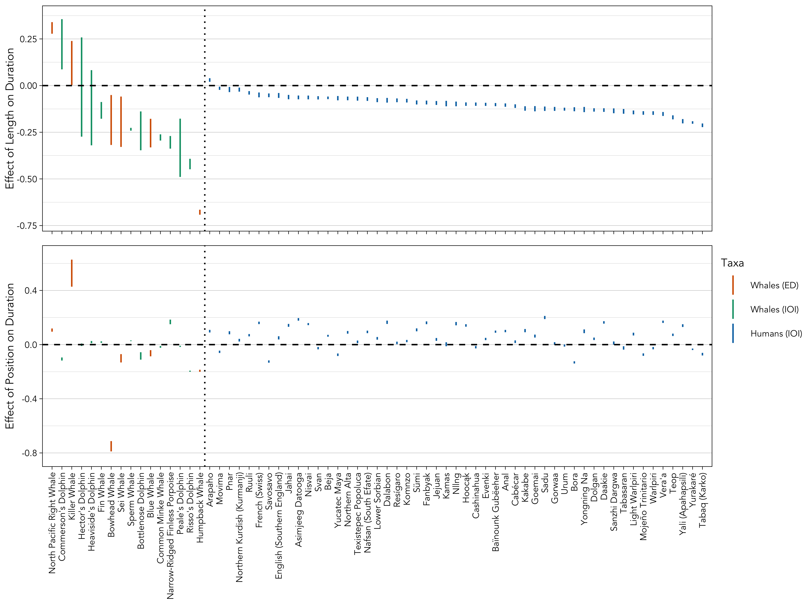

<!--- Bibliography management done via (cmd+k to insert): https://gsverhoeven.github.io/post/zotero-rmarkdown-csl/ -->
<!-- Github hosting done via: https://mbounthavong.com/blog/2022/7/30/hosting-a-r-markdown-html-file-on-a-github-page -->

```{r word-doc, echo = FALSE, eval = TRUE}
#note that several aspects of formatting aren't working properly
  #incorrect formatting of special characters in table 1
  #code blocks print
  #abstract header looks bad
  #equation labels of 7 and 8 need custom formatting
  #set font to 10-point garamond in table 2 and 3
  #replace indents with five spaces in table 2 and 3
#if output is a word document
if(!knitr::is_html_output()){
  #hide all code
  knitr::opts_chunk$set(echo = FALSE)
  
  #set fonts of flextables
  flextable::set_flextable_defaults(font.family = "Garamond", font.size = 10, padding.top = 1, padding.bottom = 1, keep_with_next = TRUE)
}
```

```{css, echo = FALSE}
pre, code {white-space:pre !important; overflow-x:auto}

/* Move code folding buttons to the left */
div.col-md-12 .pull-right {
  float: left !important
}
```

<br>
&copy; Popular Mechanics

# Links {-}

* [Main text](https://masonyoungblood.github.io/whale_efficiency/)
* [Supplementary information](https://masonyoungblood.github.io/whale_efficiency/supplement/supplement.html)
* [Science Advances publication](https://www.science.org/doi/10.1126/sciadv.ads6014)
* [PsyArXiv preprint](https://doi.org/10.31234/osf.io/tduab)
* [GitHub repository](https://github.com/masonyoungblood/whale_efficiency)
* [DoReCo reference list](https://masonyoungblood.github.io/whale_efficiency/supplement/doreco_list.html)

```{r admin, echo = FALSE, eval = TRUE, warning = FALSE, message = FALSE}
#set working directory, load sheet of datasets used, and source modeling functions
setwd("~/Documents/Work/Spring 2024/Whale ZLA/whale_efficiency/docs")
datasets <- readxl::read_xlsx("data/datasets.xlsx")
source("functions.R")

#load datasets
files <- list.files("data/processed_menz/")[grep(".RData", list.files("data/processed_menz/"))]
for(i in 1:length(files)){load(paste0("data/processed_menz/", files[i]))}
```

```{r data-sizes, echo = FALSE, eval = TRUE}
#store labels for each dataset (from phylo plot)
data_sizes <- lapply(list(sperm_data, humpback_data, humpback_phrase_data, fin_data, killer_data, killer_sequence_data, blue_data, minke_data, bowhead_data, right_data, narrow_data, rissos_data, bottlenose_data, heavisides_data, commersons_data, peales_data, hectors_data, sei_data), label_maker)

#get number of elements and intervals, sequences, and studies
n_elements <- sum(sapply(data_sizes, function(x){as.numeric(gsub(",", "", gsub(" Elements.*", "", x)))})) #number of elements and intervals
n_sequences <- sum(sapply(data_sizes, function(x){as.numeric(gsub(",", "", gsub(".*Elements\n", "", gsub(" Sequences.*", "", x))))})) #number of sequences
n_studies <- sum(sapply(data_sizes, function(x){as.numeric(as.numeric(gsub(" Stud.*", "", gsub(".*Sequences\n", "", x))))})) #number of studies
```

# Introduction

Vocal communication is essential to survival and reproduction in many species, as it enables individuals to convey critical information related to predation, resource access, courtship, and social relationships [@seyfarth_etal10]. More complex signals, which vary across multiple dimensions, can encode greater amounts of information [@fitch00], and redundancy increases the likelihood of successful transmission between signalers and receivers [@hebets_etal16]. However, elaborate and sustained vocalizations carry considerable costs, including heightened predation risk [@semple_etal10] and increased energetic demands, sometimes up to 2-8 times the resting metabolic rate in certain species [@ophir_etal10]. Consequently, vocal communication systems experience selection for efficiency [@endler93]&mdash;optimizing the benefits they convey relative to the costs of producing them [@gibson_etal19; @gruber_etal22]&mdash;a concept closely related to the "principle of least effort" in linguistics [@zipf49].

One of the simplest ways to increase efficiency is by reducing vocalization time [@semple_etal10]. Individuals who convey the same information in less time incur lower metabolic costs [@noren_etal13] and are less likely to be detected by predators and potential prey [@semple_etal10]. Vocalization time can evolve in response to factors that alter the relative costs and benefits of communication, like group size [@may-collado_etal07], as well as physical features that affect vocal production [@elemans_etal24]. Within species, vocalization time may also change over generations through cultural evolution (i.e., via social learning) [@moseleyEvidenceDifferingTrajectories2019], and within individuals during ontogeny [@zeh_etal24] or as a flexible response to anthropogenic noise [@lesage_etal99; @sorensen_etal23; @foote_etal04; @fristrup_etal03], in a way that optimizes efficiency.

In human language, efficiency is often quantified through two linguistic laws that directly relate to vocalization time: Menzerath's law and Zipf's law of abbreviation. Imagine a set of sequences (e.g., sentences, words, songs), each composed of multiple elements (e.g., words, phonemes, notes). Menzerath's law predicts that longer sequences (e.g., songs, words) will be composed of shorter elements (e.g., notes, phonemes) [@menzerath54]. In other words, when production costs increase in one domain (e.g., sequence length) they decrease in another (e.g., element duration). Zipf's law of abbreviation predicts that more frequently used elements (e.g., notes, phonemes, words) will be shorter in duration [@zipf49]. Both laws result in an overall reduction in vocalization time, and mathematical modeling work indicates that they emerge from pressure for more efficient communication [@gustison_etal16; @ferrer-i-cancho_etal13; @torre_etal19].

Outside of human language, Menzerath's law and Zipf's law of abbreviation have been observed in an increasing number of species, including gibbons [@huang_etal20], African penguins [@favaro_etal20], and house finches [@youngblood24]. Comparative studies assessing both Menzerath's law and Zipf's law of abbreviation within the same species, however, reveal an interesting discrepancy: the former is always found [@clink_etal20; @deng_etal24; @favaro_etal20; @heesen_etal19; @huang_etal20; @lewis_etal23; @safryghinVariableExpressionLinguistic2022; @stepanov_etal23; @valente_etal21; @vradi21; @zhang_etal24; @youngblood24], whereas the latter only appears in around half of cases [@zhang_etal24; @favaro_etal20; @huang_etal20; @stepanov_etal23; @vradi21; @valente_etal21]. As others have noted, this discrepancy may stem from the laws reflecting different mechanisms or constraints [@stave_etal21; @lewis_etal23].

One hypothesis for this pattern is that Menzerath's law has primarily physical origins, driven by natural selection for a more efficient vocal apparatus. Menzerath's law in humans appears to be stronger in spoken than in written language [@torre_etal19; @hernandez-fernandez_etal19], deafened canaries and zebra finches produce songs consistent with the law without hearing adult models [@james_etal21], and African penguins display the law without engaging in vocal learning [@favaro_etal20]. In contrast, Zipf's law of abbreviation may result from a more a complex combination of factors [@gibson_etal19]. Physical efficiency appears to be important, as common words are shorter and have more easily articulated phoneme sequences [@mahowald_etal18], but predictability and informativeness may also play a role. Experiments with artificial languages show that Zipfian abbreviation emerges when participants are under pressure to be both informative and fast [@kanwal_etal17], speakers shorten words when their meaning is predictable from context [@mahowald_etal13], and information content may predict word length more than frequency in some conditions [@piantadosi_etal11]. The two laws, then, may have very different prerequisites. Menzerath's law might arise wherever vocalizations occur in sequences, regardless of whether learning is involved. In contrast, Zipf's law of abbreviation may require that elements form distinct categories that vary in predictability and convey meaningful information.

Communicative efficiency is relatively understudied in cetaceans. To my knowledge, Menzerath's law has only been observed in bottlenose dolphins [@vradi21; @stepanov_etal23], and Zipf's law of abbreviation has only been observed in humpback whales and bottlenose dolphins [@kang21; @vradi21; @stepanov_etal23]. Given cetaceans' extensive reliance on learned vocalizations for complex social behavior&mdash;from courtship in baleen whales to individual recognition and coordination in toothed whales [@janik14]&mdash;they offer a valuable research model for efficiency in non-human communication. Additionally, the breadth of data on cetacean vocalizations makes it possible to conduct a meta-analysis, assessing the prevalence and strength of Menzerath's law and Zipf's law of abbreviation in a wide range of species using previously published datasets. To-date, comprehensive meta-analyses of these two laws in vocal communication have only been done for human speech, where both appear to be statistical universals [@stave_etal21; @torre_etal19], and birdsong, where Menzerath's law is widespread [@james_etal21] but Zipf's law of abbreviation is quite rare [@gilman_etal23]. The aims of this meta-analysis were to (1) determine the prevalence of Menzerath's law and Zipf's law of abbreviation in cetaceans, and to (2) directly compare the strength of the laws in cetaceans with spoken human language data&mdash;in other words, assess whether vocal efficiency in cetaceans is "language-like".

In studies of Menzerath's law in vocal communication, duration is typically measured in one of two ways: (1) from the start to the end of a sound, or (2) from the start of one sound to the start of the next. The first method, which captures only the vocalization time and excludes pauses, is widely used for animal communication [@clink_etal20; @gustison_etal16; @huang_etal20; @james_etal21; @valente_etal21; @zhang_etal24]. I refer to this as the *element duration*&mdash;the difference between a sound's start and end time. The second method measures the vocalization time including the pause before the next sound. This approach has been used for marmosets [@risueno-segovia_etal23], bottlenose dolphins [@stepanov_etal23], and is standard for human speech [@hernandez-fernandez_etal19; @paschen_etal22; @torre_etal19], which is fairly continuous. Large spoken language corpora, such as Glissando [@hernandez-fernandez_etal19], Buckeye [@torre_etal19], and DoReCo [@paschen_etal22], include the small gaps between phonemes in their duration measurements. More broadly, this measure is the "go-to" for studies of rhythm in humans and animals [@hersh_etal24]. Following the rhythm literature, I refer to this as the *inter-onset interval*&mdash;the difference between the start of one sound and the start of the next. A couple of studies in treefrogs [@deng_etal24] and geladas [@gustison_etal16] have assessed Menzerath's law using only the pauses between sounds, to supplement analyses of element durations, but this approach is rare and will not be used in this study.

In cetacean vocalizations, element durations are typically used when sequences consist of distinct notes, calls, or elements, with information thought to be encoded in acoustic features like frequency, bandwidth, and timbre (analogous to birdsong, second and third row of Figure \@ref(fig:figure-spectrograms)). In contrast, inter-onset intervals are used when sequences are made up of uniform clicks or pulses, where the rhythmic timing is thought to encode information (analogous to human drumming, fourth and fifth row of Figure \@ref(fig:figure-spectrograms)). It is worth noting that the latter case is quite different from human language (first row of Figure \@ref(fig:figure-spectrograms)), where inter-onset intervals are used because gaps between phonemes are either absent or minimal. However, regardless of the measurement used&mdash;element durations or inter-onset intervals&mdash;Menzerath's law reflects the same underlying principle: "the greater the whole the smaller its parts" [@menzerath54; @altmann80]. In other words, when longer sequences are made up of smaller components, the total vocalization time is reduced. A recent study in marmosets illustrates this concept: when individuals were rewarded for producing an increasing number of vocalizations, they maximized their vocal efficiency by reducing both the element durations and inter-onset intervals of their call sequences [@risueno-segovia_etal23]. In this study, the distributions of element durations and inter-onset intervals in whale vocal sequences exhibit the same shape ([Supplementary Information](https://masonyoungblood.github.io/whale_efficiency/supplement/supplement.html)), and Menzerath's law is only slightly different when computed from intervals in both whales (Table \@ref(tab:all-species-table)) and humans ([Supplementary Information](https://masonyoungblood.github.io/whale_efficiency/supplement/supplement.html)).

```{r figure-spectrograms, echo = FALSE, fig.align = "center", out.width = "100%", fig.cap = "Spectrograms of an English sentence (first row), humpback whale song (second row), killer whale call sequence (third row), Commerson's dolphin burst pulse (fourth row), and sperm whale codas (fifth row) that were included in this study. These recordings include all vocalization types included in Table \\@ref(tab:table-datasets). The levels of hierarchy in each vocalization are labeled with text and white bars. The element durations (in humpback whales and killer whales) span from the beginning to the end of a sound, whereas the inter-onset intervals (in Commerson's dolphins and sperm whales) span from the beginning of a sound to the beginning of the next sound. Given the fairly continuous nature of human speech, durations of phonemes and words in the DoReCo corpus are measured from the beginning of a sound to the beginning of the next sound, identically to inter-onset intervals (see [Materials & Methods] for details)."}

```

# Results

```{r load-phylo-signal,echo = FALSE, eval = TRUE}
load("models/phylo_signal.RData")
```

```{r load-models, echo = FALSE, eval = TRUE}
#load fitted models
files <- list.files("models/")[grep(".RData", list.files("models/"))]
for(i in 1:length(files)){load(paste0("models/", files[i]))}
```

In total, this analysis includes `r format(n_elements, big.mark = ",")` elements and intervals from `r format(n_sequences, big.mark = ",")` sequences, `r format(n_studies, big.mark = ",")` studies, and `r length(unique(datasets$Species[which(datasets$Used == "Yes")]))` species (see Table \@ref(tab:table-datasets)). All datasets were suitable for assessing Menzerath's law. In contrast, Zipf's law of abbreviation makes predictions about types of elements, and thus requires elements to be categorized into types [@lewis_etal23]. Only `r length(which(datasets$ZLA == "Yes"))` datasets in `r length(unique(datasets$Species[which(datasets$ZLA == "Yes")]))` species were suitable for assessing Zipf's law of abbreviation (see Table \@ref(tab:table-datasets)), all of which measured element durations rather than inter-onset intervals.

As a comparison with the whale data, I also analyzed spoken language data from DoReCo&mdash;a corpus of ~500,000 annotated words (with phonemes) from 51 languages that focuses on small and endangered languages [@seifart_etal22] and has been used in previous studies of Menzerath's law and Zipf's law of abbreviation [@stave_etal21].

```{r data-table, echo = FALSE, message = FALSE, warning = FALSE}
#load libraries
library(flextable)
library(dplyr)
library(ftExtra)
library(officer)

#store data to print
table_data <- datasets[which(datasets$Used == "Yes"), c(6, 7, 8, 1, 11, 12, 5)]

#order by group and then by species
table_data <- table_data[with(table_data, order(Group, Species)), ]

#print table
flex_table <- flextable(table_data) %>% 
  merge_v(j = 1) %>% merge_v(j = 2) %>%
  theme_vanilla() %>% set_table_properties(layout = "autofit") %>%
  set_caption("The datasets included in this analysis, with whether they are open access, the vocalization category, and whether the sequences are comprised of element durations or inter-onset intervals. All datasets were appropriate for assessing Menzerath's law, and the subset that were also appropriate for Zipf's law of abbreviation are denoted in the final column.", autonum = run_autonum(seq_id = "tab", bkm = "table-datasets")) %>%
  colformat_md()
flex_table
```

## Menzerath's Law

The main model used to test Menzerath's law was a linear model with the log-transformed element duration or inter-onset interval as the outcome variable, the log-transformed sequence length (i.e., number of element durations or inter-onset intervals in the sequence) as a fixed effect, and sequence ID as a varying intercept to account for the repeated measurements of durations within sequences. This model is directly derived from the Menzerath-Altmann law&mdash;a precise and more robust mathematical form of Menzerath's law [@altmann80; @g_torre_etal21] (see [Materials & Methods] for details). Some species had multiple datasets, in which case the study ID was included as a second varying intercept. Here is the main model in Wilkinson notation&mdash;standard R model syntax.

\begin{equation}
\ln(\textrm{duration}) \sim \ln(\textrm{length}) + (1|\textrm{sequence})
(\#eq:lengthmodel)
\end{equation}

The strength of Menzerath's law in baleen and toothed whale species, computed using Equation \@ref(eq:lengthmodel), can be seen in Figures \@ref(fig:figure-myst-plot) and \@ref(fig:figure-odon-plot), respectively (see [Supplementary Information](https://masonyoungblood.github.io/whale_efficiency/supplement/supplement.html) for the same plots with transformed axes to match the statistical model). In all baleen whale species, except for the North Pacific right whale, there is a negative relationship between sequence length and element durations or inter-onset intervals consistent with Menzerath's law. The results are more mixed for the toothed whale species, where only five of the nine exhibit Menzerath's law. All three dolphins in the *Cephalorhynchus* genus, as well as killer whales, display a neutral or positive relationship between sequence length and element durations or inter-onset intervals.

```{r phylo_plot, echo = TRUE, eval = FALSE, warning = FALSE, message = FALSE}
#load libraries and data
library(ggtree)
cetaceans <- ape::read.tree("data/phylo_lloyd_2021.tre")

#create table of mysticetes tips
myst_tips <- data.frame(scientific = c("Megaptera_novaeangliae", #humpback
                                       "Balaenoptera_musculus", #blue
                                       "Balaenoptera_physalus", #fin
                                       "Balaenoptera_acutorostrata", #minke
                                       "Balaena_mysticetus", #bowhead
                                       "Eubalaena_japonica", #right
                                       "Balaenoptera_borealis"), #sei whale
                        common = c("Humpback Whale\n(Megaptera novaeangliae)",
                                   "Blue Whale\n(Balaenoptera musculus)",
                                   "Fin Whale\n(Balaenoptera physalus)",
                                   "Common Minke Whale\n(Balaenoptera acutorostrata)",
                                   "Bowhead Whale\n(Balaena mysticetus)",
                                   "North Pacific Right Whale\n(Eubalaena japonica)",
                                   "Sei Whale\n(Balaenoptera borealis)"),
                        img = c("humpback", "blue", "fin", "minke", "bowhead", "right", "sei"))

#create table of odontocete tips
odon_tips <- data.frame(scientific = c("Physeter_macrocephalus", #sperm
                                       "Orcinus_orca", #killer
                                       "Neophocaena_phocaenoides", #narrow-ridged finless porpoise (replaced species name with indo-pacific finless porpoise bc does not exist in phylo)
                                       "Grampus_griseus", #rissos dolphin
                                       "Tursiops_truncatus", #bottlenose dolphin
                                       "Cephalorhynchus_heavisidii", #heavisides dolphin
                                       "Cephalorhynchus_eutropia", #commersons dolphin (replaced species name with close relative bc does not exist in phylo)
                                       "Lagenorhynchus_albirostris", #peales dolphin (replaced species name with close relative bc does not exist in phylo)
                                       "Cephalorhynchus_hectori"), #hectors dolphin
                        common = c("Sperm Whale\n(Physeter macrocephalus)",
                                   "Killer Whale\n(Orcinus orca)",
                                   "Narrow-Ridged Finless Porpoise\n(Neophocaena asiaeorientalis)",
                                   "Risso's Dolphin\n(Grampus griseus)",
                                   "Bottlenose Dolphin\n(Tursiops truncatus)",
                                   "Heaviside's Dolphin\n(Cephalorhynchus heavisidii)",
                                   "Commerson's Dolphin\n(Cephalorhynchus commersonii)",
                                   "Peale's Dolphin\n(Lagenorhynchus australis)",
                                   "Hector's Dolphin\n(Cephalorhynchus hectori)"),
                        img = c("sperm", "killer", "narrow", "rissos", "dolphin", "heavisides", "commersons", "peales", "hectors"))

#subset the original phylogeny to only include the relevant species
mysticetes <- ape::keep.tip(cetaceans, myst_tips$scientific)
odonticetes <- ape::keep.tip(cetaceans, odon_tips$scientific)

#match up the tip labels with the image files
mysticetes$tip.label <- myst_tips$common[match(mysticetes$tip.label, myst_tips$scientific)]
mysticetes$file <- paste0("imgs/", myst_tips$img[match(mysticetes$tip.label, myst_tips$common)], ".svg")
odonticetes$tip.label <- odon_tips$common[match(odonticetes$tip.label, odon_tips$scientific)]
odonticetes$file <- paste0("imgs/", odon_tips$img[match(odonticetes$tip.label, odon_tips$common)], ".svg")

#generate colors for each species
colors <- hues::iwanthue(nrow(myst_tips)+nrow(odon_tips), hmin = 0, hmax = 360, cmin = 0, cmax = 180, lmin = 50, lmax = 60)
#hues::iwanthue(nrow(myst_tips)+nrow(odon_tips), hmin = 0, hmax = 360, cmin = 30, cmax = 80, lmin = 35, lmax = 80)
#set.seed(12)
set.seed(3)
#set.seed(12345)
#set.seed(123)
#set.seed(1234)
colors <- colors[sample(1:(nrow(myst_tips)+nrow(odon_tips)))]

#construct un-annotated phylogeny plot for mysticetes
myst_phylo_plot <- ggtree(mysticetes, branch.length = "none", layout = "roundrect")
myst_phylo_plot$data$file <- c(mysticetes$file, rep(NA, nrow(myst_phylo_plot$data) - nrow(myst_tips)))
myst_phylo_plot <- myst_phylo_plot + 
  geom_tiplab(aes(image = file, color = label), geom = "image", offset = 9, size = 0.06, align = TRUE) + xlim(NA, 13.5) + 
  geom_tiplab(aes(color = label), geom = "label", family = "Avenir", parse = FALSE, align = TRUE, size = 2.5) + 
  scale_color_manual(values = colors[1:nrow(myst_tips)]) + theme(legend.position = "none") + ylim(0.5, nrow(myst_tips))

#construct un-annotated phylogeny plot for odontocetes
odon_phylo_plot <- ggtree(odonticetes, branch.length = "none", layout = "roundrect")
odon_phylo_plot$data$file <- c(odonticetes$file, rep(NA, nrow(odon_phylo_plot$data) - nrow(odon_tips)))
odon_phylo_plot <- odon_phylo_plot + 
  geom_tiplab(aes(image = file, color = label), geom = "image", offset = 21, size = 0.05, align = TRUE) + xlim(NA, 28) + 
  geom_tiplab(aes(color = label), geom = "label", family = "Avenir", parse = FALSE, align = TRUE, size = 2.5) + 
  scale_color_manual(values = colors[(nrow(myst_tips)+1):(nrow(myst_tips)+nrow(odon_tips))]) + theme(legend.position = "none") + ylim(0.5, nrow(odon_tips))

#create plot labels for mysticetes
myst_labels <- c(label_maker(bowhead_data, intervals = TRUE),
                 label_maker(right_data),
                 label_maker(minke_data, intervals = TRUE),
                 label_maker(sei_data),
                 label_maker(blue_data),
                 label_maker(fin_data, intervals = TRUE),
                 label_maker(humpback_data))

#create plot labels for odontocetes
odon_labels <- c(label_maker(sperm_data, intervals = TRUE),
                 label_maker(narrow_data, intervals = TRUE),
                 label_maker(killer_data),
                 label_maker(peales_data, intervals = TRUE),
                 label_maker(bottlenose_data, intervals = TRUE),
                 label_maker(rissos_data, intervals = TRUE),
                 label_maker(heavisides_data, intervals = TRUE),
                 label_maker(commersons_data, intervals = TRUE),
                 label_maker(hectors_data, intervals = TRUE))

#add annotations to mysticetes
myst_phylo_plot <- myst_phylo_plot + annotate("text", label = myst_labels, x = rep(max(myst_phylo_plot$data$x), length(myst_labels)), y = (1:length(myst_labels))-0.35, hjust = 0, family = "Avenir", size = 2.2, lineheight = 0.8)
myst_phylo_plot <- myst_phylo_plot + annotate("text", label = "Baleen Whales (Mysticetes)", x = min(myst_phylo_plot$data$x)-0.65, y = myst_phylo_plot$data$y[which.min(myst_phylo_plot$data$x)], angle = 90, family = "Avenir", size = 3)

#add annotations to odontocetes
odon_phylo_plot <- odon_phylo_plot + annotate("text", label = odon_labels, x = rep(max(odon_phylo_plot$data$x), length(odon_labels)), y = (1:length(odon_labels))-0.35, hjust = 0, family = "Avenir", size = 2.2, lineheight = 0.8)
odon_phylo_plot <- odon_phylo_plot + annotate("text", label = "Toothed Whales (Odontocetes)", x = min(odon_phylo_plot$data$x)-1.4, y = odon_phylo_plot$data$y[which.min(odon_phylo_plot$data$x)], angle = 90, family = "Avenir", size = 3)

#match up the colors between phylogeny and menzerath's law plots based on the labels
color_matching <- data.frame(species = c(myst_phylo_plot$data$label[-which(is.na(myst_phylo_plot$data$label))], odon_phylo_plot$data$label[-which(is.na(odon_phylo_plot$data$label))]), color_code = colors[c(as.numeric(factor(mysticetes$tip.label)), as.numeric(factor(odonticetes$tip.label))+nrow(myst_tips))])

#create menzerath's law plots for each species
blue_plot <- menz_plot(data = blue_data, model = blue_models, color = color_matching$color_code[grep("Blue ", color_matching$species)])
bowhead_plot <- menz_plot(data = bowhead_data, model = bowhead_models, intervals = TRUE, color = color_matching$color_code[grep("Bowhead ", color_matching$species)])
fin_plot <- menz_plot(data = fin_data, model = fin_models, intervals = TRUE, color = color_matching$color_code[grep("Fin ", color_matching$species)])
humpback_plot <- menz_plot(data = humpback_data, model = humpback_models, color = color_matching$color_code[grep("Humpback ", color_matching$species)])
minke_plot <- menz_plot(data = minke_data, model = minke_models, intervals = TRUE, color = color_matching$color_code[grep("Minke ", color_matching$species)])
right_plot <- menz_plot(data = right_data, model = right_models, color = color_matching$color_code[grep("Right ", color_matching$species)])
sei_plot <- menz_plot(data = sei_data, model = sei_models, color = color_matching$color_code[grep("Sei ", color_matching$species)])
killer_plot <- menz_plot(data = killer_data, model = killer_models, color = color_matching$color_code[grep("Killer ", color_matching$species)], effects_axis = c(-0.6, 0.4))
sperm_plot <- menz_plot(data = sperm_data, model = sperm_models, intervals = TRUE, color = color_matching$color_code[grep("Sperm ", color_matching$species)], effects_axis = c(-0.6, 0.4))
narrow_plot <- menz_plot(data = narrow_data, model = narrow_models, intervals = TRUE, color = color_matching$color_code[grep(" Porpoise", color_matching$species)], effects_axis = c(-0.6, 0.4))
rissos_plot <- menz_plot(data = rissos_data, model = rissos_models, intervals = TRUE, color = color_matching$color_code[grep("Risso's ", color_matching$species)], effects_axis = c(-0.6, 0.4))
bottlenose_plot <- menz_plot(data = bottlenose_data, model = bottlenose_models, intervals = TRUE, color = color_matching$color_code[grep("Bottlenose ", color_matching$species)], effects_axis = c(-0.6, 0.4))
heavisides_plot <- menz_plot(data = heavisides_data, model = heavisides_models, intervals = TRUE, color = color_matching$color_code[grep("Heaviside's ", color_matching$species)], effects_axis = c(-0.6, 0.4))
commersons_plot <- menz_plot(data = commersons_data, model = commersons_models, intervals = TRUE, color = color_matching$color_code[grep("Commerson's ", color_matching$species)], effects_axis = c(-0.6, 0.4))
peales_plot <- menz_plot(data = peales_data, model = peales_models, intervals = TRUE, color = color_matching$color_code[grep("Peale's ", color_matching$species)], effects_axis = c(-0.6, 0.4))
hectors_plot <- menz_plot(data = hectors_data, model = hectors_models, intervals = TRUE, color = color_matching$color_code[grep("Hector's ", color_matching$species)], effects_axis = c(-0.6, 0.4))

#create and save full phylogeny plot for mysticetes
png("plots/myst_phylo.png", width = 6, height = nrow(myst_tips), units = "in", res = 600)
#svglite::svglite(filename = "plots/myst_phylo.svg", width = 6, height = nrow(myst_tips))
right_panel <- cowplot::plot_grid(humpback_plot, fin_plot, blue_plot, sei_plot, minke_plot, right_plot, bowhead_plot, NULL,
                                  ncol = 1, rel_heights = c(rep(1, nrow(myst_tips)), 0.35))
bottom_row <- cowplot::plot_grid(myst_phylo_plot, right_panel, rel_widths = c(1, 1))
bottom_row
dev.off()

#create and save full phylogeny plot for odontocetes
png("plots/odon_phylo.png", width = 6, height = nrow(odon_tips), units = "in", res = 600)
#svglite::svglite("plots/odon_phylo.svg", width = 6, height = nrow(odon_tips))
right_panel <- cowplot::plot_grid(hectors_plot, commersons_plot, heavisides_plot, rissos_plot, bottlenose_plot, peales_plot, killer_plot, narrow_plot, sperm_plot, NULL,
                                  ncol = 1, rel_heights = c(rep(1, nrow(odon_tips)), 0.35))
bottom_row <- cowplot::plot_grid(odon_phylo_plot, right_panel, rel_widths = c(1, 1))
bottom_row
dev.off()
```

```{r phylo_plot_trans, echo = FALSE, eval = FALSE, warning = FALSE, message = FALSE}
#load libraries and data
library(ggtree)
cetaceans <- ape::read.tree("data/phylo_lloyd_2021.tre")

#create table of mysticetes tips
myst_tips <- data.frame(scientific = c("Megaptera_novaeangliae", #humpback
                                       "Balaenoptera_musculus", #blue
                                       "Balaenoptera_physalus", #fin
                                       "Balaenoptera_acutorostrata", #minke
                                       "Balaena_mysticetus", #bowhead
                                       "Eubalaena_japonica", #right
                                       "Balaenoptera_borealis"), #sei whale
                        common = c("Humpback Whale\n(Megaptera novaeangliae)",
                                   "Blue Whale\n(Balaenoptera musculus)",
                                   "Fin Whale\n(Balaenoptera physalus)",
                                   "Common Minke Whale\n(Balaenoptera acutorostrata)",
                                   "Bowhead Whale\n(Balaena mysticetus)",
                                   "North Pacific Right Whale\n(Eubalaena japonica)",
                                   "Sei Whale\n(Balaenoptera borealis)"),
                        img = c("humpback", "blue", "fin", "minke", "bowhead", "right", "sei"))

#create table of odontocete tips
odon_tips <- data.frame(scientific = c("Physeter_macrocephalus", #sperm
                                       "Orcinus_orca", #killer
                                       "Neophocaena_phocaenoides", #narrow-ridged finless porpoise (replaced species name with indo-pacific finless porpoise bc does not exist in phylo)
                                       "Grampus_griseus", #rissos dolphin
                                       "Tursiops_truncatus", #bottlenose dolphin
                                       "Cephalorhynchus_heavisidii", #heavisides dolphin
                                       "Cephalorhynchus_eutropia", #commersons dolphin (replaced species name with close relative bc does not exist in phylo)
                                       "Lagenorhynchus_albirostris", #peales dolphin (replaced species name with close relative bc does not exist in phylo)
                                       "Cephalorhynchus_hectori"), #hectors dolphin
                        common = c("Sperm Whale\n(Physeter macrocephalus)",
                                   "Killer Whale\n(Orcinus orca)",
                                   "Narrow-Ridged Finless Porpoise\n(Neophocaena asiaeorientalis)",
                                   "Risso's Dolphin\n(Grampus griseus)",
                                   "Bottlenose Dolphin\n(Tursiops truncatus)",
                                   "Heaviside's Dolphin\n(Cephalorhynchus heavisidii)",
                                   "Commerson's Dolphin\n(Cephalorhynchus commersonii)",
                                   "Peale's Dolphin\n(Lagenorhynchus australis)",
                                   "Hector's Dolphin\n(Cephalorhynchus hectori)"),
                        img = c("sperm", "killer", "narrow", "rissos", "dolphin", "heavisides", "commersons", "peales", "hectors"))

#subset the original phylogeny to only include the relevant species
mysticetes <- ape::keep.tip(cetaceans, myst_tips$scientific)
odonticetes <- ape::keep.tip(cetaceans, odon_tips$scientific)

#match up the tip labels with the image files
mysticetes$tip.label <- myst_tips$common[match(mysticetes$tip.label, myst_tips$scientific)]
mysticetes$file <- paste0("imgs/", myst_tips$img[match(mysticetes$tip.label, myst_tips$common)], ".svg")
odonticetes$tip.label <- odon_tips$common[match(odonticetes$tip.label, odon_tips$scientific)]
odonticetes$file <- paste0("imgs/", odon_tips$img[match(odonticetes$tip.label, odon_tips$common)], ".svg")

#generate colors for each species
colors <- hues::iwanthue(nrow(myst_tips)+nrow(odon_tips), hmin = 0, hmax = 360, cmin = 0, cmax = 180, lmin = 50, lmax = 60)
#hues::iwanthue(nrow(myst_tips)+nrow(odon_tips), hmin = 0, hmax = 360, cmin = 30, cmax = 80, lmin = 35, lmax = 80)
#set.seed(12)
set.seed(3)
#set.seed(12345)
#set.seed(123)
#set.seed(1234)
colors <- colors[sample(1:(nrow(myst_tips)+nrow(odon_tips)))]

#construct un-annotated phylogeny plot for mysticetes
myst_phylo_plot <- ggtree(mysticetes, branch.length = "none", layout = "roundrect")
myst_phylo_plot$data$file <- c(mysticetes$file, rep(NA, nrow(myst_phylo_plot$data) - nrow(myst_tips)))
myst_phylo_plot <- myst_phylo_plot + 
  geom_tiplab(aes(image = file, color = label), geom = "image", offset = 9, size = 0.06, align = TRUE) + xlim(NA, 13.5) + 
  geom_tiplab(aes(color = label), geom = "label", family = "Avenir", parse = FALSE, align = TRUE, size = 2.5) + 
  scale_color_manual(values = colors[1:nrow(myst_tips)]) + theme(legend.position = "none") + ylim(0.5, nrow(myst_tips))

#construct un-annotated phylogeny plot for odontocetes
odon_phylo_plot <- ggtree(odonticetes, branch.length = "none", layout = "roundrect")
odon_phylo_plot$data$file <- c(odonticetes$file, rep(NA, nrow(odon_phylo_plot$data) - nrow(odon_tips)))
odon_phylo_plot <- odon_phylo_plot + 
  geom_tiplab(aes(image = file, color = label), geom = "image", offset = 21, size = 0.05, align = TRUE) + xlim(NA, 28) + 
  geom_tiplab(aes(color = label), geom = "label", family = "Avenir", parse = FALSE, align = TRUE, size = 2.5) + 
  scale_color_manual(values = colors[(nrow(myst_tips)+1):(nrow(myst_tips)+nrow(odon_tips))]) + theme(legend.position = "none") + ylim(0.5, nrow(odon_tips))

#create plot labels for mysticetes
myst_labels <- c(label_maker(bowhead_data, intervals = TRUE),
                 label_maker(right_data),
                 label_maker(minke_data, intervals = TRUE),
                 label_maker(sei_data),
                 label_maker(blue_data),
                 label_maker(fin_data, intervals = TRUE),
                 label_maker(humpback_data))

#create plot labels for odontocetes
odon_labels <- c(label_maker(sperm_data, intervals = TRUE),
                 label_maker(narrow_data, intervals = TRUE),
                 label_maker(killer_data),
                 label_maker(peales_data, intervals = TRUE),
                 label_maker(bottlenose_data, intervals = TRUE),
                 label_maker(rissos_data, intervals = TRUE),
                 label_maker(heavisides_data, intervals = TRUE),
                 label_maker(commersons_data, intervals = TRUE),
                 label_maker(hectors_data, intervals = TRUE))

#add annotations to mysticetes
myst_phylo_plot <- myst_phylo_plot + annotate("text", label = myst_labels, x = rep(max(myst_phylo_plot$data$x), length(myst_labels)), y = (1:length(myst_labels))-0.35, hjust = 0, family = "Avenir", size = 2.2, lineheight = 0.8)
myst_phylo_plot <- myst_phylo_plot + annotate("text", label = "Baleen Whales (Mysticetes)", x = min(myst_phylo_plot$data$x)-0.65, y = myst_phylo_plot$data$y[which.min(myst_phylo_plot$data$x)], angle = 90, family = "Avenir", size = 3)

#add annotations to odontocetes
odon_phylo_plot <- odon_phylo_plot + annotate("text", label = odon_labels, x = rep(max(odon_phylo_plot$data$x), length(odon_labels)), y = (1:length(odon_labels))-0.35, hjust = 0, family = "Avenir", size = 2.2, lineheight = 0.8)
odon_phylo_plot <- odon_phylo_plot + annotate("text", label = "Toothed Whales (Odontocetes)", x = min(odon_phylo_plot$data$x)-1.4, y = odon_phylo_plot$data$y[which.min(odon_phylo_plot$data$x)], angle = 90, family = "Avenir", size = 3)

#match up the colors between phylogeny and menzerath's law plots based on the labels
color_matching <- data.frame(species = c(myst_phylo_plot$data$label[-which(is.na(myst_phylo_plot$data$label))], odon_phylo_plot$data$label[-which(is.na(odon_phylo_plot$data$label))]), color_code = colors[c(as.numeric(factor(mysticetes$tip.label)), as.numeric(factor(odonticetes$tip.label))+nrow(myst_tips))])

#create menzerath's law plots for each species
blue_plot <- menz_plot(data = blue_data, model = blue_models, color = color_matching$color_code[grep("Blue ", color_matching$species)], original_axes = FALSE, y_breaks = 3)
bowhead_plot <- menz_plot(data = bowhead_data, model = bowhead_models, intervals = TRUE, color = color_matching$color_code[grep("Bowhead ", color_matching$species)], original_axes = FALSE, y_breaks = 3)
fin_plot <- menz_plot(data = fin_data, model = fin_models, intervals = TRUE, color = color_matching$color_code[grep("Fin ", color_matching$species)], original_axes = FALSE, y_breaks = 3)
humpback_plot <- menz_plot(data = humpback_data, model = humpback_models, color = color_matching$color_code[grep("Humpback ", color_matching$species)], original_axes = FALSE, y_breaks = 3)
minke_plot <- menz_plot(data = minke_data, model = minke_models, intervals = TRUE, color = color_matching$color_code[grep("Minke ", color_matching$species)], original_axes = FALSE, y_breaks = 3)
right_plot <- menz_plot(data = right_data, model = right_models, color = color_matching$color_code[grep("Right ", color_matching$species)], original_axes = FALSE, y_breaks = 3)
sei_plot <- menz_plot(data = sei_data, model = sei_models, color = color_matching$color_code[grep("Sei ", color_matching$species)], original_axes = FALSE, y_breaks = 3)
killer_plot <- menz_plot(data = killer_data, model = killer_models, color = color_matching$color_code[grep("Killer ", color_matching$species)], effects_axis = c(-0.6, 0.4), original_axes = FALSE, y_breaks = 3)
sperm_plot <- menz_plot(data = sperm_data, model = sperm_models, intervals = TRUE, color = color_matching$color_code[grep("Sperm ", color_matching$species)], effects_axis = c(-0.6, 0.4), original_axes = FALSE, y_breaks = 3)
narrow_plot <- menz_plot(data = narrow_data, model = narrow_models, intervals = TRUE, color = color_matching$color_code[grep(" Porpoise", color_matching$species)], effects_axis = c(-0.6, 0.4), original_axes = FALSE, y_breaks = 3)
rissos_plot <- menz_plot(data = rissos_data, model = rissos_models, intervals = TRUE, color = color_matching$color_code[grep("Risso's ", color_matching$species)], effects_axis = c(-0.6, 0.4), original_axes = FALSE, y_breaks = 3)
bottlenose_plot <- menz_plot(data = bottlenose_data, model = bottlenose_models, intervals = TRUE, color = color_matching$color_code[grep("Bottlenose ", color_matching$species)], effects_axis = c(-0.6, 0.4), original_axes = FALSE, y_breaks = 3)
heavisides_plot <- menz_plot(data = heavisides_data, model = heavisides_models, intervals = TRUE, color = color_matching$color_code[grep("Heaviside's ", color_matching$species)], effects_axis = c(-0.6, 0.4), original_axes = FALSE, y_breaks = 3)
commersons_plot <- menz_plot(data = commersons_data, model = commersons_models, intervals = TRUE, color = color_matching$color_code[grep("Commerson's ", color_matching$species)], effects_axis = c(-0.6, 0.4), original_axes = FALSE, y_breaks = 3)
peales_plot <- menz_plot(data = peales_data, model = peales_models, intervals = TRUE, color = color_matching$color_code[grep("Peale's ", color_matching$species)], effects_axis = c(-0.6, 0.4), original_axes = FALSE, y_breaks = 3)
hectors_plot <- menz_plot(data = hectors_data, model = hectors_models, intervals = TRUE, color = color_matching$color_code[grep("Hector's ", color_matching$species)], effects_axis = c(-0.6, 0.4), original_axes = FALSE, y_breaks = 3)

#create and save full phylogeny plot for mysticetes
png("plots/myst_phylo_trans.png", width = 6, height = nrow(myst_tips), units = "in", res = 600)
right_panel <- cowplot::plot_grid(humpback_plot, fin_plot, blue_plot, sei_plot, minke_plot, right_plot, bowhead_plot, NULL,
                                  ncol = 1, rel_heights = c(rep(1, nrow(myst_tips)), 0.35))
bottom_row <- cowplot::plot_grid(myst_phylo_plot, right_panel, rel_widths = c(1, 1))
bottom_row
dev.off()

#create and save full phylogeny plot for odontocetes
png("plots/odon_phylo_trans.png", width = 6, height = nrow(odon_tips), units = "in", res = 600)
right_panel <- cowplot::plot_grid(hectors_plot, commersons_plot, heavisides_plot, rissos_plot, bottlenose_plot, peales_plot, killer_plot, narrow_plot, sperm_plot, NULL,
                                  ncol = 1, rel_heights = c(rep(1, nrow(odon_tips)), 0.35))
bottom_row <- cowplot::plot_grid(odon_phylo_plot, right_panel, rel_widths = c(1, 1))
bottom_row
dev.off()
```

```{r figure-myst-plot, echo = FALSE, fig.align = "center", out.width = "80%", fig.cap = "The baleen whale (Mysticete) species included in the study (left), alongside the distribution of element durations or inter-onset intervals and sequence lengths (middle) and the slope of Menzerath's law (right). Each point in the distribution plots (middle) marks the mean element duration or inter-onset interval, but the slopes on the right were computed from the full set of elements/intervals. The bars in the slope plots (right) mark the 95% confidence intervals around the point estimates."}

```

Interestingly, the North Pacific right whales have four distinct clusters of sequences in Figure \@ref(fig:figure-myst-plot), which directly correspond to the four song types identified by Crance et al. [@crance_etal19]. The strong positive relationship between sequence length and element duration appears to be driven by the distribution of these clusters. Menzerath's law makes no predictions about different categories of sequences, but it is worth noting that when Equation \@ref(eq:lengthmodel) is computed separately on each song type the results vary (GS1-PF estimate: `r round(extract_freq_effects(right_type_models[[1]])$length[2], 2)`, 95% CI: [`r round(extract_freq_effects(right_type_models[[1]])$length[1], 2)`, `r round(extract_freq_effects(right_type_models[[1]])$length[3], 2)`]; GS4-DG estimate: `r round(extract_freq_effects(right_type_models[[2]])$length[2], 2)`, 95% CI: [`r round(extract_freq_effects(right_type_models[[2]])$length[1], 2)`, `r round(extract_freq_effects(right_type_models[[2]])$length[3], 2)`]; GS3-PU estimate: `r round(extract_freq_effects(right_type_models[[3]])$length[2], 2)`, 95% CI: [`r round(extract_freq_effects(right_type_models[[3]])$length[1], 2)`, `r round(extract_freq_effects(right_type_models[[3]])$length[3], 2)`]; GS2-TP estimate: `r round(extract_freq_effects(right_type_models[[4]])$length[2], 2)`, 95% CI: [`r round(extract_freq_effects(right_type_models[[4]])$length[1], 2)`, `r round(extract_freq_effects(right_type_models[[4]])$length[3], 2)`]). Note that the GS* abbreviations are the North Pacific right whale song types, as named by Crance et al. [@crance_etal19].

For humpback and killer whales, I also assessed Menzerath's law using data from a higher level of analysis (i.e., one step up in the structural hierarchy). In humpback whales, I found that the length of songs negatively predicted the duration of phrases (estimate = `r round(fixef(humpback_phrase_models$actual$reduced_scaled)[2], 3)`, 95% CI: [`r round(confint(humpback_phrase_models$actual$reduced_scaled, method = "Wald")[5, 1], 3)`, `r round(confint(humpback_phrase_models$actual$reduced_scaled, method = "Wald")[5, 2], 3)`], using Equation \@ref(eq:lengthmodel)), similar to the pattern for notes within phrases. Interestingly, in killer whales I found that the length of call sequences negatively predicted the duration of calls (estimate = `r round(fixef(killer_sequence_models$actual$reduced_scaled)[2], 3)`, 95% CI: [`r round(confint(killer_sequence_models$actual$reduced_scaled, method = "Wald")[4, 1], 3)`, `r round(confint(killer_sequence_models$actual$reduced_scaled, method = "Wald")[4, 2], 3)`], Equation \@ref(eq:lengthmodel)), even though the situation is reversed for elements within calls (Figure \@ref(fig:figure-odon-plot)).

```{r figure-odon-plot, echo = FALSE, fig.align = "center", out.width = "80%", fig.cap = "The toothed whale (Odontocete) species included in the study (left), alongside the distribution of element durations or inter-onset intervals and sequence lengths (middle) and the slope of Menzerath's law (right). Each point in the distribution plots (middle) marks the mean element duration or inter-onset interval, but the slopes on the right were computed from the full set of elements/intervals. The bars in the slope plots (right) mark the 95% confidence intervals around the point estimates."}
knitr::include_graphics("plots/odon_phylo.png")
```

Additionally, I fit a second model that included the position of each element or inter-onset interval in the sequence as a fixed effect, following previous studies of Menzerath's law in non-human animals [@james_etal21; @lewis_etal23; @vradi21; @gustison_etal16; @clink_lau20; @huang_etal20]. Position was normalized between 0 and 1 using the function $(n - 1)/(l - 1)$, where $n$ is the position of the element or interval and $l$ is the length of the sequence [@james_etal21]. The purpose of this model was to assess whether Menzerath's law is driven by a shortening of elements or intervals over the course of the sequence, or a tendency to begin long sequences with shorter elements or intervals.

\begin{equation}
\ln(\textrm{duration}) \sim \ln(\textrm{length}) + \textrm{position} + (1|\textrm{sequence})
(\#eq:positionmodel)
\end{equation}

Figure \@ref(fig:figure-word-effects) shows a direct comparison between the strength of Menzerath's law in the whale data and the spoken human language data (i.e., phonemes within words) from the DoReCo corpus [@seifart_etal22], alongside the influence of the position of elements or inter-onset intervals on their duration computed using Equations \@ref(eq:lengthmodel) and \@ref(eq:positionmodel). The same results for words within sentences can be seen in the [Supplementary Information](https://masonyoungblood.github.io/whale_efficiency/supplement/supplement.html). The 11 whale species that adhere to Menzerath's law express it to at least a similar extent as the human languages, and sometimes to a much greater extent (e.g., humpback whales). The effect of the position of elements and intervals on their duration is much more variable. Human languages tend to have a positive relationship between position and inter-onset intervals, which means that intervals are lengthened as sequences progress. Whales, on the other hand, appear to shorten elements and intervals over the course of sequences (see Table \@ref(tab:all-species-table)), but this varies dramatically across species.

Interestingly, there are several exceptions to Menzerath's law in the human language data. Arapaho exhibits a positive effect of word length on the inter-onset intervals of phonemes (Figure \@ref(fig:figure-word-effects)), and Tabasaran, Sanzhi Dargwa, Pnar, English (recorded in southern England), Yongning Na, and Cabécar show no effect of sentence length on the inter-onset intervals of words ([Supplementary Information](https://masonyoungblood.github.io/whale_efficiency/supplement/supplement.html)). These exceptions come from a wide variety of language families (e.g., Algic, Nakh-Daghestanian, Austroasiatic, Indo-European, Sino-Tibetan, Chibchan) from North America, Europe, and Asia.

```{r phonemes-in-words, echo = TRUE, eval = FALSE, message = FALSE, warning = FALSE}
#get labels for plotting
human_dataset_labels <- list.files("data/doreco/")
human_dataset_labels <- substr(human_dataset_labels[grep("doreco", human_dataset_labels)], 1, 15)
human_dataset_labels <- as.character(sapply(human_dataset_labels, function(x){gsub(" DoReCo dataset.*", "", gsub("^The ", "", readLines(paste0("data/doreco/", x, "_extended/", x, "_dataset-info.txt")[1])[1]))}))

#extract effects for phonemes in words
phonemes_in_words_effects <- lapply(phonemes_in_words, extract_freq_effects)

#reformat words data in a format that is plottable
phonemes_in_words_plot_data <- data.frame(cbind(do.call(rbind, lapply(phonemes_in_words_effects, function(x){x$length})), do.call(rbind, lapply(phonemes_in_words_effects, function(x){x$position}))))
colnames(phonemes_in_words_plot_data) <- c("length_lower", "length_median", "length_upper", "position_lower", "position_median", "position_upper")
phonemes_in_words_plot_data$label <- human_dataset_labels
phonemes_in_words_plot_data <- phonemes_in_words_plot_data[order(phonemes_in_words_plot_data$length_median, decreasing = TRUE), ]
phonemes_in_words_plot_data$label[which(phonemes_in_words_plot_data$label == "Nǁng")] <- "Nllng" #special characters

#compute effects for whale data
whales_effects <- lapply(list(sperm_models, humpback_models, fin_models, killer_models, blue_models, minke_models, bowhead_models, right_models, narrow_models, heavisides_models, commersons_models, peales_models, hectors_models, rissos_models, bottlenose_models, sei_models), extract_freq_effects)

#reformat whale data in a format that is plottable
whales_plot_data <- data.frame(cbind(do.call(rbind, lapply(whales_effects, function(x){x$length})), do.call(rbind, lapply(whales_effects, function(x){x$position}))))
colnames(whales_plot_data) <- c("length_lower", "length_median", "length_upper", "position_lower", "position_median", "position_upper")
whales_plot_data$label <- c("Sperm Whale", "Humpback Whale", "Fin Whale", "Killer Whale", "Blue Whale", "Common Minke Whale", "Bowhead Whale", "North Pacific Right Whale", "Narrow-Ridged Finless Porpoise", "Heaviside's Dolphin", "Commerson's Dolphin", "Peale's Dolphin", "Hector's Dolphin", "Risso's Dolphin", "Bottlenose Dolphin", "Sei Whale")
whales_plot_data <- whales_plot_data[order(whales_plot_data$length_median, decreasing = TRUE), ]

#reorder everything for a single axis
whales_plot_data$x <- 1:nrow(whales_plot_data)
whales_plot_data$group <- c(1, 2, 1, 2, 2, 2, 1, 1, 2, 2, 1, 2, 2, 2, 2, 1) #1 is elements, 2 is intervals
phonemes_in_words_plot_data$x <- (max(whales_plot_data$x)+1):(max(whales_plot_data$x)+nrow(phonemes_in_words_plot_data))
phonemes_in_words_plot_data$group <- 3

#combine whale data with word data
combined_words_plot_data <- rbind(phonemes_in_words_plot_data, whales_plot_data)

#generate plot of phonemes in words against whales, for length
combined_words_length_plot <- ggplot(combined_words_plot_data) + 
  geom_linerange(aes(x = x, ymin = length_lower, ymax = length_upper, color = factor(group))) + 
  geom_hline(aes(yintercept = 0), lty = "dashed") + 
  geom_vline(aes(xintercept = nrow(whales_plot_data) + 0.5), lty = "dotted") + 
  scale_y_continuous(limits = c(min(combined_words_plot_data$length_lower)*1.05, max(combined_words_plot_data$length_upper)*1.05), 
                     #name = expression("95% CI for "~italic("b")~"(Strength of Menzerath's Law)")) + 
                     name = "Effect of Length on Duration") + 
  scale_x_continuous(breaks = combined_words_plot_data$x, labels = combined_words_plot_data$label, name = NULL, limits = c(0, nrow(combined_words_plot_data) + 1), expand = c(0, 0)) + 
  scale_color_manual(values = c("#D55E00", "#009E73", "#0072B2"), labels = c("Whales (ED)", "Whales (IOI)", "Humans (IOI)"), name = "Taxa") + 
  theme_linedraw(base_size = 8, base_family = "Avenir") + theme(axis.text.x = element_text(angle = 90, hjust = 0.99, vjust = 0.5), panel.grid.major.x = element_blank(), panel.grid.minor.x = element_blank())

#generate plot of phonemes in words against whales, for position
combined_words_position_plot <- ggplot(combined_words_plot_data) + 
  geom_linerange(aes(x = x, ymin = position_lower, ymax = position_upper, color = factor(group))) + 
  geom_hline(aes(yintercept = 0), lty = "dashed") + 
  geom_vline(aes(xintercept = nrow(whales_plot_data) + 0.5), lty = "dotted") + 
  scale_y_continuous(limits = c(min(combined_words_plot_data$position_lower)*1.05, max(combined_words_plot_data$position_upper)*1.05), 
                     #name = expression("95% CI for "~italic("b")~"(Strength of Menzerath's Law)")) + 
                     name = "Effect of Position on Duration") + 
  scale_x_continuous(breaks = combined_words_plot_data$x, labels = combined_words_plot_data$label, name = NULL, limits = c(0, nrow(combined_words_plot_data) + 1), expand = c(0, 0)) + 
  scale_color_manual(values = c("#D55E00", "#009E73", "#0072B2"), labels = c("Whales (ED)", "Whales (IOI)", "Humans (IOI)"), name = "Taxa") + 
  theme_linedraw(base_size = 8, base_family = "Avenir") + theme(axis.text.x = element_text(angle = 90, hjust = 0.99, vjust = 0.5), panel.grid.major.x = element_blank(), panel.grid.minor.x = element_blank())

#export plot of phonemes in words
png("plots/word_level_effects.png", width = 8, height = 6, units = "in", res = 600)
#svglite::svglite("plots/word_level_effects.svg", width = 8, height = 6)
cowplot::plot_grid(cowplot::plot_grid(combined_words_length_plot + theme(axis.text.x = element_blank(), legend.position = "none"), combined_words_position_plot + theme(legend.position = "none"), ncol = 1, align = "v", rel_heights = c(0.66, 1)), cowplot::get_legend(combined_words_length_plot), nrow = 1, rel_widths = c(1, 0.12))
dev.off()
```

```{r figure-word-effects, echo = FALSE, fig.align = "center", out.width = "100%", fig.cap = "The 95% confidence intervals for the effect of sequence length (top; computed from Equation \\@ref(eq:lengthmodel)) and position (bottom; computed from Equation \\@ref(eq:positionmodel)) on element duration and inter-onset intervals for the 16 whale species and 51 human languages. The human language data are comprised of phonemes within words. The colors correspond to the taxonomic group and whether the data are element durations (ED) or inter-onset intervals (IOI)."}

```

Finally, I assessed broader cross-species trends in Menzerath's law with expanded forms of Equation \@ref(eq:lengthmodel) and \@ref(eq:positionmodel) applied to all species at once&mdash;Equation \@ref(eq:lengthmodelall) and \@ref(eq:positionmodelall) below. Interactions between length and position and the following two features were added: (1) the group the species comes from, to determine whether the effect varies between Mysticetes and Odontocetes, and (2) the type of vocalization, to determine whether the effect is stronger for element durations or inter-onset intervals. Group and type were not added as separate fixed effects (outside of the interactions) because the z-scoring of duration within species removes species differences (see [Materials & Methods]). Sequence and study were included as varying intercepts. The effect of sequence length on elements and intervals does not have significant phylogenetic signal ($K$ = `r round(phylo_signal$K, 2)`; $p$ = `r round(phylo_signal$P, 2)`), computed using the method of Ives et al. [@ives_etal07] as implemented in the *phytools* package (2.1.1) in *R* (v4.3.1) [@revell24], so I did not include phylogeny in the modeling.

\begin{align*}
\ln(\textrm{duration}) & \sim \ln(\textrm{length}) \\ & + \ln(\textrm{length}) : \textrm{group} + \ln(\textrm{length}) : \textrm{type} \\ & + (1|\textrm{sequence}) + (1|\textrm{study})
(\#eq:lengthmodelall)
\end{align*}

\begin{align*}
\ln(\textrm{duration}) & \sim \ln(\textrm{length}) \\ & + \ln(\textrm{length}) : \textrm{group} + \ln(\textrm{length}) : \textrm{type} \\ & + \textrm{position} \\ & + \textrm{position} : \textrm{group} + \textrm{position} : \textrm{type} \\ & + (1|\textrm{sequence}) + (1|\textrm{study})
(\#eq:positionmodelall)
\end{align*}

Of the two models used to assess cross-species trends, the one that included both length and position best fit the data (Equation \@ref(eq:positionmodelall); $\Delta AIC$ = `r round(abs(AIC(all_species_model$base) - AIC(all_species_model$position)), 0)`). The results of this model can be seen in Table \@ref(tab:all-species-table). Overall, there is a strong negative effect of sequence length on element durations and inter-onset intervals, which is consistent with Menzerath's law. The interaction between this effect and data type is positive, suggesting that Menzerath's law is slightly weaker when data are comprised of inter-onset intervals rather than elements. Additionally, there is a negative effect of position on element durations and inter-onset intervals, indicating that elements and intervals tend to shorten as sequences progress. The interactions between position, group, and type suggest two things: toothed whales (Odontocetes) shorten later elements and intervals to a greater extent, and elements tend to get shortened more than intervals over the course of sequences. Importantly, these interactions are strong enough to neutralize the effect of position in some conditions. For example, the overall effect of position on duration in a baleen whale species (Mysticete, group = 0) with interval data (type = 1) would be only `r round(fixef(all_species_model$position)[3] + fixef(all_species_model$position)[7], 3)` (95% CI: [`r round(confint(all_species_model$position, method = "Wald", parm = "position")[1] + confint(all_species_model$position, method = "Wald", parm = "position:type")[1], 3)`, `r round(confint(all_species_model$position, method = "Wald", parm = "position")[2] + confint(all_species_model$position, method = "Wald", parm = "position:type")[2], 3)`]).

```{r all-species-table, echo = FALSE, eval = TRUE}
#load packages
library(flextable)
library(dplyr)

#construct table
table <- confint(all_species_model$position, method = "Wald")
table <- as.data.frame(table)
table <- round(table, 3)
table <- table[-c(1:4), ]
table <- cbind(round(fixef(all_species_model$position)[-1], 3), table)
table <- cbind(table, sapply(1:nrow(table), function(x){ifelse(table[x, 2]*table[x, 3] > 0, "*", "")}))
table <- table[c(1, 3, 4, 2, 5, 6), ]
table <- cbind(c("Length", "\t: Group", "\t: Type", "Position", "\t: Group", "\t: Type"), table)
colnames(table) <- c("Predictor", "Effect", "2.5%", "97.5%", " ")
rownames(table) <- NULL

#print table
flextable(table, col_keys = colnames(table)) %>% 
  theme_vanilla() %>% 
  set_table_properties(layout = "autofit") %>%
  set_caption("The estimated effect of each predictor and interaction (indented and marked with :) on element durations and inter-onset intervals in sequences. Length is the sequence length (in number of elements or intervals), position is the normalized position of each element or interval in the sequence, group is whether the species is a baleen (0) or toothed (1) whale, and type is whether the data are comprised of element durations (0) or inter-onset intervals (1). 2.5% and 97.5% denote the lower and upper bounds of the 95% confidence intervals. Asterisks mark 95% CIs that do not overlap zero, interpreted here as evidence for a strong effect.")
```

## Zipf's Law of Abbreviation

Unlike Menzerath's law, Zipf's law of abbreviation is a qualitative law that simply predicts that common types of elements will have shorter duration than rare ones [@torre_etal19]. To assess Zipf's law of abbreviation, I followed previous studies in using a lognormal model with duration as the outcome variable, count as a fixed effect, and the type of element as a varying intercept to account for the repeated measurements of durations within each type [@youngblood24]. Note that only duration is log-transformed in this model, but the results are qualitatively the same if count is also log-transformed. Some species had multiple datasets, in which case the study ID was included as a varying intercept.

\begin{equation}
\ln(\textrm{duration}) \sim \textrm{count} + (1|\textrm{type})
(\#eq:zipfmodel)
\end{equation}

The strength of Zipf's law of abbreviation in the five whale species considered, computed using Equation \@ref(eq:zipfmodel), can be found Figure \@ref(fig:figure-zla-plot)  (see [Supplementary Information](https://masonyoungblood.github.io/whale_efficiency/supplement/supplement.html) for the same plot with transformed axes to match the statistical model). The negative relationship between element duration and count is only found in blue whales and humpback whales. Blue whales from the northeast Pacific population analyzed in this study only use two call types in sequences (A and B calls) [@lewis_etal18], so I confirmed Zipf's law of abbreviation in that species using a simpler lognormal model with duration as the outcome variable and whether the element is of the more common type (B calls) as a fixed effect (binary: 1/0). An element coming from the more common type negatively predicts duration (estimate = `r round(coef(summary(blue_models_zla_simple))[2, 1], 3)`, 95% CI: [`r round(confint(blue_models_zla_simple, type = "Wald")[2, 1], 3)`, `r round(confint(blue_models_zla_simple, type = "Wald")[2, 2], 3)`], supporting the result shown in Figure \@ref(fig:figure-zla-plot).

For humpback whales, I also assessed Zipf's law of abbreviation using data from a higher level of analysis (i.e., one step up in the structural hierarchy). Common phrases tend to be shorter in duration (estimate = `r round(fixef(humpback_phrase_models_zla)[2], 3)`, 95% CI: [`r round(confint(humpback_phrase_models_zla, method = "Wald")[5, 1], 3)`, `r round(confint(humpback_phrase_models_zla, method = "Wald")[5, 2], 3)`], using Equation \@ref(eq:zipfmodel)), similar to the pattern for notes within phrases.

```{r, echo = FALSE, eval = FALSE}
#load files for zla models
files <- list.files("data/processed_zla/")[grep(".RData", list.files("data/processed_zla/"))]
for(i in 1:length(files)){load(paste0("data/processed_zla/", files[i]))}
```

```{r zla_phylo_plot, echo = TRUE, eval = FALSE, warning = FALSE, message = FALSE}
#load libraries and data
library(ggtree)
cetaceans <- ape::read.tree("data/phylo_lloyd_2021.tre")

#create table of tips
zla_tips <- data.frame(scientific = c("Megaptera_novaeangliae", #humpback
                                      "Balaenoptera_musculus", #blue
                                      "Balaena_mysticetus", #bowhead
                                      "Orcinus_orca", #killer
                                      "Balaenoptera_borealis"), #sei whale
                       common = c("Humpback Whale\n(Megaptera novaeangliae)",
                                  "Blue Whale\n(Balaenoptera musculus)",
                                  "Bowhead Whale\n(Balaena mysticetus)",
                                  "Killer Whale\n(Orcinus orca)",
                                  "Sei Whale\n(Balaenoptera borealis)"),
                       img = c("humpback", "blue", "bowhead", "killer", "sei"))

#subset the original phylogeny to only include the relevant species
cetaceans <- ape::keep.tip(cetaceans, zla_tips$scientific)

#match up the tip labels with the image files
cetaceans$tip.label <- zla_tips$common[match(cetaceans$tip.label, zla_tips$scientific)]
cetaceans$file <- paste0("imgs/", zla_tips$img[match(cetaceans$tip.label, zla_tips$common)], ".svg")

#construct un-annotated phylogeny plot for cetaceans
#colors in following order to match myst plot: blue, bowhead, humpback, killer, sei
zla_phylo_plot <- ggtree(cetaceans, branch.length = "none", layout = "roundrect")
zla_phylo_plot$data$file <- c(cetaceans$file, rep(NA, nrow(zla_phylo_plot$data) - nrow(zla_tips)))
zla_phylo_plot <- zla_phylo_plot + 
  geom_tiplab(aes(image = file, color = label), geom = "image", offset = 9, size = 0.1, align = TRUE) + xlim(NA, 13.5) + 
  geom_tiplab(aes(color = label), geom = "label", family = "Avenir", parse = FALSE, align = TRUE, size = 2.5) + 
  scale_color_manual(values = c("#5F8B99", "#BE722D", "#CD655B", "#D23DE6", "#657CE2")) + theme(legend.position = "none") + ylim(0.5, nrow(zla_tips))

#create plot labels
zla_labels <- c(zla_label_maker(killer_data),
                zla_label_maker(bowhead_data),
                zla_label_maker(humpback_data),
                zla_label_maker(sei_data),
                zla_label_maker(blue_data))

#add annotations to mysticetes
zla_phylo_plot <- zla_phylo_plot + annotate("text", label = zla_labels, x = rep(max(zla_phylo_plot$data$x), length(zla_labels)), y = (1:length(zla_labels))-0.35, hjust = 0, family = "Avenir", size = 2.2, lineheight = 0.8)

#create zipf's law plots for each species
blue_plot <- zla_plot(blue_data, zla_fit(blue_data), color = "#5F8B99", ylims = c(10, 20))
bowhead_plot <- zla_plot(bowhead_data, zla_fit(bowhead_data), color = "#BE722D")
humpback_plot <- zla_plot(humpback_data, zla_fit(humpback_data), color = "#CD655B")
killer_plot <- zla_plot(killer_data, zla_fit(killer_data), color = "#D23DE6")
sei_plot <- zla_plot(sei_data, zla_fit(sei_data), color = "#657CE2")

#create and save full phylogeny plot
png("plots/zla_phylo.png", width = 6, height = nrow(zla_tips), units = "in", res = 600)
#svglite::svglite("plots/zla_phylo.svg", width = 6, height = nrow(zla_tips))
right_panel <- cowplot::plot_grid(blue_plot, sei_plot, humpback_plot, bowhead_plot, killer_plot, NULL,
                                  ncol = 1, rel_heights = c(rep(1, nrow(zla_tips)), 0.35))
bottom_row <- cowplot::plot_grid(zla_phylo_plot, right_panel, rel_widths = c(1, 1))
bottom_row
dev.off()
```

```{r zla_phylo_trans_plot, echo = FALSE, eval = FALSE, warning = FALSE, message = FALSE}
#load libraries and data
library(ggtree)
cetaceans <- ape::read.tree("data/phylo_lloyd_2021.tre")

#create table of tips
zla_tips <- data.frame(scientific = c("Megaptera_novaeangliae", #humpback
                                      "Balaenoptera_musculus", #blue
                                      "Balaena_mysticetus", #bowhead
                                      "Orcinus_orca", #killer
                                      "Balaenoptera_borealis"), #sei whale
                       common = c("Humpback Whale\n(Megaptera novaeangliae)",
                                  "Blue Whale\n(Balaenoptera musculus)",
                                  "Bowhead Whale\n(Balaena mysticetus)",
                                  "Killer Whale\n(Orcinus orca)",
                                  "Sei Whale\n(Balaenoptera borealis)"),
                       img = c("humpback", "blue", "bowhead", "killer", "sei"))

#subset the original phylogeny to only include the relevant species
cetaceans <- ape::keep.tip(cetaceans, zla_tips$scientific)

#match up the tip labels with the image files
cetaceans$tip.label <- zla_tips$common[match(cetaceans$tip.label, zla_tips$scientific)]
cetaceans$file <- paste0("imgs/", zla_tips$img[match(cetaceans$tip.label, zla_tips$common)], ".svg")

#construct un-annotated phylogeny plot for cetaceans
#colors in following order to match myst plot: blue, bowhead, humpback, killer, sei
zla_phylo_plot <- ggtree(cetaceans, branch.length = "none", layout = "roundrect")
zla_phylo_plot$data$file <- c(cetaceans$file, rep(NA, nrow(zla_phylo_plot$data) - nrow(zla_tips)))
zla_phylo_plot <- zla_phylo_plot + 
  geom_tiplab(aes(image = file, color = label), geom = "image", offset = 9, size = 0.1, align = TRUE) + xlim(NA, 13.5) + 
  geom_tiplab(aes(color = label), geom = "label", family = "Avenir", parse = FALSE, align = TRUE, size = 2.5) + 
  scale_color_manual(values = c("#5F8B99", "#BE722D", "#CD655B", "#D23DE6", "#657CE2")) + theme(legend.position = "none") + ylim(0.5, nrow(zla_tips))

#create plot labels
zla_labels <- c(zla_label_maker(killer_data),
                zla_label_maker(bowhead_data),
                zla_label_maker(humpback_data),
                zla_label_maker(sei_data),
                zla_label_maker(blue_data))

#add annotations to mysticetes
zla_phylo_plot <- zla_phylo_plot + annotate("text", label = zla_labels, x = rep(max(zla_phylo_plot$data$x), length(zla_labels)), y = (1:length(zla_labels))-0.35, hjust = 0, family = "Avenir", size = 2.2, lineheight = 0.8)

#create zipf's law plots for each species
blue_plot <- zla_plot(blue_data, zla_fit(blue_data), color = "#5F8B99", original_axes = FALSE, y_breaks = 2)
bowhead_plot <- zla_plot(bowhead_data, zla_fit(bowhead_data), color = "#BE722D", original_axes = FALSE, y_breaks = 3)
humpback_plot <- zla_plot(humpback_data, zla_fit(humpback_data), color = "#CD655B", original_axes = FALSE)
killer_plot <- zla_plot(killer_data, zla_fit(killer_data), color = "#D23DE6", original_axes = FALSE, y_breaks = 3)
sei_plot <- zla_plot(sei_data, zla_fit(sei_data), color = "#657CE2", original_axes = FALSE)

#create and save full phylogeny plot
png("plots/zla_phylo_trans.png", width = 6, height = nrow(zla_tips), units = "in", res = 600)
right_panel <- cowplot::plot_grid(blue_plot, sei_plot, humpback_plot, bowhead_plot, killer_plot, NULL,
                                  ncol = 1, rel_heights = c(rep(1, nrow(zla_tips)), 0.35))
bottom_row <- cowplot::plot_grid(zla_phylo_plot, right_panel, rel_widths = c(1, 1))
bottom_row
dev.off()
```

```{r figure-zla-plot, echo = FALSE, fig.align = "center", out.width = "80%", fig.cap = "The whale species included in the study (left), alongside the distribution of element durations and counts (middle) and the slope of Zipf's law of abbreviation (right). Each point in the distribution plots (middle) marks the mean duration of elements, but the slopes on the right were computed from the full set of elements. The bars in the slope plots (right) mark the 95% confidence intervals around the point estimates."}

```

```{r phonemes-zla, echo = TRUE, eval = FALSE, message = FALSE, warning = FALSE}
#get labels for plotting
human_dataset_labels <- list.files("data/doreco/")
human_dataset_labels <- substr(human_dataset_labels[grep("doreco", human_dataset_labels)], 1, 15)
human_dataset_labels <- as.character(sapply(human_dataset_labels, function(x){gsub(" DoReCo dataset.*", "", gsub("^The ", "", readLines(paste0("data/doreco/", x, "_extended/", x, "_dataset-info.txt")[1])[1]))}))
human_dataset_labels[which(human_dataset_labels == "Nǁng")] <- "Nllng" #special characters

#extract effects for phonemes in words
phonemes_effects <- data.frame(do.call(rbind, lapply(1:length(phonemes_zla), function(x){c(confint(phonemes_zla[[x]], parm = "count", method = "Wald")[1], summary(phonemes_zla[[x]])$coefficients[2, 1], confint(phonemes_zla[[x]], parm = "count", method = "Wald")[2])})))
colnames(phonemes_effects) <- c("lower", "median", "upper")
phonemes_effects$label <- human_dataset_labels
phonemes_effects <- phonemes_effects[order(phonemes_effects$median, decreasing = TRUE), ]

#compute effects for whale data
whales_effects <- data.frame(do.call(rbind, lapply(list(humpback_models_zla, bowhead_models_zla, sei_models_zla, blue_models_zla, killer_models_zla), function(x){c(confint(x, parm = "count", method = "Wald")[1], summary(x)$coefficients[2, 1], confint(x, parm = "count", method = "Wald")[2])})))
colnames(whales_effects) <- c("lower", "median", "upper")
whales_effects$label <- c("Humpback Whale", "Bowhead Whale", "Sei Whale", "Blue Whale", "Killer Whale")
whales_effects <- whales_effects[order(whales_effects$median, decreasing = TRUE), ]

#reorder everything for a single axis
whales_effects$x <- 1:nrow(whales_effects)
whales_effects$group <- 1 #1 for elements, 2 for intervals
phonemes_effects$x <- (max(whales_effects$x)+1):(max(whales_effects$x)+nrow(phonemes_effects))
phonemes_effects$group <- 3

#combine whale data with phonemes data
combined_plot_data <- rbind(phonemes_effects, whales_effects)

#generate plot of phonemes in words against whales, for length
combined_plot <- ggplot(combined_plot_data) + 
  geom_linerange(aes(x = x, ymin = lower, ymax = upper, color = factor(group))) + 
  geom_hline(aes(yintercept = 0), lty = "dashed") + 
  geom_vline(aes(xintercept = nrow(whales_effects) + 0.5), lty = "dotted") + 
  scale_y_continuous(limits = c(min(combined_plot_data$lower)*1.05, max(combined_plot_data$upper)*1.05), 
                     name = "Effect of Count on Duration") + 
  scale_x_continuous(breaks = combined_plot_data$x, labels = combined_plot_data$label, name = NULL, limits = c(0, nrow(combined_plot_data) + 1), expand = c(0, 0)) + 
  #scale_color_manual(values = c("#D55E00", "#009E73", "#0072B2"), labels = c("Whales (ED)", "Whales (IOI)", "Humans (IOI)"), name = "Taxa") + 
  scale_color_manual(values = c("#D55E00", "#0072B2"), labels = c("Whales (ED)", "Humans (IOI)"), name = "Taxa") + 
  theme_linedraw(base_size = 8, base_family = "Avenir") + theme(axis.text.x = element_text(angle = 90, hjust = 0.99, vjust = 0.5), panel.grid.major.x = element_blank(), panel.grid.minor.x = element_blank())

#export plot of phonemes in words
png("plots/phoneme_effects_zla.png", width = 8, height = 3.5, units = "in", res = 600)
#svglite::svglite("plots/phoneme_effects_zla.svg", width = 8, height = 3.5)
combined_plot
dev.off()
```

Figure \@ref(fig:figure-zla-effects) shows a direct comparison between the strength of Zipf’s law of abbreviation in the whale data and the spoken human language data (i.e., phonemes) from the DoReCo corpus [@seifart_etal22], computed using Equation \@ref(eq:zipfmodel). The same results for words within can be seen in the [Supplementary Information](https://masonyoungblood.github.io/whale_efficiency/supplement/supplement.html). Only humpback whales exhibit Zipf's law of abbreviation to a similar extent as the human languages, while blue whales are much closer to neutrality.

```{r figure-zla-effects, echo = FALSE, fig.align = "center", out.width = "100%", fig.cap = "The 95% confidence intervals for the effect of count on element duration (computed from Equation \\@ref(eq:zipfmodel) for the five whale species and 51 human languages. The human language data are comprised of phonemes. The colors correspond to the taxonomic group and whether the data are element durations (ED) or inter-onset intervals (IOI)."}
knitr::include_graphics("plots/phoneme_effects_zla.png")
```

I assessed cross-species trends in Zipf's law of abbreviation with an expanded form of Equation \@ref(eq:zipfmodel) applied to all species at once&mdash;Equation \@ref(eq:zipfmodelall) below. An interaction between count and the group the species comes from was added, to determine whether the effect varies between Mysticetes and Odontocetes. Group was not added as a separate fixed effect (outside of the interaction) because the z-scoring of duration within species removes species differences (see [Materials & Methods]). Study was included as a varying intercept.

\begin{equation}
\ln(\textrm{duration}) \sim \textrm{count} + \textrm{count} : \textrm{group} + (1|\textrm{type}) + (1|\textrm{study})
(\#eq:zipfmodelall)
\end{equation}

```{r all-species-table-zla, echo = FALSE, eval = TRUE}
#load packages
library(flextable)
library(dplyr)

#construct table
table <- confint(all_species_model_zla, method = "Wald")
table <- as.data.frame(table)
table <- round(table, 3)
table <- table[-c(1:3), ]
table <- cbind(round(fixef(all_species_model_zla)[-1], 3), table)
table <- cbind(table, sapply(1:nrow(table), function(x){ifelse(table[x, 2]*table[x, 3] > 0, "*", "")}))
table <- cbind(c("Count", "\t: Group"), table)
colnames(table) <- c("Predictor", "Effect", "2.5%", "97.5%", " ")
rownames(table) <- NULL

#print table
flextable(table, col_keys = colnames(table)) %>% 
  theme_vanilla() %>% 
  set_table_properties(layout = "autofit") %>%
  set_caption("The estimated effect of each predictor and interaction (indented and marked with :) on the duration of elements. Count is the number of times that each type of element is found in each dataset, and group is whether the species is a baleen (0) or toothed (1) whale. 2.5% and 97.5% denote the lower and upper bounds of the 95% confidence intervals. Asterisks mark 95% CIs that do not overlap zero, interpreted here as evidence for a strong effect.")
```

The results of the model used to assess overall trends in Zipf's law of abbreviation (Equation \@ref(eq:zipfmodelall)) can be seen in Table \@ref(tab:all-species-table-zla). Overall, there is a strong negative effect of count on the duration of elements, which is consistent with Zipf's law of abbreviation, although this effect is probably driven primarily by humpback whales and blue whales. The interaction between this effect and the group the data come from is positive, suggesting that Zipf's law of abbreviation is weaker in Odontocetes. However, the only Odontocete species in this model is the killer whale, so this result may not generalize to a larger sample.

# Discussion

## Menzerath's Law

The vocalizations of 11 of the 16 whale species included in this analysis adhere to Menzerath's law, suggesting that they have undergone compression for increased efficiency in time. Among these 11 species, the strength of Menzerath's law is comparable to, and sometimes far greater than, what is observed in spoken human language data. In the main text, I compared the whale sequences to phonemes within words, but the results are similar for words within sentences (see [Supplementary Information](https://masonyoungblood.github.io/whale_efficiency/supplement/supplement.html)). For two species, humpback whales and killer whales, I was able to analyze sequences at two levels of analysis. Humpback whales exhibit Menzerath's law for both notes within phrases and phrases within songs. Killer whales, on the other hand, only exhibit Menzerath's law at the level of call sequences, as opposed to the elements comprising calls. When data from all 16 whale species are included in a single analysis, there is strong evidence for both Menzerath's law and for an effect of position&mdash;elements and intervals tend to be shortened over the course of sequences.

Several species produce vocalizations that do not adhere to Menzerath's law&mdash;killer whales (at the level of elements within calls), North Pacific right whales, and the three *Cephalorhynchus* dolphin species. The fact that killer whale vocalizations exhibit Menzerath's law in their call sequences, but not elements within calls, suggests that the former may be the more relevant level of analysis for communication. The results from the North Pacific right whales are more puzzling. The data used in this study are from the first documented recordings of song in any right whale species [@crance_etal19], and are comprised of four song types with fairly dramatic differences in sequence lengths and interval durations (see clusters in Figure \@ref(fig:figure-myst-plot)). When Menzerath's law is assessed separately on each song type, two display the expected negative relationship, one displays a neutral relationship, and one displays a positive relationship between sequence length and interval duration. One speculative explanation for the mixed results in North Pacific right whales is that the songs may be in an early stage of cultural evolution, either for the first time or as part of recovery from endangerment. Crance et al. [@crance_etal19] found only one clear case of different animals producing the same song type, and linguistic laws may emerge from repeated cultural transmission between individuals [@kanwal_etal17]. The three *Cephalorhynchus* species in this study&mdash;Hector's dolphins, Commerson's dolphins, and Heaviside's dolphins&mdash;all produce burst pulses with both narrowband high-frequency and broadband clicks [@nielsen_etal24; @martin_etal21; @martin_etal18]. The former are thought to be used for echolocation and cryptic communication (above the hearing range of killer whales), whereas the latter are used for long-range communication [@martin_etal18]. One potential explanation for the absence of Menzerath's law in *Cephalorhynchus* is that the crypsis of narrowband high-frequency clicks is more important than their efficiency. Another interesting detail is that Heaviside's and Hector's dolphins sometimes produce temporally-patterned burst pulses with much more rhythmic variation during social interactions [@martin_etal19; @nielsen_etal24]. A preliminary analysis of patterned burst pulses from Heaviside's dolphins [@martin_etal19] shows that they do adhere to Menzerath's law (see [Supplementary Information](https://masonyoungblood.github.io/whale_efficiency/supplement/supplement.html)), suggesting that they may experience more information compression than burst pulses with more consistent intervals. Patterned burst pulses may be a good candidate for future studies of communication in *Cephalorhynchus*, although more documentation of these relatively rare vocalizations is needed.

On a related note, Menzerath's law does not appear to be universal in spoken language at the level of phonemes in words (Figure \@ref(fig:figure-word-effects)) or words within sentences ([Supplementary Information](https://masonyoungblood.github.io/whale_efficiency/supplement/supplement.html)), which is consistent with previous work on clauses in written sentences [@hou_etal17] and syllables in written words [@g_torre_etal21]. Menzerath's law in language, then, appears to be a statistical tendency rather than an absolute universal.

The shortening of elements and intervals later in sequences is an unexpected finding, as the opposite pattern is often (but not always) observed in birdsong [@james_etal21; @lewis_etal23] and human language [@g_torre_etal21] (see Figure \@ref(fig:figure-word-effects)). In fact, "final lengthening" is a well-studied linguistic phenomenon in which vowels are lengthened right before word, phrase, and sentence boundaries [@paschen_etal22; @seifart_etal21]. One account for final lengthening is that it initially evolved to minimize the cost of switching from exhaling to inhaling between elements, and has subsequently been elaborated via cultural evolution to make the boundaries between elements easier to perceive [@matzinger_fitch21]. Both toothed and baleen whales have specialized adaptations that allow them to vocalize while holding their breath [@madsen_etal23; @elemans_etal24], which may release them from the specific motor constraints that drive final lengthening.

Another explanation comes from primates, where coppery titi monkeys, eastern grey gibbons, and geladas shorten some aspects of their vocalizations over the course of sequences (elements for the first two, intervals for the third) [@clink_lau20; @gustison_etal16]. Longer vocalizations are more energetically costly [@holt_etal15], which is probably why humans and other mammals shorten their vocalizations as they fatigue [@vannoni_mcelligott09]. Gustison et al. [@gustison_etal16] and Clink and Lau [@clink_lau20] hypothesize that vocal shortening later in sequences reflects this simple energetic constraint, and that it may even explain Menzerath's law in some species. Other work in humans and birds supports the idea that Menzerath's law has physical origins [@torre_etal19; @hernandez-fernandez_etal19; @james_etal21]&mdash;a development that some have described as "liberating" after decades of debate about the origins of linguistic laws [@benesova_etal21]. Menzerath's law in humans appears to be stronger in spoken than in written language [@torre_etal19; @hernandez-fernandez_etal19], deafened canaries and zebra finches produce songs consistent with the law without hearing adult models [@james_etal21], and African penguins display the law without engaging in vocal learning [@favaro_etal20]. If Gustison et al. [@gustison_etal16] and Clink and Lau [@clink_lau20] are correct, then the presence of vocal shortening may point to a physical origin for Menzerath's law in whale communication.

## Zipf's Law of Abbreviation

The vocalizations of humpback whales and blue whales also adhere to Zipf's law of abbreviation, suggesting that they have undergone additional compression for efficiency in time. Of these two species, only humpback whales exhibit Zipf's law of abbreviation to the extent observed in spoken human language data. In the main text, I compared the whale elements to phonemes, but the results are similar for words (see [Supplementary Information](https://masonyoungblood.github.io/whale_efficiency/supplement/supplement.html)). Interestingly, humpback whales also exhibit Zipf's law of abbreviation at a higher level of analysis&mdash;phrases, the sequences of notes that make up songs. When data from all five whale species are included in a single analysis, there is strong evidence for Zipf's law of abbreviation, but this is probably driven primarily by humpback whales and blue whales. Note that Zipf's law of abbreviation requires that elements are categorized into types, so it could only be assessed in five of the 16 species included in this study.

Previous studies looking at both laws in the same species indicate that Zipf's law of abbreviation is not usually found without Menzerath's law [@zhang_etal24; @favaro_etal20; @huang_etal20; @stepanov_etal23; @vradi21; @valente_etal21], while Menzerath's law often exists on its own [@lewis_etal23; @clink_etal20; @heesen_etal19; @deng_etal24; @safryghinVariableExpressionLinguistic2022]. A similar pattern appears to be present in cetaceans, where four of the five species with categorized elements exhibit Menzerath's law, but only two of those four also exhibit Zipf's law of abbreviation. As described in the [Introduction], this discrepancy may be due to differences in the mechanisms or constraints underlying the two laws. Menzerath's law may be rooted in physical constraints [@torre_etal19; @hernandez-fernandez_etal19; @james_etal21], whereas Zipf's law of abbreviation may reflect additional pressure for informativeness and predictability [@kanwal_etal17; @piantadosi_etal11]. Based on this logic, one might expect species that exhibit Zipf's law of abbreviation to have more complex vocalizations with more learned content, but this is not necessarily the case in cetaceans. Humpback whales and bowhead whales both have complex, hierarchically-structured songs [@owen_etal19; @erbs_etal21], but only humpback whales appear to exhibit the law. Similarly, blue whales from the northeast Pacific population exhibit the law despite producing very simple sequences comprised of only two call types [@lewis_etal18].

## Other Considerations

A variety of factors can counteract compression in vocal communication [@ferrer-i-cancho_etal13], including transmission range, noise, and sexual selection. In some terrestrial mammals, including bats, marmosets, and geladas, linguistic laws appear in short- but not in long-range vocalizations [@ferrer-i-cancho_hernandez-fernandez13; @gustison_etal16]. This pattern likely reflects a trade-off [@semple_etal22]&mdash;increased duration and redundancy enhance the transmission success of long-range signals at the expense of production cost [@ferrer-i-cancho_hernandez-fernandez13]. Interestingly, no clear relationship exists between transmission range and the strength of Menzerath's law or Zipf's law of abbreviation across cetacean species, though I was unable to quantitatively confirm this due to limited data. It is possible that the enhanced speed and range of underwater sound [@ladich_winkler17] reduce the need for cetaceans to sacrifice efficiency for the transmissibility of long-range signals. In noisy environments, beluga whales [@lesage_etal99], bottlenose dolphins [@sorensen_etal23], killer whales [@foote_etal04], and humpback whales [@fristrup_etal03] have all been observed to increase vocalization time to boost transmission success. Lastly, vocalization time itself can be a target of sexual selection. For instance, female humpback whales may prefer males who sing longer and more complex songs [@garland_etal23]. Selection should lead to adaptive compromises among all of the costs and benefits associated with vocal communication [@endler93], including those mentioned above.

Importantly, the physical mechanisms of underwater vocal production in cetaceans have just recently been investigated in detail [@madsen_etal23; @elemans_etal24], and there are some key differences between Mysticetes and Odontocetes. Mysticetes produce sound with their larynx, whereas Odontocetes rely on their nasal passages [@madsen_etal23; @elemans_etal24]. Both groups appear to recycle air as they vocalize, but Odontocetes do so more rapidly because of the smaller volume of the nasal passages [@madsen_etal23]. These differences may partly explain why Odontocetes exhibit more final shortening in their vocal sequences than Mysticetes. It is also unclear how life underwater might shift the relative pressures on elements and intervals. To my knowledge, there has been very little work on the metabolic costs of changing the durations of elements and intervals in cetaceans. One study conducted with two captive bottlenose dolphins found that the metabolic cost of vocalizing increased with the duration of elements, but was unaffected by the durations of the intervals between elements [@noren_etal13]. This finding suggests that elements may be subject to more constraints than intervals, which is consistent with the result that Menzerath's law is slightly stronger in elements, but this is necessarily speculative. Much more work needs to be done on how vocal production varies across aquatic mammals, with a focus on the differences in the physical constraints that they are subject to [@ladich_winkler17].

## Conclusion

The findings of this study contribute to an emerging consensus that whale communication, like birdsong, shares remarkable structural parallels with human language [@garland_etal17; @suzuki_etal06; @pines18; @allen_etal19; @begus_etal23; @stepanov_etal23; @sharma_etal24]. 11 of the 16 species analyzed exhibit Menzerath's law, with effect sizes comparable to or even greater than those observed in human speech. Two of the five species with categorized element types adhere to Zipf's law of abbreviation, with one having an effect size comparable to human speech. On average, whales also tend to shorten elements and intervals towards the end of sequences, although this varies by species. Overall, Menzerath's law is widespread while Zipf's law of abbreviation is relatively rare. This discrepancy aligns with findings in songbirds and other animals [@james_etal21; @gilman_etal23; @zhang_etal24; @favaro_etal20; @huang_etal20; @stepanov_etal23; @vradi21; @valente_etal21], and may point to differences in the mechanisms driving the two laws [@stave_etal21; @lewis_etal23]. Notably, humpback whales exhibit both laws across two levels of analysis&mdash;notes within phrases and phrases within songs.

A parallel analysis of human speech data from 51 languages reveals multiple exceptions to Menzerath's law at the levels of phonemes within words and words within sentences, while Zipf's law of abbreviation appears to be universal across these levels. Previous studies of these two laws in human speech have focused on one or two languages [@hernandez-fernandez_etal19; @torre_etal19] or converted spoken data from nine languages into written formats [@stave_etal21].

It is important to recognize that similarity in form does not necessarily imply similarity in function. Language-like structure can emerge from pressures for efficiency even when communication carries no semantic meaning [@youngblood24]. While some cetacean species have the capacity to convey a great deal of information [@sharma_etal24], researchers should be wary of over-interpreting structural similarities with language [@rendell24]. Further comparisons with music&mdash;which shares many language-like features without conveying semantic meaning [@rohrmeier_etal15]&mdash;may also help illuminate the diverse forms and functions of communication across whale species [@hersh_etal24].

# Materials & Methods

```{r run-models, echo = TRUE, eval = FALSE, warning = FALSE, message = FALSE}
#fit models to datasets
#singular fit errors occur because the random effects terms are estimated near zero
#not a problem, especially as it seems to occur only with the null models
sperm_models <- menz_fit(sperm_data)
humpback_models <- menz_fit(humpback_data)
humpback_phrase_models <- menz_fit(humpback_phrase_data)
fin_models <- menz_fit(fin_data)
killer_models <- menz_fit(killer_data)
killer_sequence_models <- menz_fit(killer_sequence_data)
blue_models <- menz_fit(blue_data)
minke_models <- menz_fit(minke_data)
bowhead_models <- menz_fit(bowhead_data)
right_models <- menz_fit(right_data)
narrow_models <- menz_fit(narrow_data)
rissos_models <- menz_fit(rissos_data)
bottlenose_models <- menz_fit(bottlenose_data)
heavisides_models <- menz_fit(heavisides_data)
heavisides_patterned_models <- menz_fit(heavisides_patterned_data)
commersons_models <- menz_fit(commersons_data)
peales_models <- menz_fit(peales_data)
hectors_models <- menz_fit(hectors_data)
sei_models <- menz_fit(sei_data)
```

```{r save-models, echo = FALSE, eval = FALSE}
#save fitted models
save(sperm_models, file = "models/sperm_models.RData")
save(humpback_models, file = "models/humpback_models.RData")
save(humpback_phrase_models, file = "models/humpback_phrase_models.RData")
save(fin_models, file = "models/fin_models.RData")
save(killer_models, file = "models/killer_models.RData")
save(killer_sequence_models, file = "models/killer_sequence_models.RData")
save(blue_models, file = "models/blue_models.RData")
save(minke_models, file = "models/minke_models.RData")
save(bowhead_models, file = "models/bowhead_models.RData")
save(right_models, file = "models/right_models.RData")
save(narrow_models, file = "models/narrow_models.RData")
save(rissos_models, file = "models/rissos_models.RData")
save(bottlenose_models, file = "models/bottlenose_models.RData")
save(heavisides_models, file = "models/heavisides_models.RData")
save(heavisides_patterned_models, file = "models/heavisides_patterned_models.RData")
save(commersons_models, file = "models/commersons_models.RData")
save(peales_models, file = "models/peales_models.RData")
save(hectors_models, file = "models/hectors_models.RData")
save(sei_models, file = "models/sei_models.RData")
```

```{r vifs, echo = FALSE, eval = FALSE}
#get average variance inflation factor from the full models across all species
vifs <- c(car::vif(sperm_models$actual$full),
          car::vif(humpback_models$actual$full),
          car::vif(fin_models$actual$full),
          #car::vif(killer_models$actual$full), #throws error during model fitting
          car::vif(blue_models$actual$full),
          car::vif(minke_models$actual$full),
          car::vif(bowhead_models$actual$full),
          car::vif(right_models$actual$full),
          car::vif(narrow_models$actual$full),
          car::vif(rissos_models$actual$full),
          car::vif(bottlenose_models$actual$full),
          car::vif(heavisides_models$actual$full),
          car::vif(commersons_models$actual$full),
          car::vif(peales_models$actual$full),
          car::vif(hectors_models$actual$full),
          car::vif(sei_models$actual$full))
```

```{r delta-aic, echo = FALSE, eval = FALSE}
#negative values mean full model fits better
#positive values mean reduced model fits better
delta_aic <- c(
  AIC(sperm_models$actual$full) - AIC(sperm_models$actual$reduced),
  AIC(humpback_models$actual$full) - AIC(humpback_models$actual$reduced),
  AIC(fin_models$actual$full) - AIC(fin_models$actual$reduced),
  AIC(killer_models$actual$full) - AIC(killer_models$actual$reduced),
  AIC(blue_models$actual$full) - AIC(blue_models$actual$reduced),
  AIC(minke_models$actual$full) - AIC(minke_models$actual$reduced),
  AIC(bowhead_models$actual$full) - AIC(bowhead_models$actual$reduced),
  AIC(right_models$actual$full) - AIC(right_models$actual$reduced),
  AIC(narrow_models$actual$full) - AIC(narrow_models$actual$reduced),
  AIC(rissos_models$actual$full) - AIC(rissos_models$actual$reduced),
  AIC(bottlenose_models$actual$full) - AIC(bottlenose_models$actual$reduced),
  AIC(heavisides_models$actual$full) - AIC(heavisides_models$actual$reduced),
  AIC(commersons_models$actual$full) - AIC(commersons_models$actual$reduced),
  AIC(peales_models$actual$full) - AIC(peales_models$actual$reduced),
  AIC(hectors_models$actual$full) - AIC(hectors_models$actual$reduced),
  AIC(sei_models$actual$full) - AIC(sei_models$actual$reduced)
)
```

```{r check-convergence, echo = FALSE, eval = FALSE, warning = FALSE, message = FALSE}
#for all model objects, print messages from most complex model
convergence_check <- function(object){summary(object$actual$position_scaled)$optinfo$conv$lme4$messages}
convergence_check(sperm_models)
convergence_check(humpback_models)
convergence_check(humpback_phrase_models)
convergence_check(fin_models)
convergence_check(killer_models)
convergence_check(killer_sequence_models)
convergence_check(blue_models)
convergence_check(minke_models)
convergence_check(bowhead_models)
convergence_check(right_models)
convergence_check(narrow_models)
convergence_check(rissos_models)
convergence_check(bottlenose_models)
convergence_check(heavisides_models)
convergence_check(commersons_models)
convergence_check(peales_models)
convergence_check(hectors_models)
convergence_check(sei_models)
```

```{r right-whale-models, echo = FALSE, eval = FALSE, warning = FALSE, message = FALSE}
#run right whale models separately on each type of song, and save
right_type_models <- list(type_1 = menz_fit(right_data[which(gsub("-.*", "", right_data$sequence) == 1), ]),
                          type_2 = menz_fit(right_data[which(gsub("-.*", "", right_data$sequence) == 2), ]),
                          type_3 = menz_fit(right_data[which(gsub("-.*", "", right_data$sequence) == 3), ]),
                          type_4 = menz_fit(right_data[which(gsub("-.*", "", right_data$sequence) == 4), ]))
save(right_type_models, file = "models/right_type_models.RData")
```

```{r phylo-signal, echo = TRUE, eval = FALSE}
#load phylogenetic data
cetaceans <- ape::read.tree("data/phylo_lloyd_2021.tre")

#create table of all tips
ceta_tips <- data.frame(scientific = c("Megaptera_novaeangliae", #humpback
                                       "Balaenoptera_musculus", #blue
                                       "Balaenoptera_physalus", #fin
                                       "Balaenoptera_acutorostrata", #minke
                                       "Balaena_mysticetus", #bowhead
                                       "Eubalaena_japonica", #right
                                       "Balaenoptera_borealis", #sei whale
                                       "Physeter_macrocephalus", #sperm
                                       "Orcinus_orca", #killer
                                       #"Phocoena_phocoena", #narrow-ridged finless porpoise (replaced species name with harbor porpoise bc does not exist in phylo)
                                       "Grampus_griseus", #rissos dolphin
                                       "Tursiops_truncatus", #bottlenose dolphin
                                       "Cephalorhynchus_heavisidii", #heavisides dolphin
                                       #"Cephalorhynchus_eutropia", #commersons dolphin (replaced species name with close relative bc does not exist in phylo)
                                       #"Lagenorhynchus_albirostris", #peales dolphin (replaced species name with close relative bc does not exist in phylo)
                                       "Cephalorhynchus_hectori"), #hectors dolphin
                        common = c("humpback",
                                   "blue",
                                   "fin",
                                   "minke",
                                   "bowhead",
                                   "right",
                                   "sei",
                                   "sperm",
                                   "killer",
                                   #"narrow",
                                   "rissos",
                                   "bottlenose",
                                   "heavisides",
                                   #"commersons",
                                   #"peales",
                                   "hectors"))

#subset the original phylogeny to only include the relevant species
cetaceans <- ape::keep.tip(cetaceans, ceta_tips$scientific)

#overwrite with common name abbreviation for easy matching
cetaceans$tip.label <- ceta_tips$common[match(cetaceans$tip.label, ceta_tips$scientific)]

#format model estimates and standard errors for computing the phylogenetic signal
phylo_sig_data <- data.frame(est = c(summary(sperm_models$actual$reduced_scaled)$coef[2, 1],
                                     summary(humpback_models$actual$reduced_scaled)$coef[2, 1],
                                     summary(fin_models$actual$reduced_scaled)$coef[2, 1],
                                     summary(killer_models$actual$reduced_scaled)$coef[2, 1],
                                     summary(blue_models$actual$reduced_scaled)$coef[2, 1],
                                     summary(minke_models$actual$reduced_scaled)$coef[2, 1],
                                     summary(bowhead_models$actual$reduced_scaled)$coef[2, 1],
                                     summary(right_models$actual$reduced_scaled)$coef[2, 1],
                                     summary(narrow_models$actual$reduced_scaled)$coef[2, 1],
                                     summary(rissos_models$actual$reduced_scaled)$coef[2, 1],
                                     summary(bottlenose_models$actual$reduced_scaled)$coef[2, 1],
                                     summary(heavisides_models$actual$reduced_scaled)$coef[2, 1],
                                     summary(commersons_models$actual$reduced_scaled)$coef[2, 1],
                                     summary(peales_models$actual$reduced_scaled)$coef[2, 1],
                                     summary(hectors_models$actual$reduced_scaled)$coef[2, 1],
                                     summary(sei_models$actual$reduced_scaled)$coef[2, 1]),
                             err = c(summary(sperm_models$actual$reduced_scaled)$coef[2, 2],
                                     summary(humpback_models$actual$reduced_scaled)$coef[2, 2],
                                     summary(fin_models$actual$reduced_scaled)$coef[2, 2],
                                     summary(killer_models$actual$reduced_scaled)$coef[2, 2],
                                     summary(blue_models$actual$reduced_scaled)$coef[2, 2],
                                     summary(minke_models$actual$reduced_scaled)$coef[2, 2],
                                     summary(bowhead_models$actual$reduced_scaled)$coef[2, 2],
                                     summary(right_models$actual$reduced_scaled)$coef[2, 2],
                                     summary(narrow_models$actual$reduced_scaled)$coef[2, 2],
                                     summary(rissos_models$actual$reduced_scaled)$coef[2, 2],
                                     summary(bottlenose_models$actual$reduced_scaled)$coef[2, 2],
                                     summary(heavisides_models$actual$reduced_scaled)$coef[2, 2],
                                     summary(commersons_models$actual$reduced_scaled)$coef[2, 2],
                                     summary(peales_models$actual$reduced_scaled)$coef[2, 2],
                                     summary(hectors_models$actual$reduced_scaled)$coef[2, 2],
                                     summary(sei_models$actual$reduced_scaled)$coef[2, 2]),
                             species = c("sperm", "humpback", "fin", "killer", "blue", "minke", "bowhead", "right", 
                                         "narrow", 
                                         "rissos", "bottlenose", "heavisides", 
                                         "commersons", "peales", 
                                         "hectors", "sei"))

  #compute and save phylogenetic signal with a p-value
  phylo_signal <- phytools::phylosig(cetaceans, x = phylo_sig_data$est[match(cetaceans$tip.label, phylo_sig_data$species)], se = phylo_sig_data$err[match(cetaceans$tip.label, phylo_sig_data$species)],  method = "K", test = TRUE)
  save(phylo_signal, file = "models/phylo_signal.RData")
```

```{r run-phonemes, echo = TRUE, eval = FALSE, warning = FALSE, message = FALSE}
#store locations of human datasets
human_datasets <- list.files("data/doreco/")
human_datasets <- substr(human_datasets[grep("doreco", human_datasets)], 1, 15)

#get labels for plotting
human_dataset_labels <- as.character(sapply(human_datasets, function(x){gsub(" DoReCo dataset.*", "", gsub("^The ", "", readLines(paste0("data/doreco/", x, "_extended/", x, "_dataset-info.txt")[1])[1]))}))

#store the actual phonemic data files for each language
human_datasets <- paste0("data/doreco/", human_datasets, "_extended/", human_datasets, "_ph.csv")

#compile dataset of phonemes in words and phonemes in sentences
phonemes <- parallel::mclapply(human_datasets, read_phonemes, mc.cores = 7)

#run menzerath models on all of the datasets at the word level
#cannot parallelize because menz_fit includes parallelization
#if inf cumsum error happens you need to increase the multiple in the null model window calculation
phonemes_in_words <- lapply(1:length(phonemes), function(g){menz_fit(data = phonemes[[g]]$words, cores = 1)})

#run menzerath models on all of the datasets at the sentence level
words_in_sentences <- lapply(1:length(phonemes), function(g){menz_fit(data = phonemes[[g]]$sentences, cores = 1)})

#save phonemic data
save(phonemes, file = "data/doreco/phonemes.RData")
save(phonemes_in_words, file = "models/phonemes_in_words.RData")
save(words_in_sentences, file = "models/words_in_sentences.RData")
```

```{r load-phonemes, echo = FALSE, eval = FALSE}
#load phonemic data
load("data/doreco/phonemes.RData")
load("models/phonemes_in_words.RData")
load("models/words_in_sentences.RData")
```

```{r combined-model, echo = TRUE, eval = FALSE}
#combine data from all species to be analyzed in a single model
all_species_data <- list(sperm = sperm_data, humpback = humpback_data, fin = fin_data, killer = killer_data, blue = blue_data, minke = minke_data, bowhead = bowhead_data, right = right_data, narrow = narrow_data, rissos = rissos_data, bottlenose = bottlenose_data, heavisides = heavisides_data, commersons = commersons_data, peales = peales_data, hectors = hectors_data, sei = sei_data)

#groups: 0 for mysticetes, 1 for odontocetes; types: 0 for elements, 1 for intervals
groups <- c(1, 0, 0, 1, 0, 0, 0, 0, 1, 1, 1, 1, 1, 1, 1, 0)
types <- c(1, 0, 1, 0, 0, 1, 1, 0, 1, 1, 1, 1, 1, 1, 1, 0)

#check for convergence
summary(all_species_model$base)$optinfo$conv$lme4$messages

#run model
#positive interaction means that 1 has weaker ML than 0
all_species_model <- menz_compare(all_species_data, groups, types)

#return 
save(all_species_model, file = "models/all_species_model.RData")
```

```{r whale-supp-table, echo = FALSE, eval = FALSE, message = FALSE, warning = FALSE}
#create supplementary table for mysticetes with only length
myst_length_table <- do.call(rbind, list(table_output(humpback_models),
                                         table_output(blue_models),
                                         table_output(minke_models),
                                         table_output(bowhead_models),
                                         table_output(right_models),
                                         table_output(sei_models)))
myst_length_table <- format(round(myst_length_table, 3), nsmall = 3)
myst_length_table <- as.data.frame(myst_length_table)
myst_length_table <- cbind("Mysticete", c("Humpback Whale", "Blue Whale", "Common Minke Whale", "Bowhead Whale", "North Pacific Right Whale", "Sei Whale"), myst_length_table)
myst_length_table <- myst_length_table[order(myst_length_table[, 2]), ]
myst_length_table <- rbind(c("Group", "Species", "Effect", "2.5%", "97.5%"), myst_length_table)
colnames(myst_length_table) <- paste0("V", c(1:ncol(myst_length_table)))
rownames(myst_length_table) <- NULL

#create supplementary table for mysticetes with position
myst_position_table <- do.call(rbind, list(table_output(humpback_models, w_position = TRUE),
                                           table_output(blue_models, w_position = TRUE),
                                           table_output(minke_models, w_position = TRUE),
                                           table_output(bowhead_models, w_position = TRUE),
                                           table_output(right_models, w_position = TRUE),
                                           table_output(sei_models, w_position = TRUE)))
myst_position_table <- format(round(myst_position_table, 3), nsmall = 3)
myst_position_table <- as.data.frame(myst_position_table)
myst_position_table <- cbind("Mysticete", c("Humpback Whale", "Blue Whale", "Common Minke Whale", "Bowhead Whale", "North Pacific Right Whale", "Sei Whale"), myst_position_table)
myst_position_table <- myst_position_table[order(myst_position_table[, 2]), ]
myst_position_table <- rbind(c("", "", rep("Length", 3), rep("Position", 3)), c("Group", "Species", "Effect", "2.5%", "97.5%", "Effect", "2.5%", "97.5%"), myst_position_table)
colnames(myst_position_table) <- paste0("V", c(1:ncol(myst_position_table)))
rownames(myst_position_table) <- NULL

#create supplementary table for odontocetes with only length
odon_length_table <- do.call(rbind, list(table_output(hectors_models),
                                         table_output(commersons_models),
                                         table_output(heavisides_models),
                                         table_output(rissos_models),
                                         table_output(bottlenose_models),
                                         table_output(peales_models),
                                         table_output(killer_models),
                                         table_output(narrow_models),
                                         table_output(sperm_models)))
odon_length_table <- format(round(odon_length_table, 3), nsmall = 3)
odon_length_table <- as.data.frame(odon_length_table)
odon_length_table <- cbind("Odontocete", c("Hector's Dolphin", "Commerson's Dolphin", "Heaviside's Dolphin", "Risso's Dolphin", "Bottlenose Dolphin", "Peale's Dolphin", "Killer Whale", "Narrow-Ridged Finless Porpoise", "Sperm Whale"), odon_length_table)
odon_length_table <- odon_length_table[order(odon_length_table[, 2]), ]
#odon_length_table <- rbind(c("Group", "Species", "Effect", "2.5%", "97.5%"), odon_length_table)
colnames(odon_length_table) <- paste0("V", c(1:ncol(odon_length_table)))
rownames(odon_length_table) <- NULL

#create supplementary table for odontocetes with position
odon_position_table <- do.call(rbind, list(table_output(hectors_models, w_position = TRUE),
                                           table_output(commersons_models, w_position = TRUE),
                                           table_output(heavisides_models, w_position = TRUE),
                                           table_output(rissos_models, w_position = TRUE),
                                           table_output(bottlenose_models, w_position = TRUE),
                                           table_output(peales_models, w_position = TRUE),
                                           table_output(killer_models, w_position = TRUE),
                                           table_output(narrow_models, w_position = TRUE),
                                           table_output(sperm_models, w_position = TRUE)))
odon_position_table <- format(round(odon_position_table, 3), nsmall = 3)
odon_position_table <- as.data.frame(odon_position_table)
odon_position_table <- cbind("Odontocete", c("Hector's Dolphin", "Commerson's Dolphin", "Heaviside's Dolphin", "Risso's Dolphin", "Bottlenose Dolphin", "Peale's Dolphin", "Killer Whale", "Narrow-Ridged Finless Porpoise", "Sperm Whale"), odon_position_table)
odon_position_table <- odon_position_table[order(odon_position_table[, 2]), ]
#odon_position_table <- rbind(c("", "", rep("Length", 3), rep("Position", 3)), c("Group", "Species", "Effect", "2.5%", "97.5%", "Effect", "2.5%", "97.5%"), odon_position_table)
colnames(odon_position_table) <- paste0("V", c(1:ncol(odon_position_table)))
rownames(odon_position_table) <- NULL

#combine and save them
whale_length_table <- rbind(myst_length_table, odon_length_table)
whale_position_table <- rbind(myst_position_table, odon_position_table)
whale_tables <- list(length = whale_length_table, position = whale_position_table)
save(whale_tables, file = "tables/whale_tables.RData")
```

```{r human-supp-table, echo = FALSE, eval = FALSE, message = FALSE, warning = FALSE}
#create supplementary table for human data
human_datasets <- list.files("data/doreco/")
human_datasets <- substr(human_datasets[grep("doreco", human_datasets)], 1, 15)
human_dataset_labels <- as.character(sapply(human_datasets, function(x){gsub(" DoReCo dataset.*", "", gsub("^The ", "", readLines(paste0("data/doreco/", x, "_extended/", x, "_dataset-info.txt")[1])[1]))}))
human_dataset_labels[which(human_dataset_labels == "Nǁng")] <- "Nllng"

#get tables effect
words_length_table <- do.call(rbind, lapply(phonemes_in_words, function(x){table_output(x)}))
words_position_table <- do.call(rbind, lapply(phonemes_in_words, function(x){table_output(x, w_position = TRUE)}))
words_length_table <- format(round(words_length_table, 3), nsmall = 3)
words_position_table <- format(round(words_position_table, 3), nsmall = 3)

#format length
words_length_table <- as.data.frame(words_length_table)
words_length_table <- cbind(human_dataset_labels, words_length_table)
words_length_table <- words_length_table[order(words_length_table[, 1]), ]
words_length_table <- rbind(c("Language", "Effect", "2.5%", "97.5%"), words_length_table)
colnames(words_length_table) <- paste0("V", c(1:ncol(words_length_table)))
rownames(words_length_table) <- NULL

#format position
words_position_table <- as.data.frame(words_position_table)
words_position_table <- cbind(human_dataset_labels, words_position_table)
words_position_table <- words_position_table[order(words_position_table[, 1]), ]
words_position_table <- rbind(c("", rep("Length", 3), rep("Position", 3)), c("Language", "Effect", "2.5%", "97.5%", "Effect", "2.5%", "97.5%"), words_position_table)
colnames(words_position_table) <- paste0("V", c(1:ncol(words_position_table)))
rownames(words_position_table) <- NULL

#combine and save
human_tables <- list(length = words_length_table, position = words_position_table)
save(human_tables, file = "tables/human_tables.RData")
```

```{r run-zla-models, echo = TRUE, eval = FALSE, warning = FALSE, message = FALSE}
#load files for zla models
files <- list.files("data/processed_zla/")[grep(".RData", list.files("data/processed_zla/"))]
for(i in 1:length(files)){load(paste0("data/processed_zla/", files[i]))}

#run zla models
humpback_models_zla <- zla_fit(humpback_data)
humpback_phrase_models_zla <- zla_fit(humpback_phrase_data)
sei_models_zla <- zla_fit(sei_data)
bowhead_models_zla <- zla_fit(bowhead_data)
killer_models_zla <- zla_fit(killer_data)
blue_models_zla <- zla_fit(blue_data)

#killer whale and blue whale models have singular fits from random effects with one observation
#they converged, but here are some extra analyses to confirm effects
zla_fit(killer_data$sharpe_2017)
zla_fit(killer_data$selbmann_2023)
blue_models_zla_simple <- lm(scale(log(duration)) ~ type, data = blue_data) #two types can be run as a t-test style linear model
```

```{r save-zla-models, echo = FALSE, eval = FALSE}
#save fitted models
save(humpback_models_zla, file = "models/humpback_models_zla.RData")
save(humpback_phrase_models_zla, file = "models/humpback_phrase_models_zla.RData")
save(sei_models_zla, file = "models/sei_models_zla.RData")
save(bowhead_models_zla, file = "models/bowhead_models_zla.RData")
save(killer_models_zla, file = "models/killer_models_zla.RData")
save(blue_models_zla, file = "models/blue_models_zla.RData")
save(blue_models_zla_simple, file = "models/blue_models_zla_simple.RData")
```

```{r run-phonemes-zla, echo = TRUE, eval = FALSE, warning = FALSE, message = FALSE}
#store locations of human datasets
human_datasets <- list.files("data/doreco/")
human_datasets <- substr(human_datasets[grep("doreco", human_datasets)], 1, 15)

#get labels for plotting
human_dataset_labels <- as.character(sapply(human_datasets, function(x){gsub(" DoReCo dataset.*", "", gsub("^The ", "", readLines(paste0("data/doreco/", x, "_extended/", x, "_dataset-info.txt")[1])[1]))}))

#store the actual phonemic data files for each language
human_datasets <- paste0("data/doreco/", human_datasets, "_extended/", human_datasets, "_ph.csv")

#compile dataset of phonemes in words and phonemes in sentences
phonemes <- parallel::mclapply(human_datasets, zla_read_phonemes, mc.cores = 7)

#run zla models on all of the phoneme
#cannot parallelize because menz_fit includes parallelization
phonemes_zla <- lapply(1:length(phonemes), function(g){zla_fit(data = phonemes[[g]]$phonemes)})

#run zla models on all of the words
words_zla <- lapply(1:length(phonemes), function(g){zla_fit(data = phonemes[[g]]$words)})

#save phonemic data
save(phonemes, file = "data/doreco/phonemes_zla.RData")
save(phonemes_zla, file = "models/phonemes_zla.RData")
save(words_zla, file = "models/words_zla.RData")
```

```{r load-models-zla, echo = FALSE, eval = FALSE}
#load fitted models
files <- list.files("models/")[grep(".RData", list.files("models/"))]
for(i in 1:length(files)){load(paste0("models/", files[i]))}
```

```{r whale-supp-table-zla, echo = FALSE, eval = FALSE, message = FALSE, warning = FALSE}
#create supplementary table for zla
zla_table <- do.call(rbind, list(table_output(blue_models_zla, zla = TRUE),
                                 table_output(bowhead_models_zla, zla = TRUE),
                                 table_output(humpback_models_zla, zla = TRUE),
                                 table_output(sei_models_zla, zla = TRUE),
                                 table_output(killer_models_zla, zla = TRUE)))
zla_table <- format(round(zla_table, 3), nsmall = 3)
zla_table <- as.data.frame(zla_table)
zla_table <- cbind(c("Mysticete", "Mysticete", "Mysticete", "Mysticete", "Odontocete"), c("Blue Whale", "Bowhead Whale", "Humpback Whale", "Sei Whale", "Killer Whale"), zla_table)
zla_table <- rbind(c("Group", "Species", "Effect", "2.5%", "97.5%"), zla_table)
colnames(zla_table) <- paste0("V", c(1:ncol(zla_table)))
rownames(zla_table) <- NULL

#save it
save(zla_table, file = "tables/whale_zla_table.RData")
```

```{r human-supp-table-zla, echo = FALSE, eval = FALSE, message = FALSE, warning = FALSE}
#create supplementary table for human data
human_datasets <- list.files("data/doreco/")
human_datasets <- substr(human_datasets[grep("doreco", human_datasets)], 1, 15)
human_dataset_labels <- as.character(sapply(human_datasets, function(x){gsub(" DoReCo dataset.*", "", gsub("^The ", "", readLines(paste0("data/doreco/", x, "_extended/", x, "_dataset-info.txt")[1])[1]))}))
human_dataset_labels[which(human_dataset_labels == "Nǁng")] <- "Nllng"

#get tables effect
phonemes_table <- do.call(rbind, lapply(phonemes_zla, function(x){table_output(x, zla = TRUE)}))
phonemes_table <- format(round(phonemes_table, 3), nsmall = 3)

#format it
phonemes_table <- as.data.frame(phonemes_table)
phonemes_table <- cbind(human_dataset_labels, phonemes_table)
phonemes_table <- phonemes_table[order(phonemes_table[, 1]), ]
phonemes_table <- rbind(c("Language", "Effect", "2.5%", "97.5%"), phonemes_table)
colnames(phonemes_table) <- paste0("V", c(1:ncol(phonemes_table)))
rownames(phonemes_table) <- NULL

#save it
save(phonemes_table, file = "tables/human_zla_table.RData")
```

```{r combined-model-zla, echo = TRUE, eval = FALSE}
#combine data from all species to be analyzed in a single model
all_species_data <- list(humpback = humpback_data, killer = killer_data, blue = blue_data, bowhead = bowhead_data, sei = sei_data)

#groups: 0 for mysticetes, 1 for odontocetes
groups <- c(0, 1, 0, 0, 0)

#run model
#positive interaction means that 1 has weaker ML than 0
all_species_model_zla <- zipf_compare(all_species_data, groups)

#check for convergence
summary(all_species_model_zla)$optinfo$conv$lme4$messages

#return 
save(all_species_model_zla, file = "models/all_species_model_zla.RData")
```

## Data

Cetacean vocal sequences have different names in different species (e.g., songs, codas, burst-pulses), and there is substantial variation in research effort across taxa, so I used a mixture of different strategies to compile a convenience sample of candidate datasets. For heavily studied species I was able to find papers by using species-specific search term combinations like {"humpback whale" AND "song sequences"} and {"sperm whale" AND "codas"} on Google Scholar. For less represented taxa, like dolphins and porpoises, I also searched for datasets directly on repositories like Dryad, Zenodo, and Figshare. Within odontocetes (i.e., toothed whales), who produce clicks for echolocation, I only included vocalizations that have a known or hypothesized communication function (e.g., sperm whale codas, dolphin burst-pulses) [@hersh_etal22; @martin_etal18].

In total, I found `r nrow(datasets)` studies that reported the durations of elements, or the intervals between elements, within vocal sequences. `r length(which(datasets$Open == "Yes" & datasets$Used == "Yes"))` of these had open data that were suitable for analysis. I emailed the corresponding authors of the remaining studies and was granted access to `r length(which(datasets$Used == "Yes" & datasets$Open == "No"))` closed datasets that were suitable for analysis. The final `r length(which(datasets$Used == "Yes"))` datasets can be seen in Table \@ref(tab:table-datasets) [@lewis_etal18; @erbs_etal21; @romagosa_etal24; @wood_sirovic22; @best_etal22; @schall_etal21; @schall_etal22; @owen_etal19; @martin_etal22; @crance_etal19; @macklin_etal24; @cerchio_weir22; @stepanov_etal23; @martin_etal21; @martin_etal18; @nielsen_etal24; @selbmann_etal23; @terada_etal22; @martin_etal24; @arranz_etal16; @hersh_etal22; @vachon_etal22a; @gero_etal16; @sharpe_etal17]. For each dataset, I analyzed sequences as they were defined by the original authors. Three of the datasets, two in humpback whales [@schall_etal21; @schall_etal22] and one in killer whales [@selbmann_etal23], were analyzed separately because they measured the durations of higher-level units (e.g., for the humpbacks, phrases within songs rather than notes within phrases).

The phrase-level humpback whale dataset [@owen_etal19] was the only one that did not include the durations of individual elements or intervals in sequences. Instead, Owen et al. [@owen_etal19] report the sequences as strings of element categories, with a separate file that logs the durations of many different elements from each category. For this dataset, I interpolated the sequences with the median duration of each element category. Supplementary analysis with human language data suggests that interpolation with median values systematically reduces the strength of Menzerath's law, which should lead to more conservative conclusions (see [Supplementary Information](https://masonyoungblood.github.io/whale_efficiency/supplement/supplement.html)). One clear outlier was removed from one of the other humpback whale datasets [@schall_etal21]&mdash;a phrase with a duration of 752 seconds (the next longest in that category is 16.9 seconds, with a median of 9.3 seconds).

The phylogeny in Figures \@ref(fig:figure-myst-plot) and \@ref(fig:figure-odon-plot) comes from a metatree of Cetacea comprised of both molecular and morphological data [@lloyd_slater21]. As the phylogeny was primarily for visualization purposes, I assigned three species that do not appear in the metatree to close relatives in the same genus: the narrow-ridged finless porpoise (*Neophocaena asiaeorientalis*) to the Indo-Pacific finless porpoise (*Neophocaena phocaenoides*), the Commerson's dolphin (*Cephalorhynchus commersonii*) to the Chilean dolphin (*Cephalorhynchus eutropia*), and the Peale's dolphin (*Lagenorhynchus australis*) to the white-beaked dolphin (*Lagenorhynchus albirostris*).

For the DoReCo spoken language dataset [@seifart_etal22], the only pre-processing was removing everything marked as an "exceptional speech event" (i.e., singing, disfluencies). For the main analysis, I followed Menzerath [@menzerath54] in using data on phonemes within words, but the results for words within sentences can be found in the [Supplementary Information](https://masonyoungblood.github.io/whale_efficiency/supplement/supplement.html).

Element durations and inter-onset intervals were measured slightly differently across the datasets. Most element durations were measured manually from spectrograms [@schall_etal21; @schall_etal22; @owen_etal19; @lewis_etal18; @erbs_etal21; @crance_etal19; @cerchio_weir22; @sharpe_etal17; @selbmann_etal23], with one dataset processed semi-automatically using PAMlab [@macklin_etal24]. The approaches for measuring inter-onset intervals were more varied. Some datasets were processed manually [@vachon_etal22a; @wood_sirovic22; @martin_etal22], while others used automated methods through custom pipelines, MATLAB, or Raven Pro [@romagosa_etal24; @best_etal22; @stepanov_etal23; @martin_etal24]. Several studies did not specify the method used for measuring intervals [@martin_etal21; @martin_etal18; @nielsen_etal24; @terada_etal22; @arranz_etal16; @hersh_etal22; @gero_etal16]. The spoken language data from DoReCo were annotated semi-automatically using WebMAUS [@paschen_etal22]. Researchers used different strategies for automatically identifying onsets, such as: when cumulative energy in the signal reached 5% [@romagosa_etal24], when maximum energy occurred within a specific frequency range [@best_etal22], or when a sliding time window detected above-threshold kurtosis [@stepanov_etal23]. For more details, refer to the original source for each dataset.

There are two notes about the datasets used to assess Zipf's law of abbreviation. First, only one of the two sei whale datasets separated out the calls into types [@cerchio_weir22], which is why the other is excluded [@macklin_etal24]. Second, even though the two killer whale datasets focus on different levels of analysis (i.e., elements in calls vs. calls in call sequences) both of them have labelled call types, which is why both are included [@sharpe_etal17; @selbmann_etal23].

## Model Fitting

All models were fit using the *lme4* (v1.1-35.1) package in *R* (v4.3.1) with the BOBYQA optimizer. To avoid the many problems associated with *p*-values [@amrhein_etal19], I report mean estimates and 95% Wald confidence intervals, and interpret intervals that do not overlap zero as indicating a strong effect. To enable direct comparison of fixed effects across different models, I used maximum likelihood and z-scored the sequence lengths and element or interval durations within species and languages. All reported models were manually checked for convergence.

I focus on the Menzerath-Altmann law&mdash;a precise and more robust mathematical form of Menzerath's law [@altmann80; @g_torre_etal21]. Here is the standard form of the Menzerath-Altmann law where $y$ is the duration of elements within a sequence comprised of $x$ elements, and $a$, $b$, and $c$ are parameters controlling the shape of the relationship.

\begin{equation}
y = ax^{b}e^{cx} \;\;\textrm{(full model)}
(\#eq:fullmenz)
\end{equation}

$c$ is usually close to 0 when this model is fit to empirical data [@james_etal21], leading to a reduced model that is its most common form in contemporary linguistics [@hou_etal17].

\begin{equation}
y = ax^{b} \;\;\textrm{(reduced model)}
(\#eq:reducedmenz)
\end{equation}

With some simple algebra we can convert Equation \@ref(eq:fullmenz) and Equation \@ref(eq:reducedmenz) into linear models.

\begin{equation}
\ln(y) = \ln(a) + b\ln(x) + cx \;\;\textrm{(full model)}
(\#eq:fullmenzlinear)
\end{equation}

\begin{equation}
\ln(y) = \ln(a) + b\ln(x) \;\;\textrm{(reduced model)}
(\#eq:reducedmenzlinear)
\end{equation}

I will use Equation \@ref(eq:reducedmenzlinear) to enable direct comparison with previous studies of the Menzerath-Altmann law in non-human animals [@james_etal21; @lewis_etal23; @gustison_etal16; @vradi21; @stepanov_etal23; @clink_lau20; @favaro_etal20; @huang_etal20], and because the inclusion of $x$ twice in Equation \@ref(eq:fullmenzlinear) leads to severe multicollinearity.

In Equation \@ref(eq:reducedmenzlinear), $y$ is usually the mean duration of elements within sequences, but I will use the full distribution of element durations within sequences [@youngblood24]. This leads to similar estimates of $a$ and $b$ in linguistic corpora, helps to avoid spurious "regression to the mean" effects [@milicka23; @gustison_etal16; @ferrer-i-cancho_etal14], and better captures uncertainty in the models [@youngblood24]. I also follow other work in excluding single-element sequences (i.e., with a length of one) from the analysis, which have been shown to depart from Menzerath's law [@heesen_etal19; @torre_etal19; @g_torre_etal21; @hernandez-fernandez_etal19].

I originally planned to compare the patterns in the real data with simulated data from a null model that is thought to account for production constraints [@james_etal21], as I recently did for house finch song [@youngblood24], but analyses of language data suggest that it is far too conservative of a null model. More details about this exploratory analysis can be found in the [Supplementary Information](https://masonyoungblood.github.io/whale_efficiency/supplement/supplement.html).

Several previous studies of Menzerath's law in non-human communication have also included individual identity as a varying intercept [@huang_etal20; @clink_lau20]. I did not include individual identity in the models because it is not available in any of the included datasets is rarely included in linguistics studies [@torre_etal19].

All details about Zipf's law of abbreviation can be found in the [Results].

# Acknowledgments {-}

I would like to thank all first authors who contributed data to this study, either directly (via personal correspondence) or indirectly (by publishing open data): Leah Lewis, Florence Erbs, Miriam Romagosa, Megan Wood, Paul Best, Elena Schall, Clare Owen, Cameron Martin, Jessica Crance, Gabrielle Macklin, Arthur Stepanov, Morgan Martin, Nicoline Nielsen, Anna Selbmann, Deborah Sharpe, Tomoyoshi Terada, Patricia Arranz, Taylor Hersh, Felicia Vachon, and Shane Gero.

# Data & Code Availability {-}

The analysis code, and all datasets that were made open access by the original authors, can be found on GitHub (https://github.com/masonyoungblood/whale_efficiency) and in the HTML form of the manuscript (https://masonyoungblood.github.io/whale_efficiency/). For access to the other datasets that are not publicly available, please reach out to the original authors (see Table \@ref(tab:table-datasets)).

# References {-}

<div id="refs"></div>

<!-- Get rid of extra white space at the bottom caused by table of contents -->
<div class="tocify-extend-page" data-unique="tocify-extend-page" style="height: 0;"></div>

<br><br>
