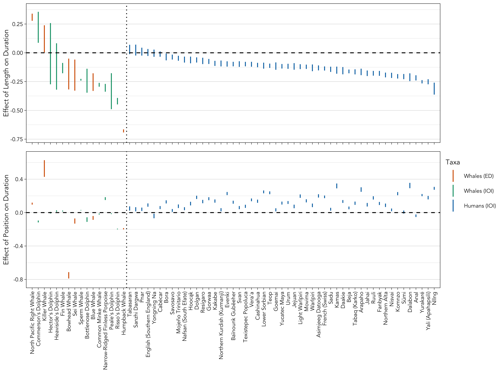
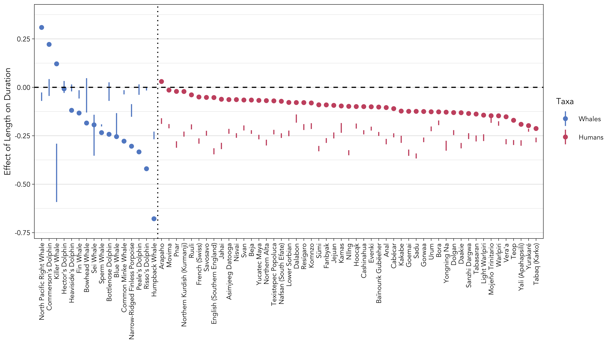
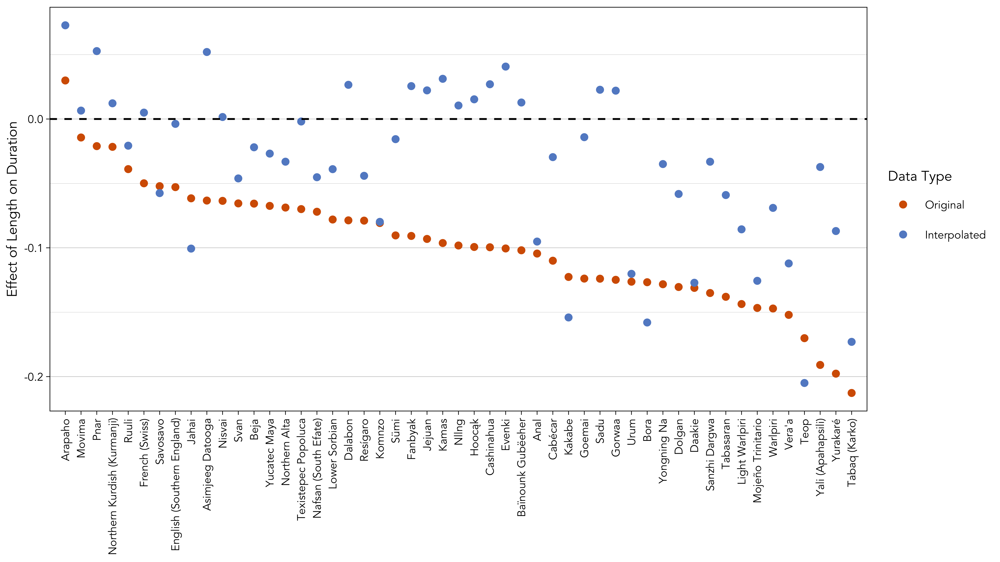

```{r, echo = FALSE, eval = FALSE}
#optionally hide all code
knitr::opts_chunk$set(echo = FALSE)

#set fonts of flextables
flextable::set_flextable_defaults(font.family = "Garamond", font.size = 10, padding.top = 1, padding.bottom = 1, keep_with_next = FALSE)
```

```{r echo = FALSE, message = FALSE}
#load libraries
library(flextable)
library(officer)
library(dplyr)
```

# Links {-}

* [Main text](https://masonyoungblood.github.io/whale_efficiency/)
* [Supplementary information](https://masonyoungblood.github.io/whale_efficiency/supplement/supplement.html)
* [GitHub repository](https://github.com/masonyoungblood/whale_efficiency)

<!-- * [PsyArXiv preprint]() -->

# Effects in Whale Data

```{r supp-whale-length-table, echo = FALSE, eval = TRUE, message = FALSE, warning = FALSE}
#load packages and data
library(flextable)
library(dplyr)
load("../tables/whale_tables.RData")

#print table
flextable(whale_tables$length[-1, ]) %>% 
  delete_part(part = "header") %>%
  add_header_row(values = whale_tables$length[1, ]) %>%
  theme_vanilla() %>% 
  merge_at(1:6, 1) %>% merge_at(7:15, 1) %>%
  set_table_properties(layout = "autofit") %>%
  set_caption("The effect of sequence length on element/interval duration for each whale species, computed from the base model that excludes position. 2.5% and 97.5% denote the lower and upper bounds of the 95% confidence intervals.")
```

```{r supp-whale-position-table, echo = FALSE, eval = TRUE, message = FALSE, warning = FALSE}
#load packages and data
library(flextable)
library(dplyr)
load("../tables/whale_tables.RData")

#print table
flextable(whale_tables$position[-c(1:2), ]) %>% 
  delete_part(part = "header") %>%
  add_header_row(values = whale_tables$position[2, ]) %>%
  add_header_row(values = c("", "Length", "Position"), colwidths = c(2, 3, 3)) %>%
  theme_vanilla() %>% 
  merge_at(1:6, 1) %>% merge_at(7:15, 1) %>%
  set_table_properties(layout = "autofit") %>%
  set_caption("The effect of sequence length and element/interval position on element/interval duration for each whale species, computed from the expanded model that includes both length and position. 2.5% and 97.5% denote the lower and upper bounds of the 95% confidence intervals.")
```

# Effects in Human Data

```{r supp-human-length-table, echo = FALSE, eval = TRUE, message = FALSE, warning = FALSE}
#load packages and data
library(flextable)
library(dplyr)
load("../tables/human_tables.RData")

#print table
flextable(human_tables$length[-1, ]) %>% 
  delete_part(part = "header") %>%
  add_header_row(values = human_tables$length[1, ]) %>%
  theme_vanilla() %>% 
  set_table_properties(layout = "autofit") %>%
  set_caption("The effect of sequence length on element/interval duration for each human language, computed from the base model that excludes position. 2.5% and 97.5% denote the lower and upper bounds of the 95% confidence intervals.")
```

```{r supp-human-position-table, echo = FALSE, eval = TRUE, message = FALSE, warning = FALSE}
#load packages and data
library(flextable)
library(dplyr)
load("../tables/human_tables.RData")

#print table
flextable(human_tables$position[-c(1:2), ]) %>% 
  delete_part(part = "header") %>%
  add_header_row(values = human_tables$position[2, ]) %>%
  add_header_row(values = c("", "Length", "Position"), colwidths = c(1, 3, 3)) %>%
  theme_vanilla() %>% 
  set_table_properties(layout = "autofit") %>%
  set_caption("The effect of sequence length and element/interval position on element/interval duration for each human language, computed from the expanded model that includes both length and position. 2.5% and 97.5% denote the lower and upper bounds of the 95% confidence intervals.")
```

# Words in Sentences

```{r words-in-sentences, echo = FALSE, eval = FALSE, message = FALSE, warning = FALSE}
#get labels for plotting
human_dataset_labels <- list.files("../data/doreco/")
human_dataset_labels <- substr(human_dataset_labels[grep("doreco", human_dataset_labels)], 1, 15)
human_dataset_labels <- as.character(sapply(human_dataset_labels, function(x){gsub(" DoReCo dataset.*", "", gsub("^The ", "", readLines(paste0("../data/doreco/", x, "_extended/", x, "_dataset-info.txt")[1])[1]))}))

#extract effects for words in sentences
words_in_sentences_effects <- lapply(words_in_sentences, extract_freq_effects)

#reformat sentences data in a format that is plottable
words_in_sentences_plot_data <- data.frame(cbind(do.call(rbind, lapply(words_in_sentences_effects, function(x){x$length})), do.call(rbind, lapply(words_in_sentences_effects, function(x){x$position}))))
colnames(words_in_sentences_plot_data) <- c("length_lower", "length_median", "length_upper", "position_lower", "position_median", "position_upper")
words_in_sentences_plot_data$label <- human_dataset_labels
words_in_sentences_plot_data <- words_in_sentences_plot_data[order(words_in_sentences_plot_data$length_median, decreasing = TRUE), ]
words_in_sentences_plot_data$label[which(words_in_sentences_plot_data$label == "Nǁng")] <- "Nllng" #special characters

#compute effects for whale data
whales_effects <- lapply(list(sperm_models, humpback_models, fin_models, killer_models, blue_models, minke_models, bowhead_models, right_models, narrow_models, heavisides_models, commersons_models, peales_models, hectors_models, rissos_models, bottlenose_models, sei_models), extract_freq_effects)

#reformat whale data in a format that is plottable
whales_plot_data <- data.frame(cbind(do.call(rbind, lapply(whales_effects, function(x){x$length})), do.call(rbind, lapply(whales_effects, function(x){x$position}))))
colnames(whales_plot_data) <- c("length_lower", "length_median", "length_upper", "position_lower", "position_median", "position_upper")
whales_plot_data$label <- c("Sperm Whale", "Humpback Whale", "Fin Whale", "Killer Whale", "Blue Whale", "Common Minke Whale", "Bowhead Whale", "North Pacific Right Whale", "Narrow-Ridged Finless Porpoise", "Heaviside's Dolphin", "Commerson's Dolphin", "Peale's Dolphin", "Hector's Dolphin", "Risso's Dolphin", "Bottlenose Dolphin", "Sei Whale")
whales_plot_data <- whales_plot_data[order(whales_plot_data$length_median, decreasing = TRUE), ]

#reorder everything for a single axis
whales_plot_data$x <- 1:nrow(whales_plot_data)
whales_plot_data$group <- 1
words_in_sentences_plot_data$x <- (max(whales_plot_data$x)+1):(max(whales_plot_data$x)+nrow(words_in_sentences_plot_data))
words_in_sentences_plot_data$group <- 2

#combine whale data with sentence data
combined_sentences_plot_data <- rbind(words_in_sentences_plot_data, whales_plot_data)

#generate plot of phonemes in sentences against whales, for length
combined_sentences_length_plot <- ggplot(combined_sentences_plot_data) + 
  geom_linerange(aes(x = x, ymin = length_lower, ymax = length_upper, color = factor(group))) + 
  geom_hline(aes(yintercept = 0), lty = "dashed") + 
  geom_vline(aes(xintercept = nrow(whales_plot_data) + 0.5), lty = "dotted") + 
  scale_y_continuous(limits = c(min(combined_sentences_plot_data$length_lower)*1.05, max(combined_sentences_plot_data$length_upper)*1.05), 
                     #name = expression("95% CI for "~italic("b")~"(Strength of Menzerath's Law)")) + 
                     name = "Effect of Length on Duration") + 
  scale_x_continuous(breaks = combined_sentences_plot_data$x, labels = combined_sentences_plot_data$label, name = NULL, limits = c(0, nrow(combined_sentences_plot_data) + 1), expand = c(0, 0)) + 
  scale_color_manual(values = c("#638ccc", "#ca5670"), labels = c("Whales", "Humans"), name = "Taxa") + 
  theme_linedraw(base_size = 8, base_family = "Avenir") + theme(axis.text.x = element_text(angle = 90, hjust = 0.99, vjust = 0.5), panel.grid.major.x = element_blank(), panel.grid.minor.x = element_blank())

#generate plot of words in sentences against whales, for position
combined_sentences_position_plot <- ggplot(combined_sentences_plot_data) + 
  geom_linerange(aes(x = x, ymin = position_lower, ymax = position_upper, color = factor(group))) + 
  geom_hline(aes(yintercept = 0), lty = "dashed") + 
  geom_vline(aes(xintercept = nrow(whales_plot_data) + 0.5), lty = "dotted") + 
  scale_y_continuous(limits = c(min(combined_sentences_plot_data$position_lower)*1.05, max(combined_sentences_plot_data$position_upper)*1.05), 
                     #name = expression("95% CI for "~italic("b")~"(Strength of Menzerath's Law)")) + 
                     name = "Effect of Position on Duration") + 
  scale_x_continuous(breaks = combined_sentences_plot_data$x, labels = combined_sentences_plot_data$label, name = NULL, limits = c(0, nrow(combined_sentences_plot_data) + 1), expand = c(0, 0)) + 
  scale_color_manual(values = c("#638ccc", "#ca5670"), labels = c("Whales", "Humans"), name = "Taxa") + 
  theme_linedraw(base_size = 8, base_family = "Avenir") + theme(axis.text.x = element_text(angle = 90, hjust = 0.99, vjust = 0.5), panel.grid.major.x = element_blank(), panel.grid.minor.x = element_blank())

#export plot of words in sentences
png("../plots/sentence_level_effects.png", width = 8, height = 6, units = "in", res = 600)
cowplot::plot_grid(cowplot::plot_grid(combined_sentences_length_plot + theme(axis.text.x = element_blank(), legend.position = "none"), combined_sentences_position_plot + theme(legend.position = "none"), ncol = 1, align = "v", rel_heights = c(0.66, 1)), cowplot::get_legend(combined_sentences_length_plot), nrow = 1, rel_widths = c(1, 0.12))
dev.off()

# #export plot of words in sentences
# png("../plots/sentence_level_effects.png", width = 8, height = 4, units = "in", res = 600)
# #cairo_pdf("../plots/effects.pdf", width = 8, height = 4, family = "avenir")
# combined_sentences_plot
# dev.off()
```

```{r supp-figure-sentence-effects, echo = FALSE, fig.align = "center", out.width = "100%", fig.cap = "The 95% confidence intervals for the effect of sequence length (top) and position (bottom) on element/interval duration for the 16 whale species and 51 human languages. The human language data are comprised of words within sentences."}

```

# Production Constraint Model

The production constraint model of @james_etal21 works as follows. For each iteration of the model, a pseudorandom sequence was produced for each real song in the dataset. Syllables were randomly sampled (with replacement) from the population until the duration of the random sequence exceeded the duration of the real song. If the difference between the duration of the random sequence and the real song was <50% of the duration of the final syllable, then the final syllable was kept in the sequence. Otherwise, it was removed. Each iteration of the model produces a set of random sequences with approximately the same distribution of durations as the real data.

For each species, I generated 100 simulated datasets from the (1) random sequence model and the (2) production constraint model. Then, I fit Menzerath's law separately to each of the 100 simulated datasets and pooled the model estimates for $a$ and $b$ using Rubin's rule as implemented in the *mice* package in *R* [@buuren_groothuis-oudshoorn11]. The results can be seen in Figure \@ref(fig:supp-figure-words-null).

Most importantly, the estimated effects from the production constraint model tend to be more negative than those from the real human language data, suggesting that this null model is far too conservative to be informative about "language-like" efficiency.

```{r phonemes-in-words-null, echo = FALSE, eval = FALSE, message = FALSE, warning = FALSE}
#get labels for plotting
human_dataset_labels <- list.files("../data/doreco/")
human_dataset_labels <- substr(human_dataset_labels[grep("doreco", human_dataset_labels)], 1, 15)
human_dataset_labels <- as.character(sapply(human_dataset_labels, function(x){gsub(" DoReCo dataset.*", "", gsub("^The ", "", readLines(paste0("../data/doreco/", x, "_extended/", x, "_dataset-info.txt")[1])[1]))}))

#extract effects for phonemes in words
phonemes_in_words_effects <- lapply(phonemes_in_words, extract_freq_effects)

#reformat words data in a format that is plottable
phonemes_in_words_plot_data <- data.frame(do.call(rbind, lapply(phonemes_in_words_effects, function(x){x$length})), do.call(rbind, lapply(phonemes_in_words_effects, function(x){x$prod_null})))
colnames(phonemes_in_words_plot_data) <- c("length_lower", "length_median", "length_upper", "null_lower", "null_median", "null_upper")
phonemes_in_words_plot_data$label <- human_dataset_labels
phonemes_in_words_plot_data <- phonemes_in_words_plot_data[order(phonemes_in_words_plot_data$length_median, decreasing = TRUE), ]
phonemes_in_words_plot_data$label[which(phonemes_in_words_plot_data$label == "Nǁng")] <- "Nllng" #special characters

#compute effects for whale data
whales_effects <- lapply(list(sperm_models, humpback_models, fin_models, killer_models, blue_models, minke_models, bowhead_models, right_models, narrow_models, heavisides_models, commersons_models, peales_models, hectors_models, rissos_models, bottlenose_models, sei_models), extract_freq_effects)

#reformat whale data in a format that is plottable
whales_plot_data <- data.frame(cbind(do.call(rbind, lapply(whales_effects, function(x){x$length})), do.call(rbind, lapply(whales_effects, function(x){x$prod_null}))))
colnames(whales_plot_data) <- c("length_lower", "length_median", "length_upper", "null_lower", "null_median", "null_upper")
whales_plot_data$label <- c("Sperm Whale", "Humpback Whale", "Fin Whale", "Killer Whale", "Blue Whale", "Common Minke Whale", "Bowhead Whale", "North Pacific Right Whale", "Narrow-Ridged Finless Porpoise", "Heaviside's Dolphin", "Commerson's Dolphin", "Peale's Dolphin", "Hector's Dolphin", "Risso's Dolphin", "Bottlenose Dolphin", "Sei Whale")
whales_plot_data <- whales_plot_data[order(whales_plot_data$length_median, decreasing = TRUE), ]

#reorder everything for a single axis
whales_plot_data$x <- 1:nrow(whales_plot_data)
whales_plot_data$group <- 1
phonemes_in_words_plot_data$x <- (max(whales_plot_data$x)+1):(max(whales_plot_data$x)+nrow(phonemes_in_words_plot_data))
phonemes_in_words_plot_data$group <- 2

#combine whale data with word data
combined_words_plot_data <- rbind(phonemes_in_words_plot_data, whales_plot_data)

#generate plot of phonemes in words against whales, for length
#export plot of phonemes in sentences
png("../plots/word_level_effects_null.png", width = 8, height = 4.5, units = "in", res = 600)
ggplot(combined_words_plot_data) + 
  geom_linerange(aes(x = x, ymin = null_lower, ymax = null_upper, color = factor(group))) + 
  geom_point(aes(x = x, y = length_median, color = factor(group))) + 
  geom_hline(aes(yintercept = 0), lty = "dashed") + 
  geom_vline(aes(xintercept = nrow(whales_plot_data) + 0.5), lty = "dotted") + 
  scale_y_continuous(limits = c(min(combined_words_plot_data$length_lower)*1.05, max(combined_words_plot_data$length_upper)*1.05), 
                     #name = expression("95% CI for "~italic("b")~"(Strength of Menzerath's Law)")) + 
                     name = "Effect of Length on Duration") + 
  scale_x_continuous(breaks = combined_words_plot_data$x, labels = combined_words_plot_data$label, name = NULL, limits = c(0, nrow(combined_words_plot_data) + 1), expand = c(0, 0)) + 
  scale_color_manual(values = c("#638ccc", "#ca5670"), labels = c("Whales", "Humans"), name = "Taxa") + 
  theme_linedraw(base_size = 8, base_family = "Avenir") + theme(axis.text.x = element_text(angle = 90, hjust = 0.99, vjust = 0.5), panel.grid.major.x = element_blank(), panel.grid.minor.x = element_blank())
dev.off()
```

```{r supp-figure-words-null, echo = FALSE, fig.align = "center", out.width = "100%", fig.cap = "The point estimates from the real data alongside 95% confidence intervals from 10 simulated datasets from the production constraint model, for the effect of sequence length on element/interval duration for the 16 whale species and 51 human languages. The human language data are comprised of phonemes within words."}

```

# Median Interpolation

```{r interp-check, eval = FALSE, echo = FALSE, message = FALSE, warning = FALSE}
#source functions
source("../functions.R")

#store locations of human datasets
human_datasets <- list.files("../data/doreco/")
human_datasets <- substr(human_datasets[grep("doreco", human_datasets)], 1, 15)
human_dataset_labels <- as.character(sapply(human_datasets, function(x){gsub(" DoReCo dataset.*", "", gsub("^The ", "", readLines(paste0("../data/doreco/", x, "_extended/", x, "_dataset-info.txt")[1])[1]))}))

#store the actual phonemic data files for each language
human_datasets <- paste0("../data/doreco/", human_datasets, "_extended/", human_datasets, "_ph.csv")

# #iterate through languages
# langs_to_read <- c(1:51)
# interpolation_check <- lapply(langs_to_read, function(z){
#   #read in data
#   human_data <- read_phonemes(human_datasets[z])[, c(1:2)]
#   colnames(human_data) <- c("duration", "sequence")
#   human_data_interp <- read_phonemes(human_datasets[z], interpolate = TRUE)[, c(1:2)]
#   colnames(human_data_interp) <- c("duration", "sequence")
# 
#   #add sequence length
#   length <- sapply(1:nrow(human_data), function(x){length(which(human_data$sequence == human_data$sequence[x]))})
#   human_data$length <- length
#   human_data_interp$length <- length
# 
#   #exclude singleton sequences
#   human_data <- human_data[-which(length == 1), ]
#   human_data_interp <- human_data_interp[-which(length == 1), ]
# 
#   #fit models to both
#   human_model <- lmer(scale(log(duration)) ~ scale(log(length)) + (1|sequence), data = human_data, REML = FALSE, control = lmerControl(optimizer = "bobyqa"))
#   human_model_interp <- lmer(scale(log(duration)) ~ scale(log(length)) + (1|sequence), data = human_data_interp, REML = FALSE, control = lmerControl(optimizer = "bobyqa"))
# 
#   #return models
#   return(list(original = human_model, interpolated = human_model_interp))
# })
# save(interpolation_check, file = "../models/interpolation_check.RData")

#load saved models
load("../models/interpolation_check.RData")

#combine
effects_table <- do.call(rbind, lapply(1:length(interpolation_check), function(x){c(fixef(interpolation_check[[x]]$original)[2], fixef(interpolation_check[[x]]$interpolated)[2])}))
length(which(effects_table[, 1] < effects_table[, 2]))/nrow(effects_table) #more conservative in over 90% of cases

#format for plotting
plot_data <- data.frame(original = effects_table[, 1], interpolated = effects_table[, 2], label = human_dataset_labels)
plot_data <- plot_data[order(plot_data$original, decreasing = TRUE), ]
plot_data$x <- 1:nrow(plot_data)
plot_data$label[which(plot_data$label == "Nǁng")] <- "Nllng" #special characters

#generate plot of phonemes in words against whales, for length
#export plot of phonemes in sentences
png("../plots/interpolation_check.png", width = 8, height = 4.5, units = "in", res = 600)
ggplot(plot_data) + 
  geom_point(aes(x = x, y = original, color = "A")) + 
  geom_point(aes(x = x, y = interpolated, color = "B")) + 
  geom_hline(aes(yintercept = 0), lty = "dashed") + 
  scale_y_continuous(name = "Effect of Length on Duration") + 
  scale_x_continuous(breaks = plot_data$x, labels = plot_data$label, name = NULL, limits = c(0, nrow(plot_data) + 1), expand = c(0, 0)) + 
  scale_color_manual(values = c("#ca5670", "#638ccc"), labels = c("Original", "Interpolated"), name = "Data Type") + 
  theme_linedraw(base_size = 8, base_family = "Avenir") + theme(axis.text.x = element_text(angle = 90, hjust = 0.99, vjust = 0.5), panel.grid.major.x = element_blank(), panel.grid.minor.x = element_blank())
dev.off()
```

```{r supp-figure-interpolation, echo = FALSE, fig.align = "center", out.width = "100%", fig.cap = "The point estimates from the original datasets (red) compared to median-interpolated datasets (blue). Interpolating sequences with the median duration of each element category appears to systematically shift model estimates towards zero (in over 90% of cases)."}

```

# References {-}

<div id="refs"></div>

<!-- Get rid of extra white space at the bottom caused by table of contents -->
<div class="tocify-extend-page" data-unique="tocify-extend-page" style="height: 0;"></div>

<br><br>
