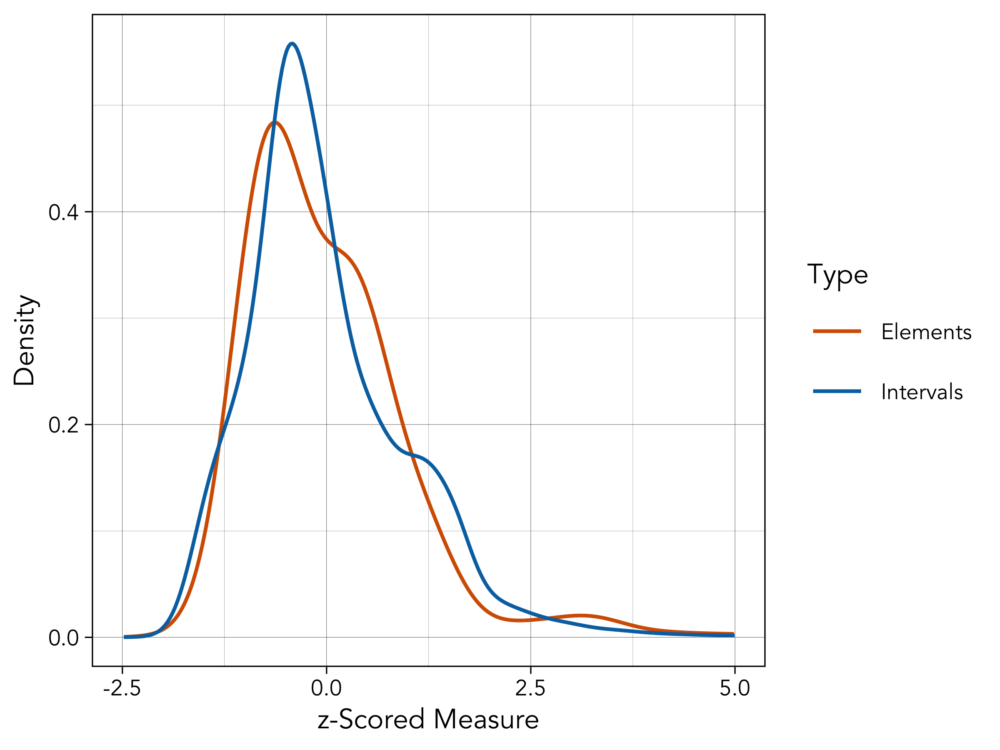
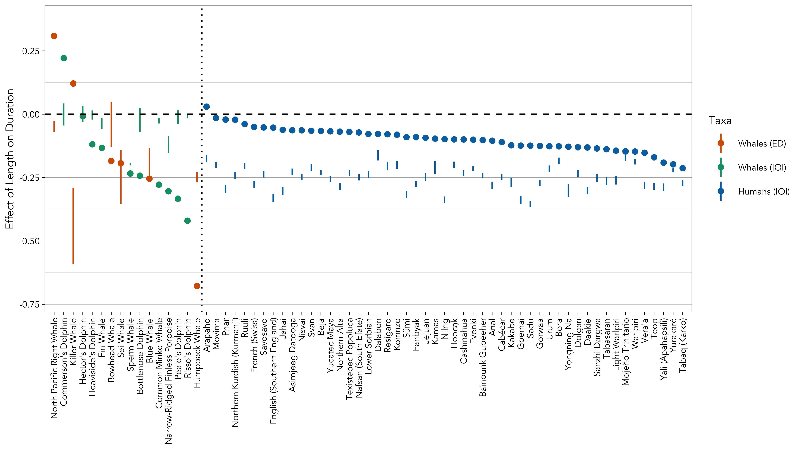

```{r word-doc, echo = FALSE, eval = TRUE}
#if output is a word document
if(!knitr::is_html_output()){
  #optionally hide all code
  knitr::opts_chunk$set(echo = FALSE)
  
  #set fonts of flextables
  flextable::set_flextable_defaults(font.family = "Garamond", font.size = 10, padding.top = 1, padding.bottom = 1, keep_with_next = FALSE)
}
```

```{r echo = FALSE, message = FALSE}
#load libraries
library(flextable)
library(officer)
library(dplyr)
```

```{r load-models, echo = FALSE, eval = FALSE}
#load fitted models
files <- list.files("../models/")[grep(".RData", list.files("../models/"))]
for(i in 1:length(files)){load(paste0("../models/", files[i]))}
```

# Links {-}

* [Main text](https://masonyoungblood.github.io/whale_efficiency/)
* [Supplementary information](https://masonyoungblood.github.io/whale_efficiency/supplement/supplement.html)
* [PsyArXiv preprint](https://doi.org/10.31234/osf.io/tduab)
* [GitHub repository](https://github.com/masonyoungblood/whale_efficiency)

# Menzerath's Law

## Durations and Intervals

```{r density, echo = FALSE, eval = FALSE}
#get z-scored durations
durations <- c(scale(blue_data$duration), scale(bowhead_data$duration), scale(humpback_data$duration), scale(right_data$duration), scale(sei_data$cerchio_2022$duration), scale(sei_data$macklin_2024$duration), scale(killer_data$duration))

#get z-scored intervals
intervals <- c(scale(fin_data$wood_2022$duration), scale(fin_data$best_2022$duration), scale(fin_data$romagosa_2024$duration), scale(minke_data$duration), scale(bottlenose_data$duration), scale(commersons_data$duration), scale(heavisides_data$duration), scale(hectors_data$duration), scale(narrow_data$duration), scale(peales_data$duration), scale(rissos_data$duration), scale(sperm_data$gero_2016), scale(sperm_data$hersh_2022), scale(sperm_data$vachon_2022))

#get densities
durations_density <- density(durations, adjust = 4, n = 1000)
intervals_density <- density(intervals, adjust = 4, n = 1000)

#combine for plotting
plot_data <- data.frame(x = c(durations_density$x, intervals_density$x), y = c(durations_density$y, intervals_density$y), Type = rep(c("Elements", "Intervals"), each = 1000))

#plot and save
png("../plots/density.png", width = 4, height = 3, units = "in", res = 600)
ggplot(plot_data, aes(x = x, y = y, color = Type)) + 
  geom_line() + 
  ylab("Density") + 
  scale_x_continuous(name = "z-Scored Measure", limits = c(-2.5, 5)) + 
  scale_color_manual(values = c("#D55E00", "#0072B2")) + 
  theme_linedraw(base_size = 8, base_family = "Avenir")
dev.off()
```

```{r supp-figure-density, echo = FALSE, fig.align = "center", out.width = "50%", fig.cap = "The distribution of element durations and inter-onset intervals from the whale vocal sequences included in this analysis. The times are z-scored within each study to enable direct comparison."}

```

To assess whether the strength of Menzerath's law in human language is similar when computed from element durations and inter-onset intervals, I conducted a supplementary analysis with a corpus of spoken language data that was collected to study efficiency in information encoding [@coupe_etal19]. DoReCo could not be used for this supplementary analysis because it includes the short gaps between phonemes in its measurements [@seifart_etal22], making it impossible to analyze element durations and inter-onset intervals separately without a reanalysis of the raw data. Coupe et al.'s dataset is composed of 2,288 recordings of speech, ranging from three to five sentences in length, and representing 17 different languages [@coupe_etal19]. For each recording, they collected the number of syllables, the overall duration including vocalizations and silence, and the duration only including silence, making it possible to compute the average element duration and inter-onset interval of each recording.

Each sequence in Coupe et al.'s data is a set of sentences from a single speaker [@coupe_etal19]. Analyzing Menzerath's law in utterances above the sentence-level is unusual but has precedent [@rothe-neves_etal18; @schusterova_etal14]. It would be ideal to conduct this analysis at the same level of the linguistic hierarchy as DoReCo (e.g., phonemes within words, words within sentences.), but Coupe et al.'s dataset is the only one I found that separates phonation from silence [@coupe_etal19].

For each sequence, I analyzed (1) the length in syllables, (2) the average duration of syllables, and (3) the average inter-onset interval between syllables. These data were analyzed using the same linear model as in the main text, excluding the varying intercept because each point corresponds to the average duration/interval within a sequence:

\begin{equation}
\ln(\textrm{duration}) \sim \ln(\textrm{length})
(\#eq:supplengthmodel)
\end{equation}

```{r durations-intervals-compare, echo = FALSE, eval = TRUE, message = FALSE, warning = FALSE}
#load in data
data <- read.table("../data/humans_coupe_2019.csv", header = TRUE)

#run models
duration_model <- lm(scale(log(phonationtime/nsyll)) ~ scale(log(nsyll)), data)
#interval_model <- lm(scale(log((dur - phonationtime)/nsyll)) ~ scale(log(nsyll)), data) #inter-element intervals
interval_model <- lm(scale(log(dur/nsyll)) ~ scale(log(nsyll)), data) #inter-onset intervals
```

The results indicate that the strength of Menzerath's law for syllables in series of sentences is quite similar when computed from element durations (estimate = `r round(coefficients(duration_model)[2], 3)`, 95% CI: [`r round(confint(duration_model, method = "Wald")[2, 1], 3)`, `r round(confint(duration_model, method = "Wald")[2, 2], 3)`]) and inter-onset intervals (estimate = `r round(coefficients(interval_model)[2], 3)`, 95% CI: [`r round(confint(interval_model, method = "Wald")[2, 1], 3)`, `r round(confint(interval_model, method = "Wald")[2, 2], 3)`]).

## Effects in Whale Data

```{r supp-whale-length-table, echo = FALSE, eval = TRUE, message = FALSE, warning = FALSE}
#load packages and data
library(flextable)
library(dplyr)
load("../tables/whale_tables.RData")

#add elements and intervals
whale_tables$length <- cbind(whale_tables$length[, c(1:2)], c("Type", "Elements", "Elements", "Elements", "Intervals", "Elements", "Elements", "Intervals", "Intervals", "Intervals", "Intervals", "Elements", "Intervals", "Intervals", "Intervals", "Intervals"), whale_tables$length[, c(3:5)])

#print table
flextable(whale_tables$length[-1, ]) %>% 
  delete_part(part = "header") %>%
  add_header_row(values = whale_tables$length[1, ]) %>%
  theme_vanilla() %>% 
  merge_at(1:6, 1) %>% merge_at(7:15, 1) %>%
  set_table_properties(layout = "autofit") %>%
  set_caption("The effect of sequence length on element durations and inter-onset intervals for each whale species, computed from the base model that excludes position. 2.5% and 97.5% denote the lower and upper bounds of the 95% confidence intervals.")
```

```{r supp-whale-position-table, echo = FALSE, eval = TRUE, message = FALSE, warning = FALSE}
#load packages and data
library(flextable)
library(dplyr)
load("../tables/whale_tables.RData")

#add elements and intervals
whale_tables$position <- cbind(whale_tables$position[, c(1:2)], c("", "Type", "Elements", "Elements", "Elements", "Intervals", "Elements", "Elements", "Intervals", "Intervals", "Intervals", "Intervals", "Elements", "Intervals", "Intervals", "Intervals", "Intervals"), whale_tables$position[, c(3:8)])

#print table
flextable(whale_tables$position[-c(1:2), ]) %>% 
  delete_part(part = "header") %>%
  add_header_row(values = whale_tables$position[2, ]) %>%
  add_header_row(values = c("", "Length", "Position"), colwidths = c(3, 3, 3)) %>%
  theme_vanilla() %>% 
  merge_at(1:6, 1) %>% merge_at(7:15, 1) %>%
  set_table_properties(layout = "autofit") %>%
  set_caption("The effect of sequence length and position on element durations and inter-onset intervals for each whale species, computed from the expanded model that includes both length and position. 2.5% and 97.5% denote the lower and upper bounds of the 95% confidence intervals.")
```

## Effects in Human Data

```{r supp-human-length-table, echo = FALSE, eval = TRUE, message = FALSE, warning = FALSE}
#load packages and data
library(flextable)
library(dplyr)
load("../tables/human_tables.RData")

#print table
flextable(human_tables$length[-1, ]) %>% 
  delete_part(part = "header") %>%
  add_header_row(values = human_tables$length[1, ]) %>%
  theme_vanilla() %>% 
  set_table_properties(layout = "autofit") %>%
  set_caption("The effect of sequence length on inter-onset intervals for each human language, computed from the base model that excludes position. 2.5% and 97.5% denote the lower and upper bounds of the 95% confidence intervals.")
```

```{r supp-human-position-table, echo = FALSE, eval = TRUE, message = FALSE, warning = FALSE}
#load packages and data
library(flextable)
library(dplyr)
load("../tables/human_tables.RData")

#print table
flextable(human_tables$position[-c(1:2), ]) %>% 
  delete_part(part = "header") %>%
  add_header_row(values = human_tables$position[2, ]) %>%
  add_header_row(values = c("", "Length", "Position"), colwidths = c(1, 3, 3)) %>%
  theme_vanilla() %>% 
  set_table_properties(layout = "autofit") %>%
  set_caption("The effect of sequence length and position on inter-onset intervals for each human language, computed from the expanded model that includes both length and position. 2.5% and 97.5% denote the lower and upper bounds of the 95% confidence intervals.")
```

## Words in Sentences

```{r words-in-sentences, echo = FALSE, eval = FALSE, message = FALSE, warning = FALSE}
#get labels for plotting
human_dataset_labels <- list.files("../data/doreco/")
human_dataset_labels <- substr(human_dataset_labels[grep("doreco", human_dataset_labels)], 1, 15)
human_dataset_labels <- as.character(sapply(human_dataset_labels, function(x){gsub(" DoReCo dataset.*", "", gsub("^The ", "", readLines(paste0("../data/doreco/", x, "_extended/", x, "_dataset-info.txt")[1])[1]))}))

#extract effects for words in sentences
words_in_sentences_effects <- lapply(words_in_sentences, extract_freq_effects)

#reformat sentences data in a format that is plottable
words_in_sentences_plot_data <- data.frame(cbind(do.call(rbind, lapply(words_in_sentences_effects, function(x){x$length})), do.call(rbind, lapply(words_in_sentences_effects, function(x){x$position}))))
colnames(words_in_sentences_plot_data) <- c("length_lower", "length_median", "length_upper", "position_lower", "position_median", "position_upper")
words_in_sentences_plot_data$label <- human_dataset_labels
words_in_sentences_plot_data <- words_in_sentences_plot_data[order(words_in_sentences_plot_data$length_median, decreasing = TRUE), ]
words_in_sentences_plot_data$label[which(words_in_sentences_plot_data$label == "Nﾇ］g")] <- "Nllng" #special characters

#compute effects for whale data
whales_effects <- lapply(list(sperm_models, humpback_models, fin_models, killer_models, blue_models, minke_models, bowhead_models, right_models, narrow_models, heavisides_models, commersons_models, peales_models, hectors_models, rissos_models, bottlenose_models, sei_models), extract_freq_effects)

#reformat whale data in a format that is plottable
whales_plot_data <- data.frame(cbind(do.call(rbind, lapply(whales_effects, function(x){x$length})), do.call(rbind, lapply(whales_effects, function(x){x$position}))))
colnames(whales_plot_data) <- c("length_lower", "length_median", "length_upper", "position_lower", "position_median", "position_upper")
whales_plot_data$label <- c("Sperm Whale", "Humpback Whale", "Fin Whale", "Killer Whale", "Blue Whale", "Common Minke Whale", "Bowhead Whale", "North Pacific Right Whale", "Narrow-Ridged Finless Porpoise", "Heaviside's Dolphin", "Commerson's Dolphin", "Peale's Dolphin", "Hector's Dolphin", "Risso's Dolphin", "Bottlenose Dolphin", "Sei Whale")
whales_plot_data <- whales_plot_data[order(whales_plot_data$length_median, decreasing = TRUE), ]

#reorder everything for a single axis
whales_plot_data$x <- 1:nrow(whales_plot_data)
whales_plot_data$group <- c(1, 2, 1, 2, 2, 2, 1, 1, 2, 2, 1, 2, 2, 2, 2, 1) #1 is elements, 2 is intervals
words_in_sentences_plot_data$x <- (max(whales_plot_data$x)+1):(max(whales_plot_data$x)+nrow(words_in_sentences_plot_data))
words_in_sentences_plot_data$group <- 3

#combine whale data with sentence data
combined_sentences_plot_data <- rbind(words_in_sentences_plot_data, whales_plot_data)

#generate plot of phonemes in sentences against whales, for length
combined_sentences_length_plot <- ggplot(combined_sentences_plot_data) + 
  geom_linerange(aes(x = x, ymin = length_lower, ymax = length_upper, color = factor(group))) + 
  geom_hline(aes(yintercept = 0), lty = "dashed") + 
  geom_vline(aes(xintercept = nrow(whales_plot_data) + 0.5), lty = "dotted") + 
  scale_y_continuous(limits = c(min(combined_sentences_plot_data$length_lower)*1.05, max(combined_sentences_plot_data$length_upper)*1.05), 
                     #name = expression("95% CI for "~italic("b")~"(Strength of Menzerath's Law)")) + 
                     name = "Effect of Length on Duration") + 
  scale_x_continuous(breaks = combined_sentences_plot_data$x, labels = combined_sentences_plot_data$label, name = NULL, limits = c(0, nrow(combined_sentences_plot_data) + 1), expand = c(0, 0)) + 
  scale_color_manual(values = c("#D55E00", "#009E73", "#0072B2"), labels = c("Whales (ED)", "Whales (IOI)", "Humans (IOI)"), name = "Taxa") + 
  theme_linedraw(base_size = 8, base_family = "Avenir") + theme(axis.text.x = element_text(angle = 90, hjust = 0.99, vjust = 0.5), panel.grid.major.x = element_blank(), panel.grid.minor.x = element_blank())

#generate plot of words in sentences against whales, for position
combined_sentences_position_plot <- ggplot(combined_sentences_plot_data) + 
  geom_linerange(aes(x = x, ymin = position_lower, ymax = position_upper, color = factor(group))) + 
  geom_hline(aes(yintercept = 0), lty = "dashed") + 
  geom_vline(aes(xintercept = nrow(whales_plot_data) + 0.5), lty = "dotted") + 
  scale_y_continuous(limits = c(min(combined_sentences_plot_data$position_lower)*1.05, max(combined_sentences_plot_data$position_upper)*1.05), 
                     #name = expression("95% CI for "~italic("b")~"(Strength of Menzerath's Law)")) + 
                     name = "Effect of Position on Duration") + 
  scale_x_continuous(breaks = combined_sentences_plot_data$x, labels = combined_sentences_plot_data$label, name = NULL, limits = c(0, nrow(combined_sentences_plot_data) + 1), expand = c(0, 0)) + 
  scale_color_manual(values = c("#D55E00", "#009E73", "#0072B2"), labels = c("Whales (ED)", "Whales (IOI)", "Humans (IOI)"), name = "Taxa") + 
  theme_linedraw(base_size = 8, base_family = "Avenir") + theme(axis.text.x = element_text(angle = 90, hjust = 0.99, vjust = 0.5), panel.grid.major.x = element_blank(), panel.grid.minor.x = element_blank())

#export plot of words in sentences
png("../plots/sentence_level_effects.png", width = 8, height = 6, units = "in", res = 600)
cowplot::plot_grid(cowplot::plot_grid(combined_sentences_length_plot + theme(axis.text.x = element_blank(), legend.position = "none"), combined_sentences_position_plot + theme(legend.position = "none"), ncol = 1, align = "v", rel_heights = c(0.66, 1)), cowplot::get_legend(combined_sentences_length_plot), nrow = 1, rel_widths = c(1, 0.12))
dev.off()
```

```{r supp-figure-sentence-effects, echo = FALSE, fig.align = "center", out.width = "100%", fig.cap = "The 95% confidence intervals for the effect of sequence length (top) and position (bottom) on element durations and inter-onset intervals for the 16 whale species and 51 human languages. The human language data are comprised of words within sentences. The colors correspond to the taxonomic group and whether the data are element durations (ED) or inter-onset intervals (IOI)."}

```

## Production Constraint Model

```{r passing-null, eval = FALSE, echo = FALSE}
#what proportion of languages and whale species are stronger than the production model
table(factor(sapply(phonemes_in_words_effects, function(x){x$length[2] < x$prod_null[2]}), levels = c(TRUE, FALSE))) #0/51 = 0%
table(factor(sapply(whales_effects, function(x){x$length[2] < x$prod_null[2]}), levels = c(TRUE, FALSE))) #12/16 = 75%
```

James et al. [@james_etal21] recently found that Menzerath's law can be detected in pseudorandom sequences of birdsong syllables that are forced to match the durations of real songs. James et al. [@james_etal21] interpret their model as approximating simple motor constraints, while stronger effects in the real data would indicate additional mechanisms (e.g., communicative efficiency through behavioral plasticity). I originally planned to compare the strength of Menzerath's law in the real data with simulated data from the model of James et al. [@james_etal21], as I recently did for house finch song [@youngblood24], but analyses of language data suggest that it is far too conservative of a null model. 0 of the 51 of languages in the DoReCo dataset exhibit Menzerath's law to a greater extent than simulated data. Even though many whale species exhibit Menzerath's law to a greater extent than simulated data from the null model of James et al. [@james_etal21] (75%; 12 out of 16 species), I do not want to over-interpret this result given the pattern in the human data. Upon further reflection I think that the fundamental assumption of James et al. [@james_etal21], that sequence durations are governed by motor constraints alone, is unlikely to apply to many species with more complex communication systems. In humpback whales and sperm whales, for example, there appears to be significant inter-individual variation in song and coda length depending on social context [@mercado22; @hersh_etal22]. More details about this analysis are below.

The production constraint model of James et al. [@james_etal21] works as follows. For each iteration of the model, a pseudorandom sequence was produced for each real song in the dataset. Syllables were randomly sampled (with replacement) from the population until the duration of the random sequence exceeded the duration of the real song. If the difference between the duration of the random sequence and the real song was < 50% of the duration of the final syllable, then the final syllable was kept in the sequence. Otherwise, it was removed. Each iteration of the model produces a set of random sequences with approximately the same distribution of durations as the real data.

For each species, I generated 100 simulated datasets from the (1) random sequence model and the (2) production constraint model. Then, I fit Menzerath's law separately to each of the 100 simulated datasets and pooled the model estimates for $a$ and $b$ using Rubin's rule as implemented in the *mice* package in *R*. The results can be seen in Figure \@ref(fig:supp-figure-words-null).

Most importantly, the estimated effects from the production constraint model tend to be more negative than those from the real human language data, suggesting that this null model is far too conservative to be informative about "language-like" efficiency.

```{r phonemes-in-words-null, echo = FALSE, eval = FALSE, message = FALSE, warning = FALSE}
#get labels for plotting
human_dataset_labels <- list.files("../data/doreco/")
human_dataset_labels <- substr(human_dataset_labels[grep("doreco", human_dataset_labels)], 1, 15)
human_dataset_labels <- as.character(sapply(human_dataset_labels, function(x){gsub(" DoReCo dataset.*", "", gsub("^The ", "", readLines(paste0("../data/doreco/", x, "_extended/", x, "_dataset-info.txt")[1])[1]))}))

#extract effects for phonemes in words
phonemes_in_words_effects <- lapply(phonemes_in_words, extract_freq_effects)

#reformat words data in a format that is plottable
phonemes_in_words_plot_data <- data.frame(do.call(rbind, lapply(phonemes_in_words_effects, function(x){x$length})), do.call(rbind, lapply(phonemes_in_words_effects, function(x){x$prod_null})))
colnames(phonemes_in_words_plot_data) <- c("length_lower", "length_median", "length_upper", "null_lower", "null_median", "null_upper")
phonemes_in_words_plot_data$label <- human_dataset_labels
phonemes_in_words_plot_data <- phonemes_in_words_plot_data[order(phonemes_in_words_plot_data$length_median, decreasing = TRUE), ]
phonemes_in_words_plot_data$label[which(phonemes_in_words_plot_data$label == "Nﾇ］g")] <- "Nllng" #special characters

#compute effects for whale data
whales_effects <- lapply(list(sperm_models, humpback_models, fin_models, killer_models, blue_models, minke_models, bowhead_models, right_models, narrow_models, heavisides_models, commersons_models, peales_models, hectors_models, rissos_models, bottlenose_models, sei_models), extract_freq_effects)

#reformat whale data in a format that is plottable
whales_plot_data <- data.frame(cbind(do.call(rbind, lapply(whales_effects, function(x){x$length})), do.call(rbind, lapply(whales_effects, function(x){x$prod_null}))))
colnames(whales_plot_data) <- c("length_lower", "length_median", "length_upper", "null_lower", "null_median", "null_upper")
whales_plot_data$label <- c("Sperm Whale", "Humpback Whale", "Fin Whale", "Killer Whale", "Blue Whale", "Common Minke Whale", "Bowhead Whale", "North Pacific Right Whale", "Narrow-Ridged Finless Porpoise", "Heaviside's Dolphin", "Commerson's Dolphin", "Peale's Dolphin", "Hector's Dolphin", "Risso's Dolphin", "Bottlenose Dolphin", "Sei Whale")
whales_plot_data <- whales_plot_data[order(whales_plot_data$length_median, decreasing = TRUE), ]

#reorder everything for a single axis
whales_plot_data$x <- 1:nrow(whales_plot_data)
whales_plot_data$group <- c(1, 2, 1, 2, 2, 2, 1, 1, 2, 2, 1, 2, 2, 2, 2, 1) #1 is elements, 2 is intervals
phonemes_in_words_plot_data$x <- (max(whales_plot_data$x)+1):(max(whales_plot_data$x)+nrow(phonemes_in_words_plot_data))
phonemes_in_words_plot_data$group <- 3

#combine whale data with word data
combined_words_plot_data <- rbind(phonemes_in_words_plot_data, whales_plot_data)

#generate plot of phonemes in words against whales, for length
#export plot of phonemes in sentences
png("../plots/word_level_effects_null.png", width = 8, height = 4.5, units = "in", res = 600)
ggplot(combined_words_plot_data) + 
  geom_linerange(aes(x = x, ymin = null_lower, ymax = null_upper, color = factor(group))) + 
  geom_point(aes(x = x, y = length_median, color = factor(group))) + 
  geom_hline(aes(yintercept = 0), lty = "dashed") + 
  geom_vline(aes(xintercept = nrow(whales_plot_data) + 0.5), lty = "dotted") + 
  scale_y_continuous(limits = c(min(combined_words_plot_data$length_lower)*1.05, max(combined_words_plot_data$length_upper)*1.05), 
                     #name = expression("95% CI for "~italic("b")~"(Strength of Menzerath's Law)")) + 
                     name = "Effect of Length on Duration") + 
  scale_x_continuous(breaks = combined_words_plot_data$x, labels = combined_words_plot_data$label, name = NULL, limits = c(0, nrow(combined_words_plot_data) + 1), expand = c(0, 0)) + 
  scale_color_manual(values = c("#D55E00", "#009E73", "#0072B2"), labels = c("Whales (ED)", "Whales (IOI)", "Humans (IOI)"), name = "Taxa") + 
  theme_linedraw(base_size = 8, base_family = "Avenir") + theme(axis.text.x = element_text(angle = 90, hjust = 0.99, vjust = 0.5), panel.grid.major.x = element_blank(), panel.grid.minor.x = element_blank())
dev.off()
```

```{r supp-figure-words-null, echo = FALSE, fig.align = "center", out.width = "100%", fig.cap = "The point estimates (points) from the real data alongside 95% confidence intervals (bars) from 10 simulated datasets from the production constraint model, for the effect of sequence length on element durations and inter-onset intervals for the 16 whale species and 51 human languages. The human language data are comprised of phonemes within words. The colors correspond to the taxonomic group and whether the data are element durations (ED) or inter-onset intervals (IOI)."}

```

## Median Interpolation

```{r interp-check, eval = FALSE, echo = FALSE, message = FALSE, warning = FALSE}
#source functions
source("../functions.R")

#store locations of human datasets
human_datasets <- list.files("../data/doreco/")
human_datasets <- substr(human_datasets[grep("doreco", human_datasets)], 1, 15)
human_dataset_labels <- as.character(sapply(human_datasets, function(x){gsub(" DoReCo dataset.*", "", gsub("^The ", "", readLines(paste0("../data/doreco/", x, "_extended/", x, "_dataset-info.txt")[1])[1]))}))

#store the actual phonemic data files for each language
human_datasets <- paste0("../data/doreco/", human_datasets, "_extended/", human_datasets, "_ph.csv")

# #iterate through languages
# langs_to_read <- c(1:51)
# interpolation_check <- lapply(langs_to_read, function(z){
#   #read in data
#   human_data <- read_phonemes(human_datasets[z])[, c(1:2)]
#   colnames(human_data) <- c("duration", "sequence")
#   human_data_interp <- read_phonemes(human_datasets[z], interpolate = TRUE)[, c(1:2)]
#   colnames(human_data_interp) <- c("duration", "sequence")
# 
#   #add sequence length
#   length <- sapply(1:nrow(human_data), function(x){length(which(human_data$sequence == human_data$sequence[x]))})
#   human_data$length <- length
#   human_data_interp$length <- length
# 
#   #exclude singleton sequences
#   human_data <- human_data[-which(length == 1), ]
#   human_data_interp <- human_data_interp[-which(length == 1), ]
# 
#   #fit models to both
#   human_model <- lmer(scale(log(duration)) ~ scale(log(length)) + (1|sequence), data = human_data, REML = FALSE, control = lmerControl(optimizer = "bobyqa"))
#   human_model_interp <- lmer(scale(log(duration)) ~ scale(log(length)) + (1|sequence), data = human_data_interp, REML = FALSE, control = lmerControl(optimizer = "bobyqa"))
# 
#   #return models
#   return(list(original = human_model, interpolated = human_model_interp))
# })
# save(interpolation_check, file = "../models/interpolation_check.RData")

#load saved models
load("../models/interpolation_check.RData")

#combine
effects_table <- do.call(rbind, lapply(1:length(interpolation_check), function(x){c(fixef(interpolation_check[[x]]$original)[2], fixef(interpolation_check[[x]]$interpolated)[2])}))
length(which(effects_table[, 1] < effects_table[, 2]))/nrow(effects_table) #more conservative in over 90% of cases

#format for plotting
plot_data <- data.frame(original = effects_table[, 1], interpolated = effects_table[, 2], label = human_dataset_labels)
plot_data <- plot_data[order(plot_data$original, decreasing = TRUE), ]
plot_data$x <- 1:nrow(plot_data)
plot_data$label[which(plot_data$label == "Nﾇ］g")] <- "Nllng" #special characters

#generate plot of phonemes in words against whales, for length
#export plot of phonemes in sentences
png("../plots/interpolation_check.png", width = 8, height = 4.5, units = "in", res = 600)
ggplot(plot_data) + 
  geom_point(aes(x = x, y = original, color = "A")) + 
  geom_point(aes(x = x, y = interpolated, color = "B")) + 
  geom_hline(aes(yintercept = 0), lty = "dashed") + 
  scale_y_continuous(name = "Effect of Length on Duration") + 
  scale_x_continuous(breaks = plot_data$x, labels = plot_data$label, name = NULL, limits = c(0, nrow(plot_data) + 1), expand = c(0, 0)) + 
  scale_color_manual(values = c("#D55E00", "#638ccc"), labels = c("Original", "Interpolated"), name = "Data Type") + 
  theme_linedraw(base_size = 8, base_family = "Avenir") + theme(axis.text.x = element_text(angle = 90, hjust = 0.99, vjust = 0.5), panel.grid.major.x = element_blank(), panel.grid.minor.x = element_blank())
dev.off()
```

```{r supp-figure-interpolation, echo = FALSE, fig.align = "center", out.width = "100%", fig.cap = "The point estimates from the original datasets (orange) compared to median-interpolated datasets (blue). Interpolating sequences with the median inter-onset interval of each phoneme appears to systematically shift model estimates towards zero (in over 90% of cases)."}
knitr::include_graphics("../plots/interpolation_check.png")
```

## Patterned Burst Pulses

```{r, echo = FALSE, eval = TRUE}
#load data and model
load("../data/processed_menz/heavisides_patterned_data.RData")
load("../models/heavisides_patterned_models.RData")
```

Martin et al. [@martin_etal19] noticed that Heaviside's dolphins sometimes produce temporally-patterned burst pulses with much more rhythmic variation, especially during social interactions. I analyzed `r max(heavisides_patterned_data$sequence)` patterned burst pulses provided by Martin et al. [@martin_etal19] and found that they adhere to Menzerath's law&mdash;there is a negative relationship between sequence length and inter-onset intervals (estimate = `r round(lme4::fixef(heavisides_patterned_models$actual$reduced_scaled)[2], 3)`, 95% CI: [`r round(confint(heavisides_patterned_models$actual$reduced_scaled, method = "Wald")[4, 1], 3)`, `r round(confint(heavisides_patterned_models$actual$reduced_scaled, method = "Wald")[4, 2], 3)`]).

## Plots with Transformed Axes

```{r supp-figure-myst-trans-plot, echo = FALSE, fig.align = "center", out.width = "80%", fig.cap = "The baleen whale (Mysticete) species included in the study (left), alongside the distribution of element durations or inter-onset intervals and sequence lengths (middle) and the slope of Menzerath's law (right). The x- and y-axes have been log-transformed and z-scored to match the structure of the statistical model. Each point in the distribution plots (middle) marks the mean element duration or inter-onset interval, but the slopes on the right were computed from the full set of elements/intervals. The bars in the slope plots (right) mark the 95% confidence intervals around the point estimates."}

```

```{r supp-figure-odon-trans-plot, echo = FALSE, fig.align = "center", out.width = "80%", fig.cap = "The toothed whale (Odontocete) species included in the study (left), alongside the distribution of element durations or inter-onset intervals and sequence lengths (middle) and the slope of Menzerath's law (right). The x- and y-axes have been log-transformed and z-scored to match the structure of the statistical model. Each point in the distribution plots (middle) marks the mean element duration or inter-onset interval, but the slopes on the right were computed from the full set of elements/intervals. The bars in the slope plots (right) mark the 95% confidence intervals around the point estimates."}

```

# Zipf's Law of Abbreviation

## Effects in Whale Data

```{r supp-whale-zla-table, echo = FALSE, eval = TRUE, message = FALSE, warning = FALSE}
#load packages and data
library(flextable)
library(dplyr)
load("../tables/whale_zla_table.RData")

#print table
flextable(zla_table[-1, ]) %>% 
  delete_part(part = "header") %>%
  add_header_row(values = zla_table[1, ]) %>%
  theme_vanilla() %>% 
  merge_at(1:4, 1) %>%
  set_table_properties(layout = "autofit") %>%
  set_caption("The effect of count on element duration for each whale species. 2.5% and 97.5% denote the lower and upper bounds of the 95% confidence intervals.")
```

## Effects in Human Data

```{r supp-human-zla-table, echo = FALSE, eval = TRUE, message = FALSE, warning = FALSE}
#load packages and data
library(flextable)
library(dplyr)
load("../tables/human_zla_table.RData")

#print table
flextable(phonemes_table[-1, ]) %>% 
  delete_part(part = "header") %>%
  add_header_row(values = phonemes_table[1, ]) %>%
  theme_vanilla() %>% 
  set_table_properties(layout = "autofit") %>%
  set_caption("The effect of count on element duration for each human language, at the level of phonemes. 2.5% and 97.5% denote the lower and upper bounds of the 95% confidence intervals.")
```

## Words

```{r words-zla, echo = FALSE, eval = FALSE, message = FALSE, warning = FALSE}
#get labels for plotting
human_dataset_labels <- list.files("../data/doreco/")
human_dataset_labels <- substr(human_dataset_labels[grep("doreco", human_dataset_labels)], 1, 15)
human_dataset_labels <- as.character(sapply(human_dataset_labels, function(x){gsub(" DoReCo dataset.*", "", gsub("^The ", "", readLines(paste0("../data/doreco/", x, "_extended/", x, "_dataset-info.txt")[1])[1]))}))
human_dataset_labels[which(human_dataset_labels == "Nﾇ］g")] <- "Nllng" #special characters

#extract effects for words
words_effects <- data.frame(do.call(rbind, lapply(1:length(words_zla), function(x){c(confint(words_zla[[x]], parm = "count", method = "Wald")[1], summary(words_zla[[x]])$coefficients[2, 1], confint(words_zla[[x]], parm = "count", method = "Wald")[2])})))
colnames(words_effects) <- c("lower", "median", "upper")
words_effects$label <- human_dataset_labels
words_effects <- words_effects[order(words_effects$median, decreasing = TRUE), ]

#compute effects for whale data
whales_effects <- data.frame(do.call(rbind, lapply(list(humpback_models_zla, bowhead_models_zla, sei_models_zla, blue_models_zla, killer_models_zla), function(x){c(confint(x, parm = "count", method = "Wald")[1], summary(x)$coefficients[2, 1], confint(x, parm = "count", method = "Wald")[2])})))
colnames(whales_effects) <- c("lower", "median", "upper")
whales_effects$label <- c("Humpback Whale", "Bowhead Whale", "Sei Whale", "Blue Whale", "Killer Whale")
whales_effects <- whales_effects[order(whales_effects$median, decreasing = TRUE), ]

#reorder everything for a single axis
whales_effects$x <- 1:nrow(whales_effects)
whales_effects$group <- 1 #1 for elements, 2 for intervals
words_effects$x <- (max(whales_effects$x)+1):(max(whales_effects$x)+nrow(words_effects))
words_effects$group <- 3

#combine whale data with words data
combined_plot_data <- rbind(words_effects, whales_effects)

#generate plot of words against whales
combined_plot <- ggplot(combined_plot_data) + 
  geom_linerange(aes(x = x, ymin = lower, ymax = upper, color = factor(group))) + 
  geom_hline(aes(yintercept = 0), lty = "dashed") + 
  geom_vline(aes(xintercept = nrow(whales_effects) + 0.5), lty = "dotted") + 
  scale_y_continuous(limits = c(min(combined_plot_data$lower)*1.05, max(combined_plot_data$upper)*1.05), 
                     name = "Effect of Count on Duration") + 
  scale_x_continuous(breaks = combined_plot_data$x, labels = combined_plot_data$label, name = NULL, limits = c(0, nrow(combined_plot_data) + 1), expand = c(0, 0)) + 
  #scale_color_manual(values = c("#D55E00", "#009E73", "#0072B2"), labels = c("Whales (ED)", "Whales (IOI)", "Humans (IOI)"), name = "Taxa") + 
  scale_color_manual(values = c("#D55E00", "#0072B2"), labels = c("Whales (ED)", "Humans (IOI)"), name = "Taxa") +   theme_linedraw(base_size = 8, base_family = "Avenir") + theme(axis.text.x = element_text(angle = 90, hjust = 0.99, vjust = 0.5), panel.grid.major.x = element_blank(), panel.grid.minor.x = element_blank())

#export plot of phonemes in words
png("../plots/word_effects_zla.png", width = 8, height = 3.5, units = "in", res = 600)
combined_plot
dev.off()
```

```{r supp-figure-word-zla, echo = FALSE, fig.align = "center", out.width = "100%", fig.cap = "The 95% confidence intervals for the effect of count on element duration for the five whale species and 51 human languages. The human language data are comprised of words. The colors correspond to the taxonomic group and whether the data are element durations (ED) or inter-onset intervals (IOI)."}

```

## Plot with Transformed Axis

```{r supp-figure-zla-trans-plot, echo = FALSE, fig.align = "center", out.width = "80%", fig.cap = "The whale species included in the study (left), alongside the distribution of element durations and counts (middle) and the slope of Zipf's law of abbreviation (right). The x-axis has been z-scored, and the y-axis has been z-scored and log-transformed, to match the structure of the statistical model. Each point in the distribution plots (middle) marks the mean duration of elements, but the slopes on the right were computed from the full set of elements. The bars in the slope plots (right) mark the 95% confidence intervals around the point estimates."}

```

# References {-}

<div id="refs"></div>

<!-- Get rid of extra white space at the bottom caused by table of contents -->
<div class="tocify-extend-page" data-unique="tocify-extend-page" style="height: 0;"></div>

<br><br>
